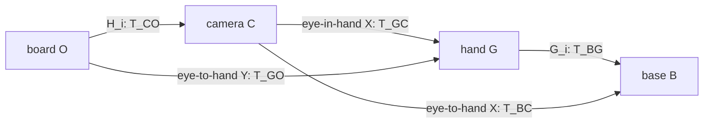

# S12.8a — Hand-Eye Geometry / AX=XB

约 1～2h。[代码](../examples/13_perception_geometry/hand_eye_geometry.py) ·
[前课 ICP](15_7b_icp_loop.md) · [状态唯一来源](../README.md#stage-12--robot-perception-geometry)。

## Problem → Why

PnP 提供标定板在相机中的位姿，robot FK 提供末端在 base 中的位姿。
怎样联系这两套数据，得到相机与机器人的固定安装关系？
这一关系才能把 camera-frame 感知用于机器人定位。本课先理解闭环、构造相对运动方程，
检查运动是否包含足够约束；**不估计 X**，不提前执行 S12.8b 的 calibration/noise/held-out 实验。

## Intuition → Core Concepts

“Hand”是选定的刚性末端 frame G，不必是夹爪指尖或 TCP；“Eye”是 optical camera frame C。
相机装在手上时，两者之间的关系不随手移动改变；相机固定在外部时，camera→base 恒定。
每次同步记录 robot pose 与 camera observation。两次观测中的不变安装关系与不变板位姿，
让我们能够消去一个未知量，留下另一未知量 X 与两边的相对运动。

`T_AB` 将 B 中的列向量坐标映到 A：`p_A = R_AB p_B+t_AB`。
矩阵乘积从右往左读，只有相邻 frame 下标匹配才有物理意义；它不是按字母任意排列。
B 在本课表示 robot base，公式中的 **B_ij** 是相对运动矩阵，不是 base frame 本身。
O 是刚性标定板/target，C 是 optical camera，G 是末端安装 frame。

| 数据 | shape / unit / direction |
| --- | --- |
| G_i=T_BG(i) | `(4,4)`；R 无量纲、t m；hand→base，通常来自 FK |
| H_i=T_CO(i) | `(4,4)`；R 无量纲、t m；board→camera，通常来自已知 K/d 的 PnP |
| X（eye-in-hand） | T_GC；camera→hand，固定未知量 |
| Y（eye-in-hand） | T_BO；board→base，固定但无需事先知道 |
| X（eye-to-hand） | T_BC；camera→base，固定未知量 |
| Y（eye-to-hand） | T_GO；board→hand，板刚性安装在末端，固定未知量 |
| A_ij / B_ij | `(4,4)`；相对位姿，与绝对 robot/camera pose 不同 |
| G / H arrays | `(N,4,4)`；按采样时刻对应，不能独立打乱 |

两种安装定义与常见 AX=XB 表述可核对
[OpenCV 官方 hand-eye 文档](https://docs.opencv.org/4.13.0/d9/d0c/group__calib3d.html)。
本课明确选取 i<j 的方向并自行展开，不依赖库求解器。

## Mathematics：Eye-in-Hand

Camera 与 hand 刚性连接，board 固定在 base。每个时刻的链都到同一 Y：

```text
G_i X H_i = Y
T_BG(i) T_GC T_CO(i) = T_BO
G_i X H_i = G_j X H_j
X H_i = G_i^-1 G_j X H_j
(G_i^-1 G_j) X = X (H_i H_j^-1)
A_ij = G_i^-1 G_j,  B_ij = H_i H_j^-1
A_ij X = X B_ij
```

带时刻标签：A_ij 是 G_j→G_i，B_ij 是 C_j→C_i。
左路 camera_j→hand_j→hand_i，与右路 camera_j→camera_i→hand_i 相同。
X 数值恒定，但左右出现的是各时刻 camera→hand 安装关系。

## Mathematics：Eye-to-Hand

Camera 固定在 base，board 刚性装在 hand 上：

```text
G_i Y = X H_i
T_BG(i) T_GO = T_BC T_CO(i)
Y = G_i^-1 X H_i = G_j^-1 X H_j
(G_j G_i^-1) X = X (H_j H_i^-1)
A_ij = G_j G_i^-1,  B_ij = H_j H_i^-1
A_ij X = X B_ij
```

这里通过 `G_j G_i^-1` 构造 base 中的左作用运动，通过 `H_j H_i^-1` 构造 camera 中的运动。
两者由固定 X=T_BC 联系。不是将 eye-in-hand 的 X 改名后保留全部乘法顺序。



图展示两种配置的链；eye-in-hand 的板固定在 base，eye-to-hand 的板固定在 hand，不能混用约束。
**若同时反转 A 与 B**，仍有 `A^-1 X = X B^-1`；只反转一边通常错误。
5 个绝对姿态产生 10 个 i<j pair，但共享观测，不是 10 个独立实验或独立噪声样本。

## Mathematics：运动激励与可观测性

将 AX=XB 拆开：

```text
R_A R_X = R_X R_B
(R_A-I) t_X = R_X t_B - t_A
```

平移未知量需要旋转来“显露”：绕某个轴旋转，沿该轴的向量保持不变，所以
`R_A-I` 沿轴方向为零。仅同轴旋转时，沿轴 t_X 不可由该式决定；
非平行轴旋转有机会使堆叠 L 的 rank 达到 3。

旋转方程可以用 column-major vec 写成线性齐次约束（本课只检查谱）：

```text
vec_F(M) 将矩阵按列堆为 (9,)
vec_F(U V W) = (W.T ⊗ U) vec_F(V)
K_ij = I ⊗ R_A - R_B.T ⊗ I       # (9,9)，无量纲
K = stack(K_ij)                   # (9*P,9)
K vec_F(R_X) = 0
L = stack(R_A-I)                  # (3*P,3)，无量纲
L t_X = stack(R_X t_B-t_A)         # RHS (3*P,)，m
```

多轴无噪声样本 K rank=8、nullity=1：齐次线性空间只剩真 R_X 的标量倍数，
SO(3) 约束确定合法尺度/符号。这不是“少一个实际旋转自由度没观测到”。
L rank=3 则在 R_X 已知条件下唯一约束 t_X。
本课是分步方程的可观测性检查，不做一般 noisy joint estimator，也不依据 pose 数量宣布可靠。

**同轴反例**：令全部 A 为绕 z 的纯旋转。Z 为任意绕 z 的旋转与沿 z 的平移，
便有 AZ=ZA；如果 AX=XB，那么 `X'=ZX` 也满足全部方程。
脚本用 Z=Rz(30°)+[0,0,0.05] m 构造不同但同样零残差的 X'。
因此更多同轴样本不能自动消除该歧义。

**纯平移反例**：R_A=R_B=I，L=0，t_X 从方程完全消失，任意改变它都不影响残差。
此时 K=0，但仍有 `t_A=R_X t_B`：两条非平行平移方向可能约束 R_X。
所以不能把“rotation-only K rank=0”误读成“整个 AX=XB 没有任何旋转信息”。
本课纯平移提供多个方向，但 t_X 始终不可观测，仍无法确定完整 X。

**近退化**：rank 未变但 informative singular value 变小，数据误差会更容易放大。
不计算包含必有零奇异值的 K 普通 condition number；比较第 8 个奇异值与 L 最小奇异值。
数值 rank cutoff=1e-9（无量纲、绝对门限）只用于本课无噪声有限数据，不是真实标定质量标准。

## Math-to-Code / API

`relative_pairs(G,H,setup)` 只读取两组观测与安装类型，返回 pairs `(P,2)`、A/B `(P,4,4)`；
不接受 X/truth，也不修改输入。拒绝 shape/count/finite/SE(3)/setup 错误。

`transform(axis,angle_deg,translation)` 用 Rodrigues 公式创建合成 SE(3)，角度 degree 转 rad；
本课调用的 axis 均非零。`rigid_inverse(T)` 用 R.T 与 −R.T@t 构造新逆矩阵，
内部几何 helper 假定已验证的 SE(3)，不是任意矩阵求逆接口。

`excitation(A,B)` 返回 K/L 和各自 singular values，不估计 R/t。
`np.kron` 创建 Kronecker 积；`np.linalg.svd(...,compute_uv=False)` 返回降序奇异值。
`R_X.reshape(9,order='F')` 必须与 vec_F 推导配套；默认 C-order 会改变公式。

`residuals(A,B,X)` 比较 AX 与 XB：旋转部分用 Frobenius norm（无量纲，**不是 degree**），
平移部分用 Euclidean norm（m）。不能把两者直接混为一个有物理单位的标量误差。
truth 仅用于合成 observation、闭环核验及反例评分，不是求解得到的 estimate。
不调用 MuJoCo、OpenCV hand-eye API，无新依赖或新增机器人控制。

## Minimal Experiment / Run → Modify

从仓库根目录：

```bash
conda activate mujoco
pwd
echo $CONDA_DEFAULT_ENV
which python
python examples/13_perception_geometry/hand_eye_geometry.py
python examples/13_perception_geometry/hand_eye_geometry.py --axis-spread-deg 1
# 可选：完全同轴极限（multi_axis case 仍有平移）。
python examples/13_perception_geometry/hand_eye_geometry.py --axis-spread-deg 0
```

两种安装、各三组 motion，每组 5 个绝对姿态/10 个 pair。
`multi_axis` 旋转角为 0/20/−35/50/70°，轴从 z 向 x/y 分散；有不同平移。
`single_axis` 为同样角度但全绕 z，motion translation=0；`translation_only` 只改变位置。
G0/X/Y 含非零旋转与平移，避免 identity 使错误顺序偶然通过。
数值在两种安装示例复用，但 X/Y 的 frame 含义各自不同，不能跨配置当作同一物理安装。

无噪声，没有 PnP、图像 visibility、robot joint reachability、时间同步误差或实体采集验证。
输出 ignored `tmp/s12_8a_geometry_spread*/`：geometry.npz（G/H、pairs、A/B、K/L、truth、X'）、
summary.json、pairs.csv（两种残差独立单位）、excitation.png（eye-in-hand 的谱，数值截到 1e-16 以画 log）。

**Run**：跑默认命令，看六组结果；沿 frame 下标重建两种闭环，查看同轴/纯平移 alternative X。
**Modify**：先预测轴分散 35→1° 会怎样影响 rank、最弱奇异值与 residual，再跑第二条命令。
比较 `multi_axis` 的第 8 个 rotation singular 与第 3 个 translation singular；
single_axis/translation_only controls 保持不变。无需估计器也能观察约束减弱。

## Expected / Actual Result → Explanation

2026-10-05 WSL2 kernel 6.18.33.2、Ubuntu 24.04.5；从 base 激活 mujoco，
同执行 shell 核验 `/home/lucas/miniconda3/envs/mujoco/bin/python`。
Python 3.12.14 / NumPy 2.5.3；3.11 为兼容目标未执行；无新依赖。
上述三条脚本均退出 0，无 import error。两种安装有相同的谱/rank 结论（浮点尾数略异）。

| case / axis spread | K rank / nullity | L rank | rotation s8 | translation s3 |
| --- | --- | --- | --- | --- |
| multi_axis / 35° | 8 / 1 | 3 | 1.002729042 | 1.002729042 |
| multi_axis / 1° | 8 / 1 | 3 | 0.034080102 | 0.034080102 |
| multi_axis / 0° | 6 / 3 | 2 | ≈1e-15 | ≈1e-15 |
| single_axis / all runs | 6 / 3 | 2 | ≈1e-15 | ≈1e-15 |
| translation_only / all runs | 0 / 9 | 0 | ≈1e-16 | ≈1e-17 |

所有 truth AX=XB 的分开残差 <1e-12；近轴无噪声 residual 仍近零，
但最弱 informative singular 降约 29.4 倍，说明小 residual 本身看不出抗噪能力。
0° multi_axis 存在平移，不等于无平移 single_axis；两者 K/L 一样退化，
不能仅凭 K 宣称它们完整旋转信息完全相同，沿共同轴 t_X 仍无约束。

内置绝对闭环、AX=XB、K vec_F(R_X)=0、平移分块方程、同轴/纯平移歧义、
只反转 B 的失败演示与输入 guards 全通过。
独立检查三套 NPZ/JSON/CSV，每套 60 个 pair rows、每组 `(10,4,4)` A/B；
通用 np.linalg.inv 与 rigid inverse 一致，反转配对样本顺序后方程仍成立，输入不修改；
X' 不仅满足相对方程，也对应另一恒定绝对 Y。CLI nan/−1/61° 均退出 2。
默认 PNG 已目视检查。未运行前课/P0、GUI、实体采集或 calibration solve；PASS 仅工程几何验证。

## Failure Cases

| 错误 / 现象 | 含义 / 检查 |
| --- | --- |
| 把 H 当 T_OC | PnP 给 board→camera；必要时完整 rigid inverse，不能只取 t 的负号 |
| eye-to-hand 套原 eye-in-hand A/B | X 和闭环不同；先推导再构造 |
| 只反转一个相对运动 | 方向不一致；一起反转可等价，单边反转通常失败 |
| 帧名只写 end-effector | flange/TCP/gripper 不一致使 X 定义变更；明确 G frame |
| 重复姿态或仅同轴采样 | 数量多但缺独立方向；检查谱与构造歧义 |
| 纯平移就能求完整 X | t_X 完全消失；平移方向可约束 R_X 但不是 t_X |
| 小 residual 当标定准确 | truth 输入的几何自检不是 calibration；真实数据需后课独立验证 |
| rank 足够就宣称抗噪好 | 近轴 informative singular 小，误差易放大；rank 与 conditioning 不同 |
| 不同步 G/H、board 挪动、安装松动 | 固定关系不成立；几何式无法补偿采集失配 |
| m/mm 混用 | 相对平移与 t_X 不一致；保持 metric scale |

## Robotics Context

Eye-in-hand 用于腕部相机感知与主动观察；eye-to-hand 用于固定工位相机把测量映射到 base。
标定不能替代 intrinsics/PnP，也不自动提供 base→world 或 TCP offset。
例如 eye-in-hand 之后的 object pose 链是 `T_BO=G_i X T_CO`；
eye-to-hand 则 `T_BO=X T_CO`，其中 O 可换成待操作物体，仍要有正确 metric observation。
本课不执行抓取；S12.8b 才求解 X 并比较噪声、truth 与 held-out residual。

## Interview Capsule

**30 秒**：Hand-eye 由 robot FK 和 board→camera 观测确定固定 camera 安装。
Eye-in-hand 的闭环 G_i X H_i=Y，得到 A=G_i^-1 G_j、B=H_i H_j^-1；
eye-to-hand 的闭环 G_i Y=X H_i，得到 A=G_j G_i^-1、B=H_j H_i^-1。
采样要有足够独立旋转：同轴存在歧义，纯平移不能确定 t_X。

**2 分钟**：解释四个 frame、X/Y 两种定义及配对采集，消去固定 Y 推导 AX=XB。
拆出 R_A R_X=R_X R_B 和 (R_A-I)t_X=R_X t_B-t_A；说明同轴方向是 L 的零空间。
以 AZ=ZA 构造 X'=ZX 展示不是 residual 小就唯一。
指出纯平移 K=0 但 t_A=R_X t_B 可给旋转信息，t_X 仍消失。
最后用 35→1° 的满秩但弱奇异值对照区分 observability 与 conditioning，说明本课没有求解器。

## Must Remember / My Verification

- X 由安装方式与 frame 定义；G/H 是绝对 pose，A/B 是成对相对运动。
- 先写闭环，再消 Y；乘法顺序/逆变换不能凭记忆混用。
- 多个姿态不等于多个独立约束；同轴/纯平移不能唯一确定完整 X。
- K 是 rotation-only 子系统，L 对 t 的检查以 R_X 已知为前提。
- 几何 residual、rank、conditioning、估计 accuracy 与 Learning Mastered 是不同证据。

状态仅在根 README 维护。本人于 2026-10-05 明确确认实验与预测均完成，并补充正确的
两种安装 X/Y 方向与固定关系；Run/Modify/Explain 全部确认，Learning Mastered。

反馈核对：本人选 A=G_j^-1 G_i、B=H_j H_i^-1，等价于同时反转本课的 A/B，推导正确。
同轴缺独立方向、纯平移消去 t_X 但平移方向能约束 R_X、rank 与抗噪能力不同的判断正确。
本人补充确认：eye-in-hand X=T_GC/Y=T_BO，相机固定在手上、板固定在 base；
eye-to-hand X=T_BC/Y=T_GO，相机固定在 base、板固定在手上。
H_i 是 board→camera 观测矩阵，不是 frame H。
进一步解释：小 informative singular 会放大数据扰动；近零 residual 不证明参数稳定。
本次仅同步学习反馈，runtime 沿用 2026-10-05 工程验证，未重跑实验或 GUI。

**Explain**：

1. 两种安装中 X、Y 分别是什么？哪些刚性关系必须保持固定？
2. 从 G_i X H_i=G_j X H_j 推导 eye-in-hand 的 A/B；eye-to-hand 为什么不同？
3. 为什么更多同轴旋转仍有歧义？用 AZ=ZA 与 X'=ZX 或平移零空间解释。
4. 纯平移时为什么不能求 t_X，却仍可能约束 R_X？
5. 35→1° 时 rank 不变、residual 近零，为什么标定仍可能更敏感？

本课学习验证完成后 STOP；下一可选任务 S12.8b hand-eye calibration，等待明确请求。
