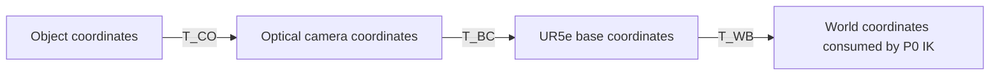

# Stage 12 — Robot Perception Geometry

S12.1：Camera Frames / Coordinate Transform，约 1～2h。
[状态唯一来源](../README.md#stage-12--robot-perception-geometry) ·
[代码](../examples/13_perception_geometry/camera_frames.py) ·
[P1 审计与路线](p1_plan.md)。S12.1 已 Mastered；新课见 [S12.2 Pinhole Projection](15_2_pinhole_projection.md)。渲染获取课见 [S12.3 RGB/Depth](15_3_rgb_depth_acquisition.md)；标定课见 [S12.4 Camera Calibration](15_4_camera_calibration.md)；位姿课见 [S12.5 PnP](15_5_pnp_pose.md)；S12.6 起仅规划。

## Problem → Why

P0 的 IK 消费 world-frame target；视觉估计器以后将输出 optical-camera-frame object pose。
即使 xyz 数字相同，参考系不同也意味着不同物理位置。需要建立 camera→base→world
坐标链，连同 object orientation 一起传递，才能复用 P0 执行层。
本课只解决坐标接口，不重复 FK/IK，也不把合成 observation 称为视觉估计。

## Intuition → Core Concepts

同一个物体没有移动，换一把坐标尺后数字会改变。`T_AB` 表示 **B frame 在 A frame 中的位姿**，
同时把 B 坐标变成 A 坐标。下标的相邻 frame 必须衔接；NumPy 不会替你检查 frame。

| Frame | 原点与轴约定 |
| --- | --- |
| W world | 仿真世界；地面 z=0，+z 向上 |
| B base | 实际 UR5e `base` body；本模型原点与 W 相同，轴绕 world z 相差 π |
| C optical camera | 合成固定 overhead camera；+x 图像右、+y 图像下、+z 朝前 |
| O object | 方块中心；本例轴与 W 平行，中心 `[-0.45,0.20,0.03] m` |

C 的轴在 W 中分别是 +x、−y、−z，故 `R_WC=diag(1,-1,-1)`，det=+1。
这不是 MuJoCo renderer camera frame；将来渲染课必须单独处理 renderer→optical 转换。
外参是 frame 间刚体变换；本例直接给定，尚未估计。内参涉及投影，留给 S12.2。



## Mathematics：meaning / shape / unit / frame

采用列向量、右乘输入坐标。`R_AB` shape `(3,3)`，无量纲，列为 B 各单位轴在 A 中的坐标；
`t_AB` shape `(3,)`，m，是 B 原点在 A 中的位置；`T_AB` shape `(4,4)`。
`p_B` shape `(3,)`，m，在 B 表达：

```text
T_AB = [ R_AB  t_AB ]       p_A = R_AB p_B + t_AB
       [ 0 0 0   1   ]

T_BA = [ R_AB^T  -R_AB^T t_AB ]
       [ 0 0 0        1       ]

T_BC = inverse(T_WB) @ T_WC
T_CO = inverse(T_WC) @ T_WO_truth   # 合成 oracle observation
T_BO = T_BC @ T_CO                 # 以后替换 T_CO 为 perception 输出
T_WO = T_WB @ T_BO                 # 回到现有 IK 的 W frame
```

点齐次坐标 `[x,y,z,1]`：旋转并平移。方向/位移为 `[dx,dy,dz,0]`：只旋转。
姿态复合包含 `R_BO=R_BC R_CO`，不能只转换 object center 而丢掉朝向。
旋转必须满足 `RᵀR=I` 和 `det(R)=+1`；det=−1 是镜像，不能作刚体旋转。

## Math-to-Code / APIs

代码 `make_transform` 填写 R/t；`invert_transform` 显式实现刚体逆；
`T_BC @ T_CO` 是核心表达式。输入均为米和列向量，不做隐式单位转换。
复用 P0 `make_transform` 的简单结构，无共享框架或新依赖。

| API | 输入 → 返回 / 原地更新 | 本课作用 |
| --- | --- | --- |
| `mujoco_menagerie.load` | 模型名称 → `MjModel`；首次可能下载缓存 | 加载现有官方 UR5e |
| `mujoco.MjData(model)` | 模型 → 新状态对象 | 存放状态与 world-pose cache |
| `mujoco.mj_forward(model,data)` | 模型和状态 → 返回 None，原地刷新派生量，不推进 time | 读取可信的 base 世界位姿 |
| `model.body("base").id` | body 名称 → 整数 ID | 避免硬编码 body 数组索引 |
| `data.xpos[id]` / `xmat[id]` | `(3,)` m / `(9,)` 无量纲，后者 reshape `(3,3)` | body 在 W 的位置和朝向；copy 避免缓存别名 |
| `np.testing.assert_allclose` | 实际值、期望值和容差 → 无返回值；失败抛异常 | 绝对 `1e-12` 的几何核验，不代表真实标定精度 |

## Minimal Experiment → Expected / Actual Result

从仓库根目录，在核验的 mujoco 环境执行：

```bash
python examples/13_perception_geometry/camera_frames.py
python examples/13_perception_geometry/camera_frames.py --camera-x -0.25
```

预期：物体不动，相机 world x 增加 0.10 m 后，物体 camera x 减少 0.10 m；
恢复出的 base/world pose 保持不变。对象上一点 `[0.02,0.01,0.03]_O m` 应恢复为
`[0.43,-0.21,0.06]_B m`。

2026-10-04 助手实测：WSL2 Ubuntu 24.04.5，mujoco 环境，
Python `/home/lucas/miniconda3/envs/mujoco/bin/python` 3.12.14，NumPy 2.5.3，MuJoCo 3.14.0。
代码兼容目标为 3.11，未在 3.11 执行。两命令均退出 0，无 import error：

| 量 | 默认 camera-x=-0.35 | Modify camera-x=-0.25 |
| --- | --- | --- |
| `p_CO` m | `[-0.10,-0.10,0.77]` | `[-0.20,-0.10,0.77]` |
| `p_BO` m | `[0.45,-0.20,0.03]` | 相同 |
| 恢复 `p_WO` m | `[-0.45,0.20,0.03]` | 相同 |
| 错序复合 position error m | 0.289137 | 0.451221 |
| mm 当 m 的 position error m | 782.096422 | 801.008641 |

实际 base rotation 为 `diag(-1,-1,1)`。完整 pose recovery、非原点测试点、方向的 w=0、
所有刚体 inverse round-trip 均通过；镜像输入被拒绝。simulation time=0。
未运行 GUI、渲染、PnP、IK 或抓取；本例 oracle T_CO 来自 truth，不能证明 perception accuracy。

## Explanation → Failure Cases

相机移动改变 `T_WC` 和 `T_CO`，两者复合恢复同一物体；base/world 朝向不同导致 xy 符号改变。
只看到 round-trip 通过还不够：互相抵消的错误可能蒙混过关，所以额外使用可手算的点和
实际 model base pose 作独立核对。

| 错误 | 本课检查 / 后续边界 |
| --- | --- |
| `T_CO @ T_BC` | shape 合法但 frame 不衔接；本课显式展示非零误差 |
| 把 `T_CB` 当 `T_BC` | 写出输入/输出 frame，先求刚体 inverse |
| 平移只取负数 | 必须先旋转 `-Rᵀt`；round-trip 检查 |
| optical/render frame 混用 | 本课不调用 renderer；后续单独核对轴 convention |
| mm 与 m 混用 | 巨大 position error；SE(3) 合法性本身不能发现单位错误 |
| 平移 direction | 使用 w=0；origin point 使用 w=1 |
| extrinsic 错误或过时 | 本课没有 calibration/time estimation；代数正确不代表外参准确 |

## Robotics Context

固定相机是 eye-to-hand；以后 `T_BC` 经标定得到。eye-in-hand 则需
`T_BC(t)=T_BE(t) T_EC`，机器人状态必须与图像时间匹配。本课不实现 hand-eye calibration。
Stage 13 在这条链之后加入 `T_OG` grasp offset，并把目标送入现有 world-frame IK。

## Interview Capsule

**30 秒**：视觉 pose 位于 optical camera frame。定义 T_AB 把 B 坐标转换到 A，
用 `T_BO=T_BC T_CO` 得到 base pose，再根据执行接口转换为 world。复合前明确轴和米单位，
检查逆变换、det=+1，以及可手算的非原点测试点。

**2 分钟**：先说明 optical x右/y下/z前，与 robot base 和仿真 world 不同。
给出 `(4,4)` 刚体变换和 `p_A=R_AB p_B+t_AB`，解释旋转列和 translation 的物理意义。
用相邻下标确定乘法顺序，推导 inverse translation 为 `-Rᵀt`。
点的 w=1、方向的 w=0；pose 必须同时转换 orientation。
固定物体、移动相机应改变观测坐标但保持 base pose，这是可验证的不变量。
最后说明 oracle observation 只验证 geometry；真实系统还需标定、时间同步及噪声评估。

## Must Remember

- 先写 frame、单位和方向，再做矩阵乘法。
- base 与 world 同原点不等于同 frame；现有 IK 消费 world pose。
- 合法 SE(3) 和自洽 round-trip 不能证明 perception/calibration 正确。

## My Verification / Run → Modify → Explain

状态在根 README；以下为本人填写记录区，不代替状态表。

**Run**：运行默认命令，记录 T_BC、T_CO、T_BO 与 PASS。
**Modify**：用 `--camera-x -0.25` 移动相机，先预测 p_CO 的变化，再验证 p_BO 不变。
**Explain**：用自己的话回答：

1. T_BC 将哪个 frame 的坐标转换到哪个 frame？为什么它乘在 T_CO 左侧？
2. 为什么这个 UR5e 的 base/world xy 符号相反？同原点为何不足以合并 frame？
3. 为什么 inverse translation 是 `-Rᵀt`？点与方向为何使用不同 w？
4. 相机移动后哪些矩阵改变，哪个物理 pose 不变？
5. 为什么本课 PASS 不能证明 PnP、标定或视觉抓取已经成功？

本人结果记录（2026-10-04）：已报告完成实验。正确解释 Camera→Base 的转换方向、
同原点不等于同 frame、inverse 的旋转转置与 translation 旋转取负、点/方向的平移区别，
以及本课只验证坐标数学，真实系统仍受标定误差和深度噪声影响。
补充复合顺序：T_CO 先 Object→Camera，再由 T_BC Camera→Base，因此 T_BO=T_BC@T_CO。
本人随后明确确认移动相机 Modify 实验完成；S12.1 Run/Modify/Explain 全部完成。
该确认未重跑 S12.1，不新增该课 runtime 证据。本人已授权推进 S12.2，见新课笔记。
