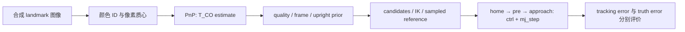

# S13.3a — 从合成图像到连续机器人运动

[代码](../examples/14_vision_manipulation/vision_to_motion.py) ·
[运行入口](../examples/14_vision_manipulation/README.md#s133a--vision-to-motion) ·
[Engineering / Learning 唯一状态](../README.md#stage-13--vision-based-manipulation)。
前置：[PnP](15_5_pnp_pose.md)、[感知接口](16_vision_based_manipulation.md)、
[抓取候选](16_2_grasp_pose_generation.md)。建议阅读/运行/修改用时 1～2h。

## Problem → Why

上一课只验证两个 IK 端点，且输入是直接构造的 estimate。
本课让 CPU 图像里的观测点真正决定目标，并从 home 连续执行 pre-grasp 与 approach。
核心问题：机器人准确跟踪了一个视觉目标，是否就准确到达了真实抓取位置？

## Intuition

把流程看成两个独立系统：感知系统决定“应该去哪里”，控制系统决定“实际去了哪里”。
视觉误差会移动整个运动目标；控制跟踪误差是在这个目标附近继续叠加的偏差。



**Truth 边界**：真实 T_WO 只用于生成图像与执行后的评价。
检测函数只收到 image；PnP 只收到 metric landmarks、detected pixels、K/d；
规划器只收到 estimate 与模型。模型里的固定 box 是碰撞环境，不能读其 pose 来替换估计目标。
机器人 base cache、已知相机外参、已知物体尺寸不属于未知 object pose。

## Core Concepts

- 输入是 640×480 的 **BGR uint8 彩色点图像**，不是 MuJoCo RGB photograph。
  12 个颜色 ID 对应已知非共面、米制 landmark rig；它与物体 O 固连。
  点阵包含 box 外部点，作为抽象教学标记架；没有模拟真实遮挡或纹理。
- detector 在整张 image 中按颜色分割，用 connected components 的质心找 uv。
  不接收 projected pixels、truth pose 或由 truth 指定的 ROI。
  每个 ID 必须恰有一个面积 13 px 的圆盘；缺失、重叠或分裂拒绝。
- 图像生成把每个 uv 加固定 seed 的扰动后取整再画圆。因此 `noise=0` 仍有像素量化误差。
  `noise-px` 是图像点中心的坐标扰动标准差，不是 image intensity noise。
- PnP 返回完整 SE(3)。S13.2 要求 yaw-only，所以本课**显式使用 upright prior**：
  raw object z 与 world z 夹角超过 5° 拒绝；否则保留 estimated xyz 与 yaw，设 roll/pitch=0。
  不用 truth 修正 yaw、xyz 或高度；raw 与 constrained pose 都保存。
- 首个端点 IK 通过的 candidate 才进入 path 检查；路径失败就拒绝，不尝试优化或搜索其他候选。
- 本课固定物体、一次观测、open-loop reference。timestamp 在规划开始检查；
  执行期间不重新感知，静态场景是前提。

## Mathematics — 意义 / Shape / Unit / Frame

| 量 | shape | 单位 / frame |
| --- | --- | --- |
| P_O | (12,3) | m，object O 的已知 landmark 坐标 |
| uv | (12,2) | pixel，(u,v)；数组 image[v,u] |
| K / d | (3,3) / (5,) | focal/principal point 为 px；d 本课全零 |
| T_CO / T_WO | (4,4) | object→optical camera / object→world；平移 m |
| q_ref / q_actual | (N,6) | UR5e 六关节，rad |
| qfrc_bias / qfrc_applied | (nv,) | 广义力；本课 arm hinge DOF 为 N·m |

PnP 与 frame 链沿用前课：

```text
p_C = R_CO p_O + t_CO
T_WO = T_WB T_BC T_CO
T_WG = T_WO_upright T_OG
p_WP = p_WG - 0.10 R_WG[:,2]
```

实际 base 的 R_WB=diag(−1,−1,1)，不能把 base pose 当 world pose。
本课 R_WG[:,2]=[0,0,−1]，所以 approach 是沿 gripper +z 向下；
attachment_site 比 object center 高 35 mm，pad center 才对齐 object center。

Home→pre 用关节 cubic；approach 的 21 个 Cartesian waypoint 使用固定 R 与递增 alpha：

```text
p(alpha) = (1-alpha) p_WP + alpha p_WG
q(t) = q_start + (3 tau² - 2 tau³) (q_goal-q_start), tau=t/T
```

相邻 approach IK 解以 0.1 s cubic 连接，20 段共 2 s。
每段端点速度为零，因此会有周期性停走/跟踪波动；不是优化后的平滑 Cartesian 控制器。
关节插值的中间 FK 不保证严格直线，本课只做离散采样接触与速度检查。
速度报告是 2 ms 相邻 reference 的有限差分最大值，门限 0.5 rad/s，不是解析全时域证明。

动力学与偏置补偿：

```text
M(q) qdd + b(q,qdot) = actuator force + applied force + passive/contact force
qfrc_applied[arm_dof] = qfrc_bias[arm_dof]
```

b 包含 gravity/Coriolis/centrifugal terms。本课把它作为可见的模型前馈，
位置伺服仍负责跟踪 q_ref，前馈不是轨迹加速度的完整 inverse dynamics。
`qfrc_applied` 是额外广义力接口，不受 position actuator 的 forcerange 限制；
这是理想模型控制实验，不代表真实驱动器的扭矩能力。它不使用 object truth pose。

误差必须分开：

```text
e_tracking = ||p_WG_actual - p_WG_estimated_target||
e_truth    = ||p_WG_actual - p_WG_truth_target||
```

两个欧氏距离不能直接标量相加；位置误差向量相加，模长服从三角不等式。
raw PnP rotation error 与使用 upright prior 后的 grasp rotation error也不是同一个量。

## Math-to-Code 与 APIs

| API / helper | 输入 → 输出或原地修改 | 为什么需要 |
| --- | --- | --- |
| cv2.circle | image、整数 (u,v)、半径、BGR → 原地修改 image | CPU 栅格观测生成；只在 producer |
| cv2.connectedComponentsWithStats | uint8 mask → count / labels / stats / centroids | 颜色 ID 分割与质心；stats 含 pixel area |
| cv2.solvePnP（复用 estimate_pose） | P_O、uv、K/d，无初值 → success / rvec(3,1) / tvec(3,1) | 估计 object→camera；rvec rad，tvec m |
| cv2.Rodrigues / projectPoints | rvec↔R；3D、pose、K/d→pixels/jacobian | producer projection 与 estimate residual；不把投影当检测结果 |
| build_model / MjData(model) | 编译 UR5e+gripper+fixed box → MjModel；分配状态→MjData | geometry 与 dynamics 共用模型，状态分开 |
| mj_resetDataKeyframe | model/data/home ID → 原地初始化 | planning 与 execution 各自初始化一次；中途不重置 |
| mj_forward | model/data → 更新 pose、force 等 caches，返回 None | IK/FK 或 integrated state 的 cache 更新，不推进时间 |
| mj_jacSite（复用 DLS） | model/data/site、(3,nv) jacp/jacr → 原地填充 | world translational/rotational Jacobian；仅取 arm DOF |
| data.ctrl | (nu,) actuator controls，arm rad / finger m | 写 position target，与 realized qpos 区分 |
| mj_step | model/data → 原地积分 qpos/qvel，time+=timestep，返回 None | 连续实际动力学；本课 timestep=0.002 s |

参考：[OpenCV PnP](https://docs.opencv.org/4.x/d5/d1f/calib3d_solvePnP.html)、
[MuJoCo simulation](https://mujoco.readthedocs.io/en/stable/programming/simulation.html)、
[MuJoCo API](https://mujoco.readthedocs.io/en/stable/APIreference/APIfunctions.html)。

## Minimal Experiment

依赖 NumPy、MuJoCo、Menagerie、Matplotlib、opencv-python-headless，均已在 requirements 声明。
不需要前课产物、Torch、RL、renderer 或 GUI。

```bash
conda activate mujoco
pwd
echo $CONDA_DEFAULT_ENV
which python
python examples/14_vision_manipulation/vision_to_motion.py
python examples/14_vision_manipulation/vision_to_motion.py --noise-px 0.8
python examples/14_vision_manipulation/vision_to_motion.py --noise-px 0
python examples/14_vision_manipulation/vision_to_motion.py --rms-limit-px 0.1
```

执行顺序：1 s home hold → 6 s transit → 0.5 s pre hold → 2 s approach → 1 s final hold。
Execution 初始化后只改 ctrl / applied force，绝不写 arm qpos 或清零 qvel。
手指每根始终 30 mm slide（80 mm total opening），不执行闭爪。
候选生成仍保留所需开口，运动采用更宽的 transit aperture。

输出在 ignored `tmp/s13_3a_motion_noise*_rms*/`：图像 landmarks.png、诊断 motion.png、
trace.csv、motion.npz、summary.json；重复同参数覆盖同目录。
以当次 summary status 为准；拒绝时不会写新的 motion/trace，旧目录中遗留产物不可当作本次成功。
感知门限拒绝退出 0 并报告 refused/time=0；planning/execution failure 退出 1，CLI 非法输入退出 2。
执行失败的完整轨迹目前不保存，time=null 表示未导出确切失败时间，不能解释成未运行。

## Expected / Actual Result

2026-10-06，机器 Zero，WSL2 Ubuntu 24.04.5；Python 3.12.14，MuJoCo 3.13.0，
NumPy 2.5.3，Matplotlib 3.11.2，Menagerie 2026.9.2，OpenCV distribution 4.14.0.94。
3.11 是代码兼容目标，本次没有在 3.11 上执行。

| noise px | reprojection RMS px | raw PnP t error mm | pre tracking mm | final tracking mm | final truth error mm |
| --- | --- | --- | --- | --- | --- |
| 0.2 默认 | 0.353150 | 3.977845 | 0.228157 | 0.072987 | 4.047543 |
| 0.8 Modify | 0.863787 | 5.257767 | 0.221806 | 0.073148 | 5.329357 |
| 0 | 0.388556 | 2.457555 | 0.226204 | 0.072836 | 2.525082 |

三组均 motion_passed，5250 个 dynamics steps、time=10.5 s、无 observed contacts；
reference peak speed 分别 0.219673 / 0.220485 / 0.219993 rad/s。
pre 与 final 都要求 position<3 mm、orientation<0.02 rad；默认 final orientation=1.84e-5 rad。
RMS=0.1 px 的对照在 perception 阶段拒绝，time=0，无 motion result。

独立核对 PNG 检测质心、CSV/NPZ 一致性、4251 reference / 5250 trace shapes、
2 ms 时间间隔、实际 base chain、pre/final error 重算、command concatenation；
missing-ID / excessive tilt / far local IK 拒绝通过。默认两张 PNG 已目视检查。
这只验证当前静态 fixture 与三组固定 seed；没有 GUI、真实相机或 grasp/lift/place 验证。

## Explanation

默认机器人能很准确地到达 estimated target，但 estimated target 自身偏了数毫米。
这说明改善 tracking 不能自动修复 perception。
首次未加 bias feedforward 的实验 final error=8.600956 mm / 0.021219 rad，未通过门限；
加入补偿后通过。位置伺服 kp 有限，承受重力时需要偏差才能产生力矩，故出现静态偏移。

`noise=0` 的 RMS 甚至略大于默认：取整是非线性的，少量扰动可能改变量化方向；
不能期待单个 seed 下所有误差严格随 noise 单调。
图里的 approach joint error 周期波动来自短 cubic 段与有限动态响应，最终 hold 后明显衰减。

## Failure Cases

- missing ID / 遮挡 / 颜色变化：简单 detector 会拒绝；没有真实鲁棒检测能力。
- 小 RMS 仍可能存在标定偏差、尺度错误、错误对应；本课 K/d 与外参精确已知。
- upright prior 错误时：即使 tilt gate 通过，也可能抹去真实 tilt；不能扩展到斜放物体。
- endpoint IK pass 不保证 path safe；sampled contacts 不保证连续时间无碰撞。
  当前排除相邻工具部件接触的模型也不是通用 collision planner。
- 实际执行 contact / joint limit / tracking failure：拒绝成功结论；固定 box 会限制物体动态响应。
- 开口保持 80 mm 且没有闭爪；motion_passed 绝不等于 grasp success。

## Robotics Context

这相当于已知标记物/夹具的视觉定位，再执行一次机器人取物前的开放式接近。
工业落地还要考虑遮挡、标定漂移、关节/力矩限幅、实际碰撞、动态重观察与接触。
本课只学习 estimate→reference→actual 的可审计接口；后续任务单独推进。

## Interview Capsule

**30 秒**：我从 CPU 合成 landmark image 检测带身份的像素对应，用无 truth 初值的 PnP
求 T_CO，经实际 base/外参链和显式 upright prior 生成抓取候选。
独立状态做 IK 与离散路径检查，再从 home 用 position ctrl 和 mj_step 连续执行。
分别报告 estimated-target tracking 与 true-target error，避免把控制成功当视觉或抓取成功。

**2 分钟**：先说明已知 metric rig 给出尺度、color ID 给出对应、K/d 给出成像模型。
再写 T_WO=T_WB T_BC T_CO，解释 UR5e base 的 xy 反向与 35 mm tool/pad offset。
完整 PnP 含 tilt，因此先 gate 再显式施加 upright prior，不偷偷用 truth 改位置。
Home cubic 与 Cartesian waypoint IK 形成 reference，planning data 的 qpos 修改不推进时间。
Execution data 只在 home 初始化，通过 ctrl 与 applied bias force 连续积分。
偏置补偿降低重力静态误差，但最终仍受 perception 误差影响。
最后给出 fixed seed / quantization / sampled collision / ideal feedforward / no grasp 的验证边界。

## Must Remember

估计目标、几何参考和实际状态是三种不同对象。
控制误差与视觉误差要分别报告；零 added noise 不代表零测量误差。
先验要显式声明，truth 只能用于 producer/scorer，动力学阶段不能通过写 qpos 假装执行。

## My Verification — Run / Modify / Explain

Engineering 结果见上表，Learning 三项只由本人确认，根 README 为唯一状态来源。

**Run**：运行默认命令，阅读 summary、landmarks.png 与 motion.png，找到 pre/approach 时段。

**Modify**：先预测 `--noise-px 0.8` 是否会主要改变 tracking error 或 true-target error，
再运行比较三个误差字段与 RMS；说明你的预测与实际结果。

**Explain（五问）**：

1. detector、PnP、planner 分别收到什么？哪些位置允许使用 truth？
2. 为什么 T_BO 不能直接送给 world-frame IK？35 mm offset 对齐的是哪里？
3. 为什么需要 upright prior？它保留和修改了什么，什么情况下会错？
4. 修改 qpos+forward 与修改 ctrl+step 分别代表什么？为什么不加偏置补偿会留下误差？
5. tracking≈0.073 mm 而 true-target≈4.05 mm 是否矛盾？为什么 noise=0 仍不精确？

### 本人学习验证（2026-10-06）

本人明确确认实验与预测完成，并回答五项 Explain；根 README 已据此记录 Run/Modify/Explain 完成。
解释覆盖 detector/PnP/planner 输入与 truth 隔离、world-frame IK target 链、
upright prior 的 xyz/yaw 保留与 tilt 风险、forward 与 step 的区别、bias compensation，
以及 tracking 与 true-target error 的区别。

精度补充：本课 PnP 输入是非共面 marker rig，不能将当前结果归因于 planar geometry sensitivity。
零 added noise 下已知的主要观测误差是圆盘中心像素取整；本课质心准确恢复绘制的整数中心。
PnP 数值误差、prior 与控制残差是不同层次的误差源，不能把一般可能性都当作本实验已证实的主因。
PnP 还使用已知 distortion coefficients（本课为零）；pad center 与 object center 对齐，
attachment_site 高出 35 mm。动力学通过只支持本课模型/路径/门限，不代表实际硬件或抓取成功。

Engineering 与 Learning 均完成。S13.3b 已按后续明确请求实现，见[完整视觉取放](16_3b_vision_pick_place.md)。
