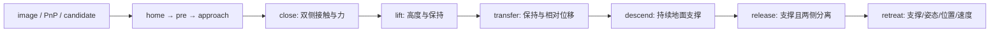

# S13.3b — 视觉驱动的完整 Pick-and-Place

[代码](../examples/14_vision_manipulation/vision_pick_place.py) ·
[示例 README](../examples/14_vision_manipulation/README.md#s133b--vision-pick-and-place) ·
[Engineering / Learning 状态](../README.md#stage-13--vision-based-manipulation)。
前置：[S13.3a](16_3a_vision_to_motion.md)、[P0 manipulation](14_pick_place.md)。
建议学习时间 1～2h。核心概念：**连续操作需要分阶段、用物理证据决定是否继续**。

## Problem → Why

S13.3a 能到达视觉估计的 grasp target，但还没有让物体离地或放到新位置。
P0 的旧集成脚本从 grasp 初始化，并用实际 held-object offset 修正放置目标。
本课从 home 连续执行，目标使用视觉 estimate、已知抓取几何和任务指定 destination。
实际物体状态用于评价；不能被当作额外定位观测偷偷修正 planner。

## Intuition

“已发出闭爪指令”“两侧都接触”“物体被抬起”“放稳后已松开”是不同事实。
每个阶段都要有允许的接触、持续时间和通过条件；不能凭最后一个画面认定全流程成功。



失败时停止后续阶段，保存 partial trace、失败阶段与实际仿真时间，退出码为 1。
这不是自动恢复或通用 manipulation framework；本课没有学习新的 path planner。

## Core Concepts 与 Truth 边界

| 数据 | 使用位置 | 边界 |
| --- | --- | --- |
| 真实初始 T_WO / model.qpos0 | scene 初始化、image producer、perception scorer | 初始化不是给 planner 一个真值目标 |
| image、known metric landmarks、K/d | detector / PnP | 复用整图颜色 ID detector，无 truth ROI 或初值 |
| raw / upright visual estimate | candidate / approach / held-target planner | 保留 estimated xyz/yaw，沿用 5° tilt gate |
| 机器人 qpos、tool pose | IK seed、Cartesian reference 起点、retreat 起点 | 正常机器人状态反馈，不是 object pose feedback |
| ground/finger contacts 与 normal forces | 阶段转换和支撑/释放判断 | 理想仿真接触反馈，未实现真实传感器 |
| 实际 object position / relative offset / velocity | slip、rise、final error scorer | 不进入目标构造；无实测 held offset 修正 |

复用 S13.3a 的固定 box 模型做 open-approach reference 与私有 IK；
执行模型另加 ground 与 free object。两者的 arm/tool 一致，物体自由度与 ground 不同。
私有 IK 可以写 qpos；**唯一 execution MjData 在 home 初始化后不再写 qpos/qvel 或 reset**。
free object 通过摩擦/接触被拿起，没有 weld 或附着约束。

## Mathematics — 物理意义 / Shape / Unit / Frame

| 量 | Shape | 单位 / frame |
| --- | --- | --- |
| T_OG | (4,4) | gripper→object 的名义变换，translation m |
| T_WG | (4,4) | gripper→world 的运动目标，translation m |
| destination | (3,) | world object-center command，m，默认 [−.30,−.10,.03] |
| object freejoint qpos / qvel | (7,) / (6,) | xyz+wxyz / translation+rotation velocity；m、m/s、rad/s |
| contact wrench | (6,) | contact-frame force N + torque N·m |
| relative center r_G | (3,) | object center 相对 tool，gripper axes，m |

名义抓取 geometry 来自 S13.2；pad center 对齐 object center，site 高出 35 mm。
放置目标由指定 object destination 与原来的估计 yaw 构造：

```text
R_WO_command = R_WG R_OGᵀ
T_WO_command = [R_WO_command, destination]
T_WG_nominal_place = T_WO_command T_OG
```

不是 `destination - measured_object_to_gripper_offset`。
Lift 在 estimated grasp site 的 world z 上加 60 mm；transfer 使用同一高度。
Descent 的有界末端目标在 nominal place site 以下 4 mm，作为 seating allowance，
但一旦 ground contact 与法向力持续确认就提前停下，不强行执行到底。
这是已知平面上的有限位置下降+接触事件停止，不是 force/impedance controller。

Lift/transfer/descent/retreat 的 Cartesian 中心路径使用 cubic progress：

```text
alpha = 3 tau² - 2 tau³, tau=t/T
p_W(t) = (1-alpha) p_start + alpha p_target
R_WG(t) = target_rotation
```

每 0.1 s 解一次 warm-start IK，在 physics dt=2 ms 线性插值相邻 q。
这是 sampled reference；关节插值中间 FK 仍不保证严格直线或严格固定朝向。
该部分速度报告是 q_ref 相邻采样有限差分，不是解析全时域界。

相对位移评价在当前夹爪 frame，避免把整体 world 位移当 slip：

```text
r_G(t) = R_WG(t)ᵀ [p_WO(t)-p_WG(t)]
phase_change = max ||r_G(t)-r_G(phase_start)||
cumulative_change = max ||r_G(t)-r_G(close_end)||
```

沿用 P0 的逐运动阶段位移门限 15 mm；另报告累计位移，不声称累计≤15 mm。
中心相对变化是 slip/relative motion proxy，不能单靠它证明刚体保持或 force closure。
释放后 relative change 是正常分离，不再按 held slip 评价。

手指位置目标与总开口：

```text
opening = .020 + q_left + q_right [m]
unloaded target opening = .020 + 2*ctrl_finger
```

默认 ctrl=.005 m，对应空载目标 30 mm；40 mm box 阻止手指完全到达该目标，形成夹紧力。
Modify ctrl=.014 m 的空载目标 48 mm，大于 box width，无法建立持续双侧夹持。
力矩/模型偏置补偿沿用 S13.3a，**只作用于 arm DOF**，不会取消 free-object gravity。
`qfrc_applied` 仍是理想外力接口，不代表真实硬件 torque limits。

## Math-to-Code 与 API

新增重点 API 是 `mujoco.mj_contactForce(model,data,contact_id,wrench)`：
输入当前 solved contacts 的 index 与 shape=(6,) buffer；原地写入 contact-frame
3D force + 3D torque，Python 返回 None。每一 geom pair 可能有多个接触点，本课求和其非负 normal force。
normal 在 contact **x 轴**，所以是 `wrench[0]`，不是 `wrench[2]`，也不是力向量模长。
用于区分“几何 contact 被检测到”和“具有负载的接触”。

参考：[官方 API](https://mujoco.readthedocs.io/en/stable/APIreference/APIfunctions.html#mj-contactforce)、
[contact frame / soft contacts](https://mujoco.readthedocs.io/en/stable/computation.html#contact)。

其余 API 复用前课：`build_model` 返回编译的 MjModel，`MjData(model)` 分配状态；
`mj_resetDataKeyframe` 初始化，`mj_forward` 更新 pose/force caches 而不推进时间；
`mj_step` 原地积分并推进 timestep。IK 的 `mj_jacSite` 原地填充 world Jacobians；
ctrl 是 arm rad / finger m position targets，实际 qpos 是 dynamics output。
`model.qpos0` 给 free object 初始化 xyz+wxyz；不能把 quaternion 当作三个角度。
完整形状与 frame 链见 [S13.3a API 表](16_3a_vision_to_motion.md#math-to-code-与-apis)。

## 阶段判据

| 阶段 | 继续条件 |
| --- | --- |
| open approach | arm limits、actual speed≤.55 rad/s；只允许 object-ground；pre/final tracking≤3 mm / .02 rad |
| close | 1 s 后最后50步（100 ms）持续双侧 contact，每侧 summed normal force>.05 N |
| lift | object rise≥40 mm；bilateral fraction≥.95；结束时双侧 contact；phase change≤15 mm |
| transfer | bilateral fraction≥.95；结束时双侧 contact；phase change≤15 mm，无 ground contact |
| descend | bounded 2 s reference；ground contact 且 normal>.05 N 持续50步后停止；bilateral≥.95、phase change≤15 mm |
| support hold | .5 s hold；末尾50步 ground contact 与 normal>.05 N，才允许开爪 |
| release | 最多2 s；ground 支撑与两侧 finger separation 持续50步 |
| retreat/final hold | 只允许ground-object接触且持续支撑；最终误差≤15 mm / 5°、retreat≥70 mm、opening≥70 mm、object v≤.01 m/s / omega≤.1 rad/s |

Normal force .05 N 是本课接触确认门限，不是“足够支撑整个重量”的一般证明。
物体 mass=.05 kg，静止重量约 .4905 N；最终稳定速度与 ground contact 提供补充证据。
所有检查只支持当前环境与模型；没有通用 held-object collision planner 或硬件验证。

## Minimal Experiment

依赖 NumPy、MuJoCo、Menagerie、Matplotlib、opencv-python-headless；均已声明，无新增依赖。
不需前课产物、renderer、GUI 或 RL。

```bash
conda activate mujoco
pwd
echo $CONDA_DEFAULT_ENV
which python
python examples/14_vision_manipulation/vision_pick_place.py
python examples/14_vision_manipulation/vision_pick_place.py --close-target 0.014
python examples/14_vision_manipulation/vision_pick_place.py --close-target 0.002
```

第二条是预期的 close failure，退出1；第三条是更强夹紧的工程对照。
输出在 ignored `tmp/s13_3b_pick_place_close*/`：landmarks.png、pipeline.png、
trace.csv、pipeline.npz、summary.json。partial失败也保存trace；phase_id通过summary.phases映射。
重复参数覆盖同目录；读当次summary.status，不根据旧图认定成功。

## Expected / Actual Result

2026-10-06，Zero / WSL2 Ubuntu 24.04.5；Python3.12.14，NumPy2.5.3、MuJoCo3.13.0、
Menagerie2026.9.2、Matplotlib3.11.2、OpenCV distribution4.14.0.94。
环境/import/module path/API均重新核验；没有安装包，3.11兼容目标未执行。

| per-finger ctrl m | outcome | sim time s | lift mm | final position error mm | final rotation error ° |
| --- | --- | --- | --- | --- | --- |
| .005 default | placement_passed / exit0 | 22.228 | 52.728 | .714212 | .008264 |
| .014 Modify | close failed / exit1 | 11.500 | 未执行 | 无placement result | 无placement result |
| .002 tighter | placement_passed / exit0 | 22.232 | 52.757 | .738792 | .013018 |

默认 close 左/右 tail force min=.809878/.808164 N，actual opening=38.091766 mm；
lift/transfer/descent bilateral fraction均1，actual arm speed max=.322212 rad/s。
逐阶段 relative changes=4.958479/10.667653/4.656103 mm；
descent 累计 relative change=23.846433 mm，超过15 mm，不能当作“无滑移”。
默认 descend 在661步提前停止；release 在53步确认；retreat实际79.974322 mm。
默认 final p_WO=[−.300266913,−.099818719,.029362824] m。
姿态误差针对 estimated-yaw command，而不是一个外部指定的独立 yaw goal。

独立核对三组CSV/NPZ一致性、PNG检测质心、2ms连续时间/phase顺序、
逐阶段/累计metric重算、support/release窗口、nominal目标与final ground force=.4905N；
私有IK与seed隔离、CLI nan/−1/.05退出2均通过。默认pipeline PNG已目视检查。
无GUI、真实视觉、硬件或多seed robustness验证。

## Explanation 与 Failure Analysis

整体成功由每阶段证据组成，不由 PnP RMS 或单次 bilateral contact决定。
默认 perception translation error≈3.978 mm，但 final placement error≈.714 mm；
两者不是同一个误差：destination来自任务指令，接触会改变物体相对关系，ground约束最终高度。
这不证明 calibration精确或全部视觉误差被控制器消除了。
final center z低于.030 m约.637 mm，是本课soft-contact模型的稳态接触位置偏差；不是pose estimator修正。

初版把15 mm门限相对close_end应用到所有阶段，transfer累计约17.4 mm而失败；
固定Cartesian朝向后累计位移仍约17.5 mm，更强夹紧也未明显消除。
因此不能将滑移仅归因于姿态变化或夹紧力不足。
最终明确定义与P0一致的**逐阶段**位移门限，并独立报告累计量；这不是累计15 mm保证。

初版下降强行到低于nominal place的末端目标，曾导致finger-ground unexpected contact。
最终采用持续support事件提前停止，未将finger-ground加入允许列表。
物体真实offset始终只用于评价；没有用它修正descent目标。

失败边界：简单color-ID detector不支持真实遮挡/光照；小RMS不保证准确；
upright prior 不适用于真实tilt；contact force是理想仿真反馈；soft-contact/摩擦/solver参数影响结果。
更强夹紧的final error稍大，并不矛盾：不同接触动态产生不同残余位置；单次结果不是单调规律或benchmark。

## Robotics Context

本课对应已知标记物的取放任务：视觉定位入口，加上接触确认的阶段切换。
与一次性open-loop arm动作相比，它能避免未抓住就lift、未支撑就release等错误。
真实系统还需要可用的接触/力传感、模型和力矩限幅、移动物体重观察与通用避障。
S13.4才系统研究pose/extrinsic扰动；本课不开始该任务。

## Interview Capsule

**30秒**：我把PnP estimate接到完整home→pick→place流程。规划目标使用视觉估计与名义抓取变换，
真实物体状态只用于评价。用持续双侧接触、抬升、保持、地面支撑、释放与退让分别判断阶段成功，
保存失败阶段与partial trace，区分estimated-target tracking和最终物体误差。

**2分钟**：先说image→metric correspondences→T_CO→world estimate→upright candidate。
再解释私有IK data与唯一连续execution data，后者没有阶段间qpos重置。
名义T_OG将任务destination转换成tool target，不用实测held offset。
指令opening不是实际opening；mj_contactForce给每个contact的局部wrench，需要合并normal。
Lift需要height和retention，bilateral存在不意味着无slip；区分阶段与累计r_G变化。
Descent用持续ground支持信号停下，release确认两侧分离后retreat。
最后报告位置/姿态/support/speed证据与soft contacts、fixed seed、理想bias补偿的边界。

## Must Remember

目标通过不等于阶段成功，阶段成功不等于无滑移。
物体pose truth不能作为held-transform feedback；接触反馈必须显式声明。
释放后relative motion是分离，不能继续叫held slip；失败要保存证据与实际执行时间。

## My Verification — Run / Modify / Explain

Engineering与Learning状态唯一在根README。本人三项未确认前保持Learning空框。

**Run**：执行默认命令，查看summary与pipeline.png，找到lift、support、release的证据。

**Modify**：先用opening=.020+2*ctrl预测`.005→.014`对接触与lift的影响，
再运行第二条命令。预期退出1是实验结果，不是import/environment故障。

**Explain（五问）**：

1. 为什么不能直接调用从grasp初始化的P0集成流程？哪些状态允许在阶段间重置？
2. 名义T_OG怎样将object destination映射为gripper target？为什么不使用真实held offset？
3. ctrl=.005与=.014分别意味着什么空载开口？为什么ctrl值不能证明实际夹持？
4. bilateral contact、lift height、phase relative change与累计位移分别说明什么？为何要在gripper frame计算？
5. 为什么必须先确认support再release？为什么最终放置误差小于PnP误差也不证明视觉精确？

本课工程完成后停止，不自动实现S13.4。
