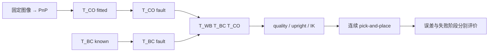

# S13.4 — Pose / Extrinsic 误差传播与失败阶段

[代码](../examples/14_vision_manipulation/perception_noise.py) ·
[示例入口](../examples/14_vision_manipulation/README.md#s134--perception-noise) ·
[状态唯一来源](../README.md#stage-13--vision-based-manipulation)。
前置：[Frame](15_robot_perception_geometry.md)、[S13.3b 完整取放](16_3b_vision_pick_place.md)。
建议用时 1～2h。本课只学习**误差注入位置、frame 与旋转中心怎样影响目标及任务结果**。

## Problem → Why

已有视觉取放能执行一个固定case，但“pose误差4 mm”或“外参误差1°”不够描述风险。
必须说明误差在哪个frame、旋转绕哪里、哪些其他量固定，才能预测末端目标怎么移动。
本课比较单一误差来源，区分raw pose、tracking、final placement与failure stage。

## Intuition

平移误差像把目标在指定坐标轴上推一下；camera x与base x未必同向。
旋转误差像绕某个支点转动：距离支点越远，位置偏移可能越大。
坐标传播是连续的，但“upright通过/拒绝”“能否接触物体”是离散且非线性的。



## Core Concepts — 实验边界

- 同一图像、同一metric rig、K/d、物体场景、机器人、controller、close target、destination。
  baseline图像仍有0.2 px固定seed扰动与像素取整；baseline不是零误差truth。
- 一次只改变T_CO或T_BC。`--scale`统一缩放指定的平移长度/旋转角，
  不改变baseline图像、估计器、门限、摩擦或控制速度。
- 本课是**拟合后的确定性fault injection**，不是pixel-noise sweep、随机协方差模型或Monte Carlo。
  不重新标定、重做hand-eye，也不训练detector；S13.5才做repeated-trial evaluation。
- 真实T_WC不动，image不变；外参case只改变consumer使用的T_BC。
  T_WO truth只用于producer/scorer，planner只收到扰动后estimate。
- 每case独立execution MjData，从home开始，复用S13.3b所有物理判据。
  编译model共享但不修改；没有复用上一个case的held状态或失败状态。

**质量字段的重要边界**：pose fault在原始PnP fit之后注入，packet仍携带原fit的reported RMS。
这故意模拟post-fit pose/packet误差；reported RMS不是扰动pose对原pixels的重新拟合质量。
脚本另存`pose_diagnostic_rms_px`，用实际扰动T_CO重新投影原pixels；
pose平移/yaw的诊断RMS会上升，不能称它们仍以0.353 px拟合原图。
外参fault不改变T_CO，因此camera reprojection诊断也不变，world target却可以大幅移动。
这是metadata检查边界实验，不建议正常producer隐瞒输出pose与拟合残差的不一致。

## Mathematics — 意义 / Shape / Unit / Frame

| 量 | shape | 单位 / frame |
| --- | --- | --- |
| T_CO / T_BC / T_WB | (4,4) | O→optical C / C→base B / B→world W；translation m |
| δt_C / δt_B | (3,) | 在camera/base轴上表达的origin-coordinate偏移，m |
| δtheta | (3,) | axis-angle旋转向量，rad，轴所在frame必须声明 |
| p_CO / p_BO | (3,) | object origin在camera/base的位置，m |
| raw error / injected shift | scalar或(3,) | 相对truth的误差 / 相对baseline的新增偏移，m |

```text
p_WO = R_WB (R_BC p_CO + t_BC) + t_WB
```

**Camera-frame pose translation**（仅改变t_CO）：

```text
t_CO' = t_CO + δt_C
δp_WO = R_WB R_BC δt_C
```

**Base-frame extrinsic translation**（仅改变t_BC）：

```text
t_BC' = t_BC + δt_B
δp_WO = R_WB δt_B
```

两者长度均保留，但方向不同。本机实际R_WB=diag(−1,−1,1)，
R_WC=diag(1,−1,−1)，故camera x +4 mm→world x +4 mm，base x +4 mm→world x −4 mm。

**Object-origin pose rotation**：右乘只旋转object局部轴，object origin不移动：

```text
T_CO' = T_CO Delta_O,  Delta_O=[DeltaR_O,0]
δp_WO(origin) = 0
δp_W(test point) = R_WC R_CO (DeltaR_O-I) p_O
```

所以origin translation error不变不代表orientation或非原点landmark误差不变。
本课yaw轴为object z，top-down 35 mm tool offset也沿object z，故该offset不产生yaw lever shift。

**Base-origin extrinsic rotation**：左乘旋转整个外参，包括其translation，绕B原点：

```text
T_BC' = Delta_B T_BC
δp_WO = R_WB (DeltaR_B-I) p_BO
       ≈ R_WB (δtheta_B × p_BO)
```

**Camera-origin extrinsic rotation**：右乘保留camera center的t_BC，改变camera轴：

```text
T_BC' = T_BC Delta_C
δp_WO = R_WB R_BC (DeltaR_C-I) p_CO
       ≈ R_WC (δtheta_C × p_CO)
```

这是不同的旋转参数化/支点，不可将两个case理解成同一个“orientation-only误差”。
小角近似要求theta以rad计；rad×m得到m。平行旋转轴的分量不贡献位置偏移。
对绕z的base yaw，rho=||p_BO[:2]||，精确偏移长度为`2 rho |sin(theta/2)|`。
默认rho约0.492 m、theta=1°，shift约8.584 mm；只用“1°很小”判断风险会遗漏lever arm。

总误差是向量叠加：

```text
e_case_W = e_baseline_W + δp_WO
```

`||e_case||`不等于`||e_baseline||+||δp||`。
scale减半使平移injected shift减半，但不必使总truth error或final placement error减半。
旋转精确偏移随sin变化；小角下近似线性。

## Math-to-Code 与 APIs

`perturb`复制并验证SE(3)，显式选择translation frame或左/右乘旋转。
`cv2.Rodrigues`输入(3,) axis-angle向量[rad]，返回(3,3) R与Jacobian；
它不是Euler-angle转换，且不原地修改T。组合后用`checked_transform`验证proper rotation。
`predicted_origin_shift`使用独立的point propagation表达式，与矩阵链的实测shift比较。

`map_estimate`沿用packet/frame/time/quality检查，返回新的T_BO/T_WO；
`upright_estimate`沿用5° tilt gate，保留xyz/yaw；`plan_motion`用私有data生成reference。
`run_pipeline`原样复用close/lift/transfer/support/release/retreat；
`MjData`每case重新分配，`mj_step`连续积分，`mj_forward`更新缓存，不重置执行状态。
物体relative offset仍只进入scorer，不用于放置target。

API详情见[S13.3a](16_3a_vision_to_motion.md#math-to-code-与-apis)、
[S13.3b](16_3b_vision_pick_place.md#math-to-code-与-api)；PnP方向见
[OpenCV官方说明](https://docs.opencv.org/4.x/d5/d1f/calib3d_solvePnP.html)。

## Minimal Experiment

NumPy、MuJoCo、Menagerie、Matplotlib、opencv-python-headless已在requirements声明。
无需新增依赖、前课产物、renderer、GUI、Torch或RL。

```bash
conda activate mujoco
pwd
echo $CONDA_DEFAULT_ENV
which python
python examples/14_vision_manipulation/perception_noise.py
python examples/14_vision_manipulation/perception_noise.py --scale 0.5
```

| case | scale=1注入 | frame / pivot |
| --- | --- | --- |
| baseline | 无新增fault | 原始带量化/噪声的PnP结果 |
| pose_translation_C | +4 mm x | camera translation |
| extrinsic_translation_B | +4 mm x | base translation |
| pose_yaw_O | +3° z | T_CO右乘，object origin |
| extrinsic_yaw_B | +1° z | T_BC左乘，base origin，旋转t_BC与R_BC |
| pose_large_y_C | +40 mm y | camera translation |
| extrinsic_tilt_C | +6° x | T_BC右乘，camera origin，t_BC不变 |

输出ignored `tmp/s13_4_noise_scale*/`：root summary.json / comparison.csv / comparison.png / landmarks.png；
各case另有summary.json / pipeline.npz / trace.csv与有执行时的pipeline.png。
pre-execution拒绝仍保存geometry，但trace为空，不生成grasp/reference或final结果。
失败有partial trace，missing final error不是0。重复参数覆盖同目录，以当次summary为准。

实验进程退出0表示baseline通过且全部case完成评价，不代表每case取放成功。
baseline失败退出1；CLI scale nan/negative/>2退出2。

## Expected / Actual Result

2026-10-06，Zero / WSL2 Ubuntu24.04.5 kernel6.18.33.2；Python3.12.14，
NumPy2.5.3、MuJoCo3.13.0、Menagerie2026.9.2、Matplotlib3.11.2、OpenCV distribution4.14.0.94。
required distributions/import paths/API现场核验，无安装/新依赖；3.11兼容目标未执行。

| case | raw t error mm (scale1) | final error mm / outcome (scale1) | final error mm / outcome (scale.5) |
| --- | --- | --- | --- |
| baseline | 3.978 | .714 / pass | .714 / pass |
| pose_translation_C | 5.893 | .717 / pass | .715 / pass |
| extrinsic_translation_B | 5.377 | .715 / pass | .715 / pass |
| pose_yaw_O | 3.978 | .769 / pass | .720 / pass |
| extrinsic_yaw_B | 9.900 | 5.000 / pass | 2.746 / pass |
| pose_large_y_C | 40.885 | close failure，无final | 6.227 / pass |
| extrinsic_tilt_C | 80.976 | upright rejected，无execution | close failure，无final |

两命令均exit0。默认extrinsic_yaw_B新增origin shift=8.583909 mm；
extrinsic_tilt_C新增shift=80.860065 mm，raw tilt=6.422181°，在5° prior gate拒绝。
scale.5时tilt=3.429361°，prior通过但目标偏移仍很大，在close失败。
两组close failure均time11.5 s / 5750 steps；默认upright rejection time0 / empty trace。

所有reported fit RMS=.353150 px。
默认pose_translation_C / pose_yaw_O / pose_large_y_C的diagnostic RMS分别
2.951576 / 2.458744 / 30.352346 px；外参cases diagnostic RMS仍.353150 px。
独立核对CSV/NPZ、14case frame chains/actual clock/原始输入一致性/重新投影、
基于sin/cos的yaw传播与lever-arm长度、±world x方向、final误差重算；
zero-amplitude/input-output isolation与非法CLI检查通过。默认comparison PNG已目视检查。
本次没有GUI、真实图像、重标定、随机trials、广泛robustness或硬件验证。

## Explanation

两个+4 mm平移case的injected shift同长却反向；raw total error不同，因为baseline已有偏差。
pose yaw只改变object orientation，origin误差不变。外参旋转则会通过指定pivot改变origin坐标。

小偏移的final error没有按raw error放大：destination是任务指令，闭爪可以重新居中，
地面支撑约束高度，最终结果还受接触/滑移影响。这不能证明视觉或外参精确。
20 mm横向pose shift仍可夹住并通过15 mm放置门限，40 mm则无法建立close；
两个结果只描述当前gripper/box/policy，不能推成通用可容忍误差。

scale减半可让原本upright拒绝变成close失败：通过几何先验并不保证可抓取。
接触反馈能阻止未抓住就lift，却不会自动修复未知外参误差。

## Failure Cases

- 同时扰动pose与extrinsic：可能叠加或抵消，本课刻意不混合，避免无法归因。
- 忘记frame/左右乘/pivot：得到合法SE(3)但物理含义错误。
- 用reported RMS冒充post-fault拟合质量：pose case的独立diagnostic可揭示不一致；
  camera reprojection本身无法验证robot-camera外参。
- 只看origin t error：会遗漏rotation与非原点几何误差。
- 把empty/partial trace或missing final result填0：会把拒绝/失败伪装成高精度。
- 从一次成功推断容差或success rate：本课只有确定性case，不是统计评价。

## Robotics Context

机器人定位链上，camera坐标误差与安装/hand-eye外参误差的传播不同。
外参旋转尤其会随作用点到pivot的距离产生位置误差；CPU几何分析能先发现这个风险。
实际部署还需要多视角、真实sensor、标定不确定性、故障检测和系统性trial评价。
下一任务S13.5才扩展固定seeds与小范围场景变化。

## Interview Capsule

**30秒**：我固定图像与完整取放系统，分别注入post-fit pose和extrinsic误差。
显式定义frame与rotation pivot，用精确坐标链和独立point公式核对world shift，
分别报告raw pose、tracking、placement和failure stage；不把低RMS或一次成功当鲁棒性。

**2分钟**：先写T_WO=T_WB T_BC T_CO，解释pose translation乘R_WC、extrinsic translation乘R_WB。
再说明右乘object yaw保持origin、左乘base rotation旋转外参translation，右乘camera rotation保持camera center。
使用delta theta×lever arm的小角近似与精确sin公式预测位置偏移。
基线已有PnP噪声，因此total error是向量叠加；quality metadata与post-fault diagnostic分开。
随后用同一IK/controller/contact gates运行独立case：upright拒绝与close失败没有final误差。
最后解释接触/地面约束造成final error非线性，不声称case成功比例是统计success rate。

## Must Remember

Frame、左/右乘、pivot是误差定义的一部分。
角度小不一定position shift小；raw pose、injected shift、tracking与final error不可混用。
检查通过、任务成功、鲁棒性是不同层次，缺失结果不可记为零误差。

## My Verification — Run / Modify / Explain

Engineering见根README；Learning只由本人确认，三项保持未勾选。

**Run**：执行默认命令，查看comparison.csv/png，找到两个不同失败阶段及原始/诊断RMS。

**Modify**：先预测scale1→.5对两个translation shifts、1° yaw lever shift、tilt gate与任务结果的影响，
再运行第二条命令；区分可以由geometry精确预测的量与需要实验判断的接触结果。

**Explain（五问）**：

1. camera x与base x各+4 mm为何在world中反向？为什么raw total error不等于injected shift？
2. 为什么object-origin yaw不移动object origin，而base-origin外参yaw会？左右乘各代表什么？
3. 1°怎样在约0.492 m lever arm上产生约8.584 mm shift？角度单位与垂直分量怎样影响结果？
4. reported fit RMS与post-fault diagnostic RMS有什么区别？为何extrinsic fault不改变camera reprojection？
5. 为什么scale减半能把upright rejection变成close failure？为何final error小也不能证明视觉精确或系统鲁棒？

本课工程完成后停止，不自动实现S13.5。
