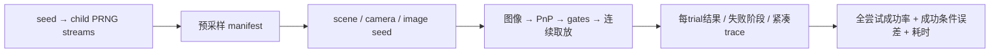

# S13.5 — 固定 Seeds 的重复试验与失败统计

[代码](../examples/14_vision_manipulation/repeated_trials.py) ·
[运行入口](../examples/14_vision_manipulation/README.md#s135--repeated-trial-evaluation) ·
[Engineering / Learning 状态](../README.md#stage-13--vision-based-manipulation)。
前置：[完整取放](16_3b_vision_pick_place.md)、[误差传播](16_4_perception_noise.md)。
建议用时1～2h。主要概念：**评价整个试验分布，不能只汇总成功样本的精度**。

## Problem → Why

一个固定场景成功、几组人为fault对照，都不足以评价一个操作pipeline。
本课从明确的小范围分布采样场景，记录每次尝试的结果、首先失败的阶段、误差和时间。
工程完成表示统计与证据链可用，不表示取放系统已普遍鲁棒。

## Intuition

把每个trial当作同一道考试的独立题目：失败也要交卷，不能从分母删除。
只看及格者的平均分会遗漏“多数题目根本没做完”。
固定seed让题目可复现；改变噪声时保留题目，才能判断差异来自噪声还是场景。



## Core Concepts — 测试分布与边界

| 量 | 采样 / 固定 | shape / unit / frame |
| --- | --- | --- |
| object center | [−.45,.20,.03]，xy各独立Uniform±.005 | (3,)，m，world |
| camera center | [−.35,.10,.80]，xyz各独立Uniform±.020 | (3,)，m，world |
| camera rotation | diag(1,−1,−1)，固定向下 | (3,3)，optical→world |
| object yaw / size | 0° / 40×30×60 mm | 固定upright box |
| image noise | Gaussian per-coordinate sigma，默认.2 px | (12,2)，pixel；取整后画圆 |
| image seed | 每trial独立uint32 seed | child stream采样，与场景一同保存 |
| mass / friction / close | .05 kg / 2.0 / .005 m per finger | 固定，不开展物理domain randomization |
| K/d、外参 | 已知、准确；外参跟随采样的真实camera pose更新 | 不注入S13.4的额外calibration fault |

这是camera位置/观测视点变化，不是camera orientation sweep。没有改变真实物体yaw。
root seed默认20261006，N默认8；CLI支持N=1～32，noise=.0～1.0 px。
每trial重新编译模型、分配execution data，从home开始，不共享held状态或轨迹。

**Truth边界**：真实场景用于生成image、初始化物理世界与scorer。
目标仍由PnP estimate→frame mapping→upright prior→候选生成得到；不将sampled object xy直接当IK target。
放置仍用nominal T_OG与commanded destination，不用真实held offset修正。
reference contact检查使用仿真模型的真实场景几何，属于oracle验证；
这不是通过真实视觉建立的collision map，也不能证明真实机器人已有同样的碰撞观测能力。

Detector仍是严格color-ID/13-pixel圆盘检查；本课不会挑掉难视点、修复失败场景或降低门限。
所有S13.3b的tracking、contact、lift、support、placement判据保持原样。

## Mathematics — 统计的分母与条件

令Y_i为trial i是否完成全部取放判据，成功为1，失败为0：

```text
N = 全部完成评价的attempts，包括detector/quality/IK/实际执行失败
k = sum(Y_i)
p_hat = k/N
mean_success_error = sum(e_i for Y_i=1)/k
```

成功条件平均误差不是全部attempts的精度。若k=0，该统计为null，不能填0。
PnP pose error只汇总有有效PnP输出的trial，并保留其count；
即使consumer随后拒绝quality，scorer也记录该PnP误差，不把它伪装成usable pose。
没有PnP输出的detector失败不具有pose error。

小N下报告名义95% Wilson区间（z=1.959964）：

```text
D = 1 + z²/N
center = (p_hat + z²/(2N))/D
radius = z sqrt(p_hat(1-p_hat)/N + z²/(4N²))/D
interval = [center-radius, center+radius]
```

公式来源：[NIST Wilson interval](https://www.itl.nist.gov/div898/handbook/prc/section2/prc241.htm)。
解释以从声明分布独立采样的Bernoulli结果为假设；这是名义score interval，不是精确binomial interval，
也不是“真实成功率有95%概率在这次区间内”的后验概率。
范围改变、相关trial或model错误都不能靠这个区间修复。
本课6/8的区间约[40.93%,92.85%]，不会仅凭75%样本比例断言可靠性。

时间必须分开：

```text
simulation_time_s = data.time，失败前实际积分的虚拟时间
algorithm_wall_s = perf_counter_end - perf_counter_start，本机真实耗时
```

Wall范围包含trial初始化、编译、image生成/PNG保存、感知、规划、执行与scoring；
不包括末尾紧凑trace、JSON/CSV和dashboard导出。不是纯physics benchmark。
早期拒绝往往更快；混合所有trial的mean变小，不代表成功取放执行更快。

## Math-to-Code 与 API

- `np.random.SeedSequence(seed).spawn(N)`返回N个child seed sequences；
  `default_rng(child)`构造各trial的Generator，`uniform(low,high,size)`返回指定shape的样本。
  新建同root seed时，增加N保留原trial前缀；noise sigma不参与场景抽样。
- 每个image seed控制观测点高斯扰动；`make_image(...,seed=...)`增加可选参数，
  旧的默认20261006保持不变，前课两参数调用的图像逐字节一致。
- `time.perf_counter()`返回单调clock读数[s]，求差计wall duration；不修改simulation time。
- `Counter`统计每个失败phase；`aggregate`统一使用全部attempts的分母，
  `stats`对空组返回None，JSON保存为null。
- `MjModel/MjData`、PnP、frame链、`mj_forward/mj_step/mj_contactForce`沿用前课；
  `run_pipeline`执行器未改，详见[S13.3b API](16_3b_vision_pick_place.md#math-to-code-与-api)。

预采样manifest在执行之前保存。感知/IK/task ValueError、RuntimeError与cv2.error记为trial failure；
import、文件系统、程序错误等基础设施失败会终止进程，不能算成“正常完成全部trial”。

## Minimal Experiment

所需NumPy、MuJoCo、Menagerie、Matplotlib、OpenCV headless均已声明，无新依赖。
无需前课输出、renderer、GUI或RL。

```bash
conda activate mujoco
pwd
echo $CONDA_DEFAULT_ENV
which python
python examples/14_vision_manipulation/repeated_trials.py
python examples/14_vision_manipulation/repeated_trials.py --noise-px 0.8
python examples/14_vision_manipulation/repeated_trials.py --seed 7
```

前两命令是配对noise对照：object/camera/image seeds相同，噪声幅度不同。
第三条产生另一批场景，用来观察小样本估计变化，不能直接将逐trial差异归因于噪声。

输出ignored `tmp/s13_5_trials_seed*_n*_noise*/`：manifest.json、summary.json、trials.csv、trials.png；
每trial有landmarks.png、summary.json与压缩trial.npz。
NPZ保存约每25个physics steps的trace，加上阶段边界两侧与最后一步；
`sample_indices`是原始step的零基索引，time=(index+1)*.002。
full_step_count与阶段指标基于完整trace，不用稀疏trace重新计算bilateral fraction或证明连续无碰撞。
三组工程产物共约1.6 MB，未保存大规模full-resolution CSV。

进程exit0与COMPLETE表示全批评价完成，不表示全trial取放成功；非法CLI退出2。
重复参数覆盖同目录；若中途异常/中断，manifest不能证明已完成全部trial，旧summary不能充当本次结果。
只使用当次完整结束的报告，并核对attempted与requested N。

## Expected / Actual Result

2026-10-06，机器Zero，WSL2 Ubuntu24.04.5/kernel6.18.33.2；Python3.12.14，
NumPy2.5.3、MuJoCo3.13.0、Menagerie2026.9.2、Matplotlib3.11.2、OpenCV distribution4.14.0.94。
required versions/import paths现场核验，无安装/新依赖；3.11兼容目标未执行。

| seed / noise px | success | nominal95% Wilson | successful error mean/max mm | failure phases |
| --- | --- | --- | --- | --- |
| 20261006 / .2 | 6/8 = 75% | 40.93～92.85% | .735565 / .819936 | grasp_hold×2 |
| 7 / .2 | 2/8 = 25% | 7.15～59.07% | .695762 / .704416 | detector×5、grasp_hold×1 |
| 20261006 / .8 | 2/8 = 25% | 7.15～59.07% | .694290 / .699436 | mapping×2、planning×2、detector×2 |

三命令均exit0，无import error；不是24次全部操作成功。
默认PnP t error mean=1.352497 mm（count8）；seed7=2.607501 mm（count3）；
noise.8=4.353447 mm（count6，包含后来quality拒绝的有效PnP）。
只有有输出的样本才可统计其误差，但成功率分母始终为8。

| seed / noise | all wall mean s | success wall mean s | failure wall mean s |
| --- | --- | --- | --- |
| 20261006 / .2 | 4.360 | 5.028 | 2.357 |
| 7 / .2 | 1.510 | 4.611 | .477 |
| 20261006 / .8 | 1.370 | 4.615 | .288 |

这些是本机当次clock观测，不是跨机器速度或稳定throughput保证。
默认相同seed重复执行的status、phase、物理stage metrics与sim time逐项相同，wall time不同。

独立核对24trial manifest/CSV/NPZ、image重建、sample indices/time、frame/pose/final error、
分母与failure counts；Wilson与独立score二次方程roots一致。
prefix稳定、配对manifest一致、旧image默认逐字节一致、零成功/零失败组null与非法CLI检查通过。
默认dashboard PNG已目视检查；未运行GUI、真实相机或硬件验证。

## Explanation 与 Failure Analysis

默认6次成功都有亚毫米最终误差，但2次真实失败不能从总体评价删掉。
noise.8的success条件均值更小，却只有2次成功；这是保留下来的样本子集，不能据此说精度改善。
seed7暴露更多detector失败，说明单个seed与小N难以代表整个允许范围。

**Detector**：保存图像的独立component检查发现圆盘面积10/11 px，低于要求13 px。
视点与raster noise改变点的投影间距，圆盘重叠导致后绘制颜色覆盖先前颜色；
严格toy detector拒绝有损身份。没有实际illumination、opaque-object occlusion或真实相机成像验证。

**Grasp hold**：默认trial4/7的estimated object z分别27.935477/27.749470 mm，
低于真实初始30 mm；名义finger下边缘只有约2 mm净空，因此小的负向z误差也能触发地面接触。
从最后arm状态独立FK重算left finger bottom，得到负z，支持日志中的finger-ground failure。
不加入允许列表、不自动抬高target或补偿truth；本课保留失败供评价。

**Mapping / planning**：noise.8有两次RMS超门限，在执行前拒绝；另两次sampled reference contact拒绝。
前者不具有usable consumer pose，scorer保存的PnP diagnostic pose仅用于评价；后者time=0，不是runtime grasp failure。

## Robotics Context

同样的控制器在某一视点成功，并不能覆盖整个允许工作区。
日志应支持把失败定位到观测、质量检查、路径或实际接触阶段，才能选择下一项工程改进。
本课只评价当前小范围synthetic pipeline；没有调参挑选seed、扩大扰动或实现新的避障算法。
Stage14规划仍是后续任务，需本人明确请求。

## Interview Capsule

**30秒**：我用root seed生成独立trial场景与image seeds，从home完整执行视觉取放。
统计所有attempts的成功率、失败phase、成功条件误差与wall/sim time；保存manifest和紧凑trace，
通过同seed复现与配对noise对照验证结果。75%只描述当前8trial，不代表普遍鲁棒。

**2分钟**：先说明范围：object xy±5 mm、camera xyz±20 mm、准确外参、固定mass/friction/controls。
SeedSequence保留可复现前缀，noise变更不重抽场景。
truth只生成scene/observation与评价，target来自PnP；碰撞验证使用simulator oracle geometry。
每trial独立状态，异常按第一失败phase归类，import/文件系统故障不伪装成task failure。
成功率分母包含早期拒绝，final error只对成功组统计，空组null并记录count。
Wilson区间展示小N的不确定性；wall包括编译/感知/执行，失败更早会拉低总体mean。
最后用image覆盖与pad-ground几何证据解释失败，不通过删除坏trial制造高成功率。

## Must Remember

成功率、成功条件精度和时间是三个不同指标。
固定seed复现物理输入与结果，不固定操作系统耗时。
失败的缺失误差不是0；子集均值与小N结果不能替代总体鲁棒性。

## My Verification — Run / Modify / Explain

Engineering与Learning状态见根README；本人已确认Run/Modify/Explain，Learning Mastered。

**Run**：运行默认命令，检查6/8、两个失败trial的phase，以及dashboard中的成功子集误差。

**Modify**：先预测`.2→.8 px`对RMS、失败阶段、成功率与条件误差均值的影响，再运行配对noise命令。
不必预测确切失败数；判断哪类结论需要实验。

**Explain（五问）**：

1. 成功率分母为什么包含detector与quality失败？为什么缺失final error不能填0？
2. 为什么2/8组的成功条件均值比6/8更小，不能说明整体精度改善？
3. 固定seed、增加trial数量和配对noise修改分别固定了什么？为什么wall time不能逐项复现？
4. 为什么6/8不能证明普遍75%成功率？Wilson区间的含义与适用范围是什么？
5. 图像标记覆盖、quality拒绝、reference contact和实际finger-ground failure分别需要什么证据？

本课工程完成后停止，不自动实现Stage14。

### 本人学习验证（2026-10-06）

本人明确确认实验与预测完成，并回答五项Explain：end-to-end成功率包含安全拒绝，
成功条件误差具有selection bias，固定seed与paired noise控制随机输入而非wall time，
8trial比例不能外推为普遍成功率，以及image/metric/reference/actual contact证据必须分开。
Run/Modify/Explain全部确认，Learning Mastered。

精度补充：本课paired noise固定scene与image seed，所以底层Gaussian realization也相同，
只改变sigma；pixel取整/覆盖以及后续gate/contact结果仍可非线性变化。
同seed复现以本课记录的代码、依赖版本和参数为条件，不保证跨环境逐bit一致。
Stage13学习项均完成，下一小任务为S14.1；本次仅同步文档，未重跑仿真/GUI，
runtime证据沿用2026-10-06工程验证，不自动实现Stage14。
