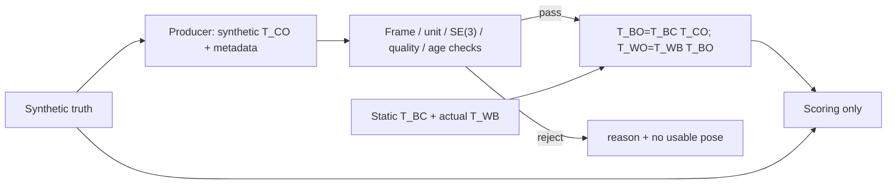

# Stage 13 — Vision-Based Manipulation

当前实现 **S13.1 — Perception Pose→Base→World**，约 1～2h。
[代码](../examples/14_vision_manipulation/perception_pose.py) ·
[示例 README](../examples/14_vision_manipulation/README.md) ·
[状态唯一来源](../README.md#stage-13--vision-based-manipulation)。
S13.2 [Grasp Pose Generation](16_2_grasp_pose_generation.md) 工程完成；S13.3a [Vision-to-Motion](16_3a_vision_to_motion.md) Engineering Complete + Learning Mastered；S13.3b [完整视觉取放](16_3b_vision_pick_place.md) Engineering Complete，Learning Mastered；S13.4 [误差传播](16_4_perception_noise.md) Engineering Complete + Learning Mastered；S13.5 [重复试验评价](16_5_repeated_trials.md) Engineering Complete、Learning待本人验证；Stage14起仍是路线。前置：[Frame](15_robot_perception_geometry.md)、
[PnP](15_5_pnp_pose.md)、[Hand-eye](15_8b_hand_eye_calibration.md)。

## Problem → Why

Perception 已报告 object 在 camera 中的位姿，但既有机器人 IK 接口使用 world-frame pose。
怎样在明确 frame/单位/质量的前提下转换，同时拒绝坏结果、不把 simulator truth 偷传给消费端？
本课建立最小消费接口，后课才产生抓取候选和执行运动。

## Intuition → Core Concepts

同一个物体在 camera/base/world 中有不同坐标，转换是在改表达，不是在改善估计精度。
先核对观察“说的是什么、多久以前、是否有效”，再做矩阵乘法。
拒绝不是“用 truth 顶上”或“沿用旧位姿继续执行”：本课返回拒绝原因，不提供可用 pose。

使用普通 dict，不引入框架、ROS、消息总线或通用 perception class。
**Synthetic producer** 读取 truth 合成一个有固定误差的 packet；**consumer** 只接 packet、
T_BC/T_WB 和质量策略；**scorer** 在转换后才读取 truth 计算误差。
这是接口隔离实验，不是实际图像估计精度测试，也不声称 packet 来自 PnP。



## Packet / Core Concepts

| 字段/输入 | shape / unit / frame / meaning |
| --- | --- |
| pose | `(4,4)` SE(3)，T_CO；object→optical camera；R 无量纲、t m |
| from_frame / to_frame | 必须为 `object` / `camera_optical` |
| length_unit | 必须 `m`；不自动猜测或换算 mm |
| valid | producer 明确 True；不是 consumer 判定的准确性 |
| timestamp_s / now_s | finite scalar，s；同一 caller-defined clock，非混用 wall/sim time |
| reprojection_rms_px | finite scalar≥0，pixel；本课合成质量字段，不重新计算 projection |
| correspondence_count | integer≥6；本课接口策略，不是 PnP 的普适最小点数定理 |
| all_points_positive_depth | producer True，假定已检查观测点；consumer 没有原始 points 可复核 |
| T_BC | `(4,4)`；光学 camera→base，可信静态外参，米制 |
| T_WB | `(4,4)`；base→world，从 actual MuJoCo body cache 读取 |
| result T_BO / T_WO | 新 `(4,4)` 数组；object→base / world；不修改 packet 或 model/data |

本课 T_BC 为精确已知的合成静态外参，不读取或重新估计 S12.8b 的标定产物。
本课限定固定相机与静态 base 的 eye-to-hand 场景；eye-in-hand 需要观测时刻的
T_BG(t) 与 T_GC 配套，不能直接用当前 robot pose 混合旧观测。
光学 frame 为 x right、y down、z forward，不是直接复制 MuJoCo rendering camera 的轴。
metadata 是 producer 的声明：consumer 无法验证其真实性、单位有没有偷偷写错、时钟是否同步，
也不判断相机外参是否真正标定准确。

## Mathematics：Pose / Point / Error

`T_AB` 将 B 中的列向量坐标映到 A。按 frame 下标连续相消：

```text
T_BO = T_BC T_CO
T_WO = T_WB T_BO = T_WB T_BC T_CO
R_WO = R_WB R_BC R_CO
t_WO = R_WB (R_BC t_CO+t_BC)+t_WB
p_W = T_WO [p_O;1]
row point arrays: points_W = points_O @ R_WO.T + t_WO
```

T_WO 是物体**完整坐标系**在 world 中的位姿，不是 gripper target；S13.2 才加入 T_OG。
translation 是 source 原点的位置；非原点物体点必须同时考虑 orientation。
同原点不等于同坐标系：本模型实测 R_WB=diag(−1,−1,1)、t_WB=0。
代码读取实际 cache，而不将此历史约定写死在 consumer。

固定且精确的 extrinsics 下，object origin 的误差满足：

```text
delta t_W = R_WB R_BC delta t_C
||delta t_W|| = ||delta t_C||     # 两个旋转都正交
```

只改变坐标表达，3.74 mm 误差不会因转换而消失。
物体 orientation 的角度误差也在共同左旋转下保持；非原点点误差还包含 rotation lever arm。
外参有误差时上述等式不再描述全部误差；本课不开展 S13.4 的完整扰动研究。

## Math-to-Code / APIs

`map_estimate(packet,T_BC,T_WB,now_s,...)` 返回 dict，含 T_BO/T_WO、age 与 reported RMS；
任何必要检查失败抛 `ValueError`。调用方捕获后只记录 reason/null，不用 truth/上次 estimate 回退。
接口没有 truth 参数，不读取 simulator object state，不产生 ctrl、qpos 或 IK target。

依次检查：required fields、valid、frame、unit、time、RMS/count/depth、pose 的 SE(3)、
object origin positive optical Z、两套外参的 SE(3)。SE(3) 检查包含 shape、finite、
bottom row、R.T R≈I、det≈+1（atol=1e-8，rtol=0），不静默 SVD 修复 malformed input。
本课 object 原点选在目标中心并在前方；不是任意物体 frame 原点的通用假设。

```python
T_BO = checked_transform(T_BC, 'T_BC') @ checked_transform(packet['pose'], 'T_CO')
T_WO = checked_transform(T_WB, 'T_WB') @ T_BO
```

`mujoco_menagerie.load('universal_robots_ur5e')` 返回 compiled `MjModel`，可能首次下载模型到用户缓存。
`mujoco.MjData(model)` 创建匹配的状态/cache；`mujoco.mj_forward(model,data)` 原地刷新，
返回 None，不推进 simulation time。
`model.body('base').id` 返回 body index；`data.xpos[id]` 为 world position `(3,)` m，
`data.xmat[id]` 为 flattened world rotation `(9,)`，reshape `(3,3)` 后读取轴方向。
必须 copy cache，避免持有随未来仿真变化的 view。
API 的共享数组语义可核对 [MuJoCo 官方 Python 文档](https://mujoco.readthedocs.io/en/stable/python.html)。
本课没有 `mj_step`，time=0，也没有 joint/cartesian motion。

质量策略：默认 `0<=now-timestamp<=0.2 s`，RMS≤1 px、count≥6，positive depth。
数值只是当前教学策略，不是已验证真实相机/机器人安全门限。
以第一个失败项作为 reason；收紧 RMS 后，部分坏 pose 会先被 RMS 拒绝，不能称每个 guard 都再次执行。

## Minimal Experiment / Run → Modify

从仓库根目录：

```bash
conda activate mujoco
pwd
echo $CONDA_DEFAULT_ENV
which python
python examples/14_vision_manipulation/perception_pose.py
python examples/14_vision_manipulation/perception_pose.py --rms-limit-px 0.3
```

Fixed camera world pose=[−0.35,0.10,0.80] m，optical rotation diag(1,−1,−1)。
object truth 为 Rz(15°)、p_W=[−0.45,0.20,0.03] m。
Synthetic estimate 将 optical rotation 左乘 Rz(0.8°)，translation 添加 [0.002,−0.001,0.003] m；
packet reported RMS=0.6 px、12 correspondences、stamp=9.95 s、now=10 s。
reported RMS 与所注入 pose error 是独立指定的接口数据，不是物理一致的 PnP noise 模型。

16 个 case：nominal、biased_low_rms，以及 valid/frame/unit/time/RMS/count/depth/
finite/shape/reflection/missing field 等拒绝对照。
biased_low_rms 保留同样 metadata，但另加 camera x +0.03 m，展示 quality pass 的能力边界。

输出 ignored `tmp/s13_1_pose_rms*/`：summary.json、decisions.csv、poses.npz、frame_mapping.png。
NPZ 存已接受的 world poses 与合成输入/truth，拒绝样本无输出 pose。
PNG 是 XY 投影，不显示 Z/rotation；truth 星号仅评分，不是控制输入。

**Run**：运行默认，检查 actual T_WB、接受/拒绝原因、T_CO→T_BO→T_WO 与 biased case。
**Modify**：先预测 RMS 门限 1→0.3 px 对接受数、输出 pose 和错误案例的影响，再运行第二条命令。
注意更严格 gate 是拒绝更多结果，不是改进任何已生成的 estimate；没有 pose 时不能填写“误差=0”。

## Expected / Actual Result → Explanation

2026-10-05，机器标识 `Zero`，WSL2 kernel 6.18.33.2、Ubuntu 24.04.5。
从 base 激活本机 conda 的 mujoco，同执行 shell 核验
`/home/lucas/miniconda3/envs/mujoco/bin/python`；Python 3.12.14。
所需 distribution versions / imports / module paths 已核验：NumPy 2.5.3、MuJoCo **3.13.0**、
Menagerie 2026.9.2、Matplotlib 3.11.2；声明未设这些包的版本范围，未安装新依赖。
OpenCV 非本课依赖，未核验其当前状态。Python 3.11 为兼容目标，未在 3.11 执行。

默认与 Modify 命令退出 0，无 import error；实际 T_WB axes xy 反向、同原点。

| 结果 | RMS limit=1 px | limit=0.3 px |
| --- | --- | --- |
| accepted / rejected | 2 / 14 | 0 / 16 |
| nominal world p m | [−0.448,0.201,0.027] | 无可用 pose |
| nominal t error | 0.003741657 m | 未定义，不是 0 |
| nominal R error | 0.8° | 未定义 |
| biased low-RMS t error | 0.032155870 m，仍通过 | 被拒绝 |
| base pose 当 world 的 t error | 0.983470386 m | 同样的错误演示，仅评分 |

拒绝 high-RMS 不保证接收的低 RMS pose 准确；frame/metric labels 也不保证 producer 真实遵守。
合法 SE(3) 的 wrong convention/inverse 会通过结构检查，需要一致的 producer contract 和独立验证。
actual base axes 检查解释了 base-as-world 的符号反转，不能把 base 中正 x/y 直接当 world 正 x/y。

内置 clean chain、non-origin p_O、正常/biased/14 refusal、误差范数保持、time=0 通过。
独立核对两套 JSON/NPZ/CSV，所有 rejected T_WO=null 且 NPZ 无该输出；
直接 T_WC T_CO 与分步 world pose 一致、t errors 一致、非零原点/旋转的替代 T_WB 通过；
packet/外参未被修改、输出不共享输入内存；非法 quality/extrinsic/CLI guards 通过。
CLI nan/−1/3 px 均退出 2。CSV 包含逗号的 reason 已用 csv.writer 正确引用并核对。
默认 PNG 已目视检查；图是几何投影，不是 RGB camera photograph。
未重跑前课/P0，无 GUI、图像估计、IK、workspace/collision/grasp 或执行验证。
助手执行不计本人 Run；PASS 只表示接口工程检查通过。

## Failure Cases

| 现象 | 含义 / 处理 |
| --- | --- |
| valid=False 或 malformed pose | 拒绝，不用 truth 回填 |
| wrong frame / mm 单位 | 拒绝声明错误；隐瞒/误声明无法只靠矩阵发现 |
| stale/future/missing stamp | 拒绝；两端必须同钟，未解决 clock synchronization |
| count/RMS/depth 不符合策略 | 拒绝；阈值是教学选择，质量字段未独立复算 |
| det=−1 / R 不正交 | 非合法 rotation，拒绝而不静默修复 |
| 小 RMS 但 metric pose 偏差 | metadata/误模型/系统误差可能隐藏；增加独立几何验证 |
| object pose 当 grasp target | frame object 与 gripper 不同；S13.2 才构造 T_OG |
| base pose 当 world | consumer 接口方向错误；使用 actual T_WB |
| 动态 camera 用旧观测配当前 G | 时间错位；本课仅固定 camera，不宣称支持动态配置 |
| 门限收紧后无结果填误差 0 | 无 evidence；保持 rejected/null |

## Robotics Context

未来流程为 accepted T_WO → object-relative grasp offset → W-frame IK → motion/contact checks。
本课只提供前端可信格式和转换：quality passed、pose accurate、IK reachable、collision free、
grasp retained 是不同判据。Stage 13 后课才集成完整动作，不把接口通过当操作成功。

## Interview Capsule

**30 秒**：感知包明确 object→optical camera、米制 pose、时间与质量；先检查合法性和 freshness，
再 T_BO=T_BC T_CO、T_WO=T_WB T_BO。读取真实 base pose 避免 frame 假设；truth 仅评分，
拒绝不回填。质量门限通过不能证明绝对精度，更不证明可达或抓取成功。

**2 分钟**：定义 packet 的 frame/单位/时间/质量和 SE(3) 检查，展开 translation/rotation chain。
说明固定 extrinsic 下只是改变误差表达，actual base xy 反向造成错误 W 消费风险。
区分 producer/consumer/scorer，metadata 可信度与时钟同步未被验证；
引用 2/14→0/16 gate 对照和 biased low-RMS 32 mm 仍通过。
最后说明 map 无 model mutation/truth/ctrl，world object pose 后面还需要 grasp offset 与 IK。

## Must Remember / My Verification

- 矩阵合法与物理 frame 正确不是同一检查。
- T_CO→T_BO→T_WO；world object pose 不是 gripper target。
- 固定准确 extrinsics 下换 frame 不降低估计误差。
- 时间/质量 gate 是接口策略，不能证明 accuracy 或 execution safety。
- 拒绝无 pose、无 truth 回退；truth 只用于合成与评分。

状态仅在根 README 维护。本人于 2026-10-05 确认实验与预测均完成，并回答五项 Explain；
Run/Modify/Explain 全部确认，Learning Mastered。
本人解释覆盖 object→camera→base→world、坐标系由原点与朝向共同定义、
frame/unit/quality/time 的筛选边界、RMS 不等于 3D accuracy、收紧 gate 不改变估计、
truth 仅合成/评分，以及物体 pose 与末端目标的区别。

精度补充：完整矩阵链为 T_BO=T_BC T_CO、T_WO=T_WB T_BO。
T_WO 包含物体的位置和朝向，不仅是位置；尚需 T_OG 才构造 gripper pose。
本课 length_unit 只检查平移 m，rotation 直接是无量纲矩阵，没有 degree/radian 字段；
quality/time 是接口策略，不能独立证明 producer 的单位/frame/质量声明真实性。
拒绝回填 truth 会绕过感知失败，导致后续结果不再衡量真实 perception 输入。
本次仅同步学习反馈，runtime 沿用 2026-10-05 Zero 工程验证，未重跑实验/仿真/GUI。

**Explain**：

1. 为什么既有 world-frame 接口不能直接消费 T_CO 或 T_BO？写出正确的乘法链。
2. 本模型 base 与 world 同原点为什么仍不同？实际 cache 与写死 rotation 的区别是什么？
3. packet 的 frame/unit/quality/time 检查分别排除什么？又有什么无法验证？
4. 为什么质量通过的 biased pose 仍可能不准？门限收紧为何不是精度提升？
5. truth 在哪里使用？拒绝时为何不能回填 truth，T_WO 又为何不是 gripper target？

本课学习验证完成后 STOP；S13.2 已按后续明确请求实现，见[学习包](16_2_grasp_pose_generation.md)。
