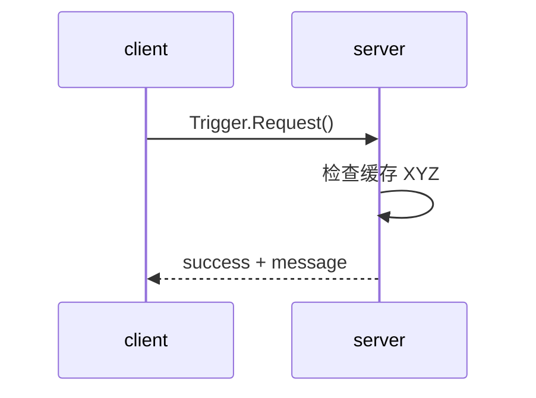

# S15.2 — Service：短请求与显式失败响应

## Problem → Why → Intuition

Topic 持续发布数据，但一次“检查当前目标位置”的调用需要有对应结果。
Service 是带类型的 request/response：client 发请求，server 处理并返回响应。
本课建立短调用、业务失败与通信超时的边界，为以后 planning service 做准备。
状态唯一来源：[根 README](../README.md#stage-15--ros2-integration)。

## Core Concepts

使用 std_srvs/Trigger：空 request → bool success + string message。
它触发检查服务端启动时配置的缓存位置，不传新 pose、不返回路径。
这不是完整 planning 接口：无姿态四元数、frame_id、timestamp、IK 或碰撞检查。
以后实际 pose/planning adapter 需要有类型的请求/响应与明确单位/frame，留到 S15.6a。



业务失败也是正常收到的 response；没有 response 则无法读取 success=False。
service discovery 成功不保证 callback 已经执行。call_async 返回 Future，executor
处理响应后 Future 才完成；调用异步 API 不会使服务端 callback 自动并行。

## Mathematics → Math-to-Code

缓存位置 p_W∈R³，shape=(3,)，单位 m，world frame。
教学 gate 是固定长方体：x,y∈[−.6,.6]m、z∈[.02,.6]m，并要求全部有限。
这是输入范围政策，不代表任何机器人可达、无碰撞或规划成功。
完整 pose 应含旋转；本课只检查平移，名称 cached_pose 是简化的教学入口。

[pose_service.py](../examples/16_ros2_integration/pose_service.py) 的 check_position
先拒绝 unavailable，再拒绝 nonfinite，最后检查闭区间；输入不变，输出(bool,str)。

| API | 输入 / 返回 / 状态变化 |
| --- | --- |
| create_service(Trigger,name,callback) | 返回 service handle；executor调用callback(request,response) |
| callback | 原地填写response.success/message，返回该response供通信层发送 |
| create_client(Trigger,name) | 返回client handle |
| wait_for_service(timeout_sec) | 返回bool，单位s，只判断发现可用服务 |
| call_async(request) | 提交请求并返回Future，不直接返回业务结果 |
| spin_until_future_complete(node,future,timeout_sec) | 调度回调并等待完成或超时；随后必须检查future.done() |
| future.result() | 完成后读取response，或抛出请求异常 |
| remove_pending_request(future) | 移除客户端本地等待记录，不取消服务端工作 |

来源：[官方 service 示例](https://raw.githubusercontent.com/ros2/examples/jazzy/rclpy/services/minimal_service/examples_rclpy_minimal_service/service_member_function.py)、
[Trigger 接口](https://raw.githubusercontent.com/ros2/common_interfaces/jazzy/std_srvs/srv/Trigger.srv)、
[rclpy Client 实现与超时语义](https://raw.githubusercontent.com/ros2/rclpy/jazzy/rclpy/rclpy/client.py)。

## Minimal Experiment

依赖：apt ros-jazzy-rclpy、ros-jazzy-std-srvs；无pip新包、无MuJoCo或本地helper imports。
两个终端都按 [S15.1 环境准备](18_ros2_integration.md#环境边界与安装方案)退出conda，
source /opt/ros/jazzy/setup.bash；本课两端统一设置：

```bash
cd /home/lucas/projects/mujoco-robotics-playground
export ROS_DOMAIN_ID=52
export ROS_AUTOMATIC_DISCOVERY_RANGE=LOCALHOST
pwd
echo "${CONDA_DEFAULT_ENV:-}"
which python3  # /usr/bin/python3
printenv ROS_DISTRO  # jazzy
```

终端 A：

```bash
/usr/bin/python3 examples/16_ros2_integration/pose_service.py server
```

终端 B：

```bash
/usr/bin/python3 examples/16_ros2_integration/pose_service.py client
ros2 service list -t --no-daemon --spin-time 2
ros2 service type /s15_2/check_cached_pose
ros2 service call /s15_2/check_cached_pose std_srvs/srv/Trigger '{}'
```

先Ctrl+C关闭原server，再启动以下对照（同名服务只保留一个server）：

```bash
# 业务失败：z=1cm低于2cm下限
/usr/bin/python3 examples/16_ros2_integration/pose_service.py server --position 0.3 0 0.01
# 可替换为缺失缓存或非有限数据
/usr/bin/python3 examples/16_ros2_integration/pose_service.py server --unavailable
/usr/bin/python3 examples/16_ros2_integration/pose_service.py server --position nan 0 0.1
```

每次从B运行相同client，观察success=False与具体reason。
最后以 `server --delay 1` 启动A，B运行：

```bash
/usr/bin/python3 examples/16_ros2_integration/pose_service.py client --response-timeout 0.1
```

B超时退出后，A仍会输出response_ready。这说明超时不是远端取消。
--delay是故意错误的阻塞注入，默认0；不用于正常算法。

## Expected / Actual Result → Explanation

退出码是本示例约定，不是ROS2统一标准：

| 情况 | 输出 / exit |
| --- | --- |
| 默认 [0.3,0,.1]m | response_received / success=True / 0 |
| z=.01m | response_received / outside_teaching_workspace / 1 |
| unavailable | response_received / pose_unavailable / 1 |
| nonfinite | response_received / invalid_position / 1 |
| 无server，wait timeout | service_unavailable / 3 |
| server delay1s，response timeout.1s | response_timeout / 4；服务端仍完成 |
| 请求异常 | transport_error / 5（防御分支，未注入验证） |
| 非法CLI delay/timeout | argparse拒绝 / 2 |

现场（2026-10-07 / Zero）：表中默认、outside、unavailable、nonfinite、无server、
delay/timeout、非法CLI全部符合预期；慢server日志在client退出后仍出现response_ready。
两组workspace闭区间边界通过，x=.600001m拒绝。CLI type/call成功，
显式发现的service list正确显示Trigger服务。普通daemon版list曾输出空列表，
不能将exit0当作发现通过；--no-daemon --spin-time 2复核通过，缓存/发现时序是可能原因，未单独定位。

当前WSL2 kernel6.18.33.2 / Ubuntu24.04.5；空conda、/usr/bin/python3 3.12.3、ROS_DISTRO=jazzy；
rclpy/std_srvs modules来自/opt/ros/jazzy/lib/python3.12/site-packages。
apt rclpy7.1.12-1noble.20260912.162354、std-srvs5.3.8-1noble.20260911.100759；
dpkg --audit无输出。无安装/新依赖，requirements.txt未改。
日志与summary只放ignored tmp/s15_2_service/。
Engineering Complete；本人随后确认实验与预测完成，并回答五项Explain，Learning Mastered。未做GUI、MuJoCo、真实pose或规划执行验证。

## Failure Cases → Robotics Context

单线程executor执行长callback会阻塞同executor其他回调。client的call_async
只避免发送时同步等待，不缩短服务端计算。不要在callback里调用同步client.call并等待自己
的executor处理响应；可能deadlock。此例从main调用，不在callback内嵌等待。

wait_timeout与response_timeout分别限制发现和响应等待，不是一个总预算，也不保证硬deadline。
超时后的远端工作状态未知；真实有副作用的请求不能盲目重试，否则可能重复执行。
本课检查无物理副作用；不实现取消、反馈、动作执行或幂等键。
多个同名server导致选择不明确；未知ROS参数由rclpy处理。

机器人上下文：快速验证缓存观测、读取配置、短预算规划可用service；
执行一条数秒轨迹、带feedback/cancel的工作用下一课action。
本例的范围门限不是可部署规划器，也没有打通conda MuJoCo。

## Interview Capsule / Must Remember

30秒：service是一次有类型的请求/响应。使用异步Future与executor接收结果；
区分业务拒绝、未发现服务和响应超时。client超时不能取消server，长任务应使用action。

2分钟：按create_service→callback填response→create_client→wait→call_async→spin→result
解释调用链。用同一client对比合法/越界输入，说明success=False仍是通信成功。
再用delay1s与timeout.1s证明“停止等待”与“停止执行”不同；说明Trigger空请求的局限，
真实pose/planning需要类型、frame、单位、时间和状态字段。

Must Remember：Future≠response；发现≠完成；通信成功≠业务成功；超时≠取消；
异步client≠并行server；位置范围通过≠规划/执行成功。

## My Verification — Run / Modify / Explain

Run：两个终端运行默认server/client，查看success=True和service type。
Modify：server位置从z=.1m改成.01m，其余不变，预测并检查同一client收到success=False，
原因outside_teaching_workspace；再恢复.1m确认成功。
Explain：

1. Service与topic在交互方式上有什么区别？
2. call_async返回什么，为什么还要spin并检查Future完成？
3. success=False、service_unavailable、response_timeout各表示什么？
4. 为什么client超时或移除pending request不等于取消server？
5. 为什么长轨迹执行不应放在这个service callback里？Trigger又缺少哪些真实pose接口字段？

2026-10-07 本人确认实验与预测完成，五项Explain覆盖核心概念；Run/Modify/Explain全部完成。
解释精度补充：此例call_async已返回Future后发生response_timeout，表示本地已提交请求，
但不能据此知道远端是否接收或执行。业务success=False则明确有响应。
真实观测pose通常还需要timestamp和过期检查，避免用旧观测规划；
速度/加速度/预算是任务接口可选字段，不是每个pose消息的必需组成。

下一小任务S15.3 Action，等待本人明确请求，不自动启动。
