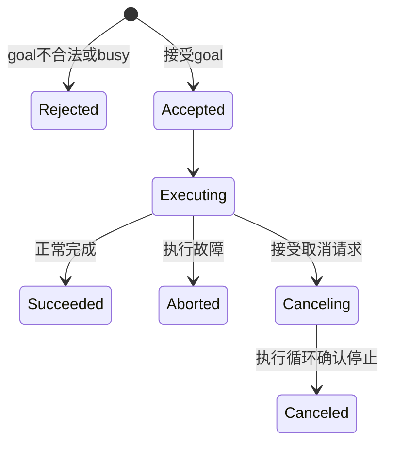

# S15.3 — Action：Goal / Feedback / Result / Cancel

## Problem → Why → Intuition

S15.2 service 能回答短请求，但轨迹执行持续数秒；调用者需要进度、最终结果和取消。
Action 为每个 goal 分配身份，分别处理接收决定、过程feedback、终态result与cancel请求。
状态唯一来源：[根 README](../README.md#stage-15--ros2-integration)。

## Core Concepts



Rejected不是执行失败：根本未接受goal。Aborted是接受后执行失败。
cancel请求返回“接受取消”只是进入取消流程；最终CANCELED result才是本课停止确认。
取消与完成会竞态：goal可能在cancel到达前已经成功，不能假定每次取消都会成功。
客户端超时也不是取消；本例在result等待超时后主动请求cancel，并等待最多额外2s，
若仍无终态则报告remote_state_unknown，不伪报停止。

使用标准 control_msgs/FollowJointTrajectory：

| 部分 | 本课字段 / 含义 |
| --- | --- |
| Goal | trajectory.joint_names；两点positions + time_from_start |
| Feedback | joint_names、desired/actual/error.positions、header时间戳 |
| Result | error_code/error_string；同时必须读取外层action terminal status |

FollowJointTrajectory没有专用CANCELED error_code；本例取消时保留默认0，
因此error_code=0不等于SUCCEEDED。先看action status，再解释业务result。
actual在本例只是软件reference的理想回显，不是传感器测量。

来源：[标准接口](https://raw.githubusercontent.com/ros-controls/control_msgs/jazzy/control_msgs/action/FollowJointTrajectory.action)、
[官方可取消多线程action示例](https://raw.githubusercontent.com/ros2/examples/jazzy/rclpy/actions/minimal_action_server/examples_rclpy_minimal_action_server/server.py)。

## Mathematics → Math-to-Code

唯一关节 teaching_joint 为教学转动关节；q单位rad，positions shape=(1,)。
两点p0=(q0,0s)、p1=(q1,T)，q(t)=q0+min(t/T,1)(q1−q0)。
默认q0=0、q1=.5rad、T=2s；名义速度.25rad/s。
这是线性reference，端点速度会突变；不做速度/加速度、动力学、碰撞或硬件能力检查。

[trajectory_action.py](../examples/16_ros2_integration/trajectory_action.py) 使用monotonic wall clock
计算elapsed；循环约20ms检查取消并更新reference，时间戳用ROS node clock。
循环调度间隔不是硬实时保证；本课无simulation time/clock同步验证。
接受前检查joint名称、两点shape/finite、|q|≤1rad、首时刻0、T∈[.2,5]s、
起点与当前reference相等（容差1e−6rad）。
只支持即时、position-only两点goal；非零header、tolerances、multiDOF、velocity/acceleration/effort等拒绝，
不悄悄忽略这些标准接口字段。不是完整FollowJointTrajectory controller实现。

单个active goal：goal callback在lock保护下预留busy，第二goal拒绝；
execute结束finally释放busy。取消/中止保留最后reference，不重置到终点。
再次运行client必须将--start设置为当前reference，或重启server恢复0。

## API → Executor

ActionServer(node,type,name,execute_callback,goal_callback,cancel_callback)返回server handle。
goal callback返回GoalResponse.ACCEPT/REJECT，cancel callback返回CancelResponse.ACCEPT/REJECT。
execute接收goal_handle，访问request；publish_feedback发送中间消息；
succeed/abort/canceled更新终态，随后返回Result对象。

ActionClient返回client handle；wait_for_server发现服务；send_goal_async返回Future，
完成后得到ClientGoalHandle并检查accepted；get_result_async返回终态Future；
cancel_goal_async返回取消响应Future，检查goals_canceling，仍需等待终态result。
feedback callback输入有goal身份与feedback的封装消息；不是最终结果。

server使用ReentrantCallbackGroup + MultiThreadedExecutor(2 workers)，
让一个worker在执行循环sleep时另一个处理cancel。两者缺一都可能使取消排队到动作完成后。
只加async关键字不能把time.sleep变成非阻塞等待；本例明确采用同步执行循环+两线程。
lock保护共享busy/q；本课不做抢占或多goal并行调度。

## Minimal Experiment

依赖见[示例README](../examples/16_ros2_integration/README.md#s153--action)。
安装control_msgs前已查看apt-get -s计划：只新增ros-jazzy-control-msgs，无升级/删除。
需本人sudo密码的安装：`sudo apt install ros-jazzy-control-msgs`。
不在conda/system pip安装ROS包，不安装ros2_control或MoveIt。

两个终端按[S15.1环境步骤](18_ros2_integration.md#环境边界与安装方案)退出conda/source Jazzy；
在项目根目录统一设置：

```bash
export ROS_DOMAIN_ID=53
export ROS_AUTOMATIC_DISCOVERY_RANGE=LOCALHOST
pwd
echo "${CONDA_DEFAULT_ENV:-}"
which python3  # /usr/bin/python3
printenv ROS_DISTRO  # jazzy
```

A：

```bash
/usr/bin/python3 examples/16_ros2_integration/trajectory_action.py server
```

B：

```bash
/usr/bin/python3 examples/16_ros2_integration/trajectory_action.py client
```

预期goal_accepted、feedback约0→.5rad、terminal=SUCCEEDED/error_code0、exit0。
每个对照先关闭并重启server，避免起点和当前reference不匹配：

```bash
# 正常server，B取消对照
/usr/bin/python3 examples/16_ros2_integration/trajectory_action.py client --cancel-after 0.5
# A故障对照，B默认client
/usr/bin/python3 examples/16_ros2_integration/trajectory_action.py server --fail-after 0.5
# 正常server，B拒绝对照：target超出1rad
/usr/bin/python3 examples/16_ros2_integration/trajectory_action.py client --target 2
# 正常server，B超时后主动cancel对照
/usr/bin/python3 examples/16_ros2_integration/trajectory_action.py client --result-timeout 0.1
```

观察：`ros2 action list -t`、`ros2 action info /s15_3/follow_joint_trajectory`；
标准CLI也可发送goal，但本课client同时检查取消响应及terminal result。

## Expected / Actual Result → Explanation

| 情况 | 预期 |
| --- | --- |
| 默认 | SUCCEEDED，code0，reference终点.5rad，client exit0 |
| cancel-after.5s | cancel确认→CANCELED，reference停在中间，取消实验符合预期则exit0 |
| fail-after.5s | ABORTED，code−4（注入故障，非真实tracking测量），exit1 |
| 非法goal | goal_rejected，exit2，无feedback/reference变化 |
| 第二并发goal | busy拒绝，不影响首goal |
| 无server | server_unavailable，exit3 |
| result-timeout.1s | 主动cancel并等待终态，仍exit4代表原等待超时 |
| 参数nan/非法时间 | argparse拒绝exit2 |

取消后的判据：server CANCELED日志之后该goal没有reference_update；
客户端收到终态且结果不声称SUCCEEDED。反馈可能已经在网络队列中，
不能用晚到feedback推断服务端又进行了新的reference更新。
取消请求发出与server观察之间允许已有更新继续；本例证明观察后不再更新，
不保证取消请求发出瞬间停止，也不保证物理机器人制动。

Actual（2026-10-07 / Zero）：本人完成control_msgs安装后，核验空conda环境、
/usr/bin/python3 3.12.3、ROS_DISTRO=jazzy；rclpy/control_msgs/trajectory_msgs/action_msgs
真实module paths均在/opt/ros/jazzy/lib/python3.12/site-packages。
apt control-msgs5.10.0-1noble.20260911.141005、rclpy7.1.12-1noble.20260912.162354、
trajectory-msgs5.3.8-1noble.20260911.111503、action-msgs2.0.4-1noble.20260911.052334；dpkg --audit空。
无助手追加安装，不改requirements，未执行MuJoCo。

| 实测case | 结果 |
| --- | --- |
| 默认 | SUCCEEDED/code0，95次feedback，q=.500000rad，exit0 |
| cancel-after.5 | cancel_acknowledged=True，CANCELED，25次feedback，held q=.128135rad，exit0 |
| fail-after.5 | ABORTED/code−4，24次feedback，held q=.121639rad，exit1 |
| target2 | goal_rejected，0次feedback，server无reference更新，exit2 |
| result-timeout.1 | cancel_acknowledged=True，CANCELED，held q=.026044rad，exit4 |
| 并发第二goal | busy拒绝exit2，首goal duration3s仍SUCCEEDED |
| 无server | server_unavailable/exit3 |
| nan duration/zero result timeout/cancel-after−2 | exit2 |

server取消terminal之后无reference_update，额外等待.1s复核；不是硬实时停止测试。
独立validate检查名称错误、nan位置、非支持velocity/frame字段均拒绝，合法goal通过。
日志与summary只在ignored tmp/s15_3_action/；反馈次数/held位置依调度变化，不是固定保证。

**CLI限制**：ros2 action list -t为空，info显示0个server；重启DOMAIN53 daemon后仍空。
直接rclpy graph API经2s发现，正确显示FollowJointTrajectory及s15_3_server；
因此CLI图查询不报告PASS。该版本action list/info没有公开--no-daemon/--spin-time参数。
异常原因未定位，不能确定是缓存、发现配置或daemon实现。为复核启动的daemon已停止。
核心真实action交互与直接graph通过，Engineering Complete；CLI限制保留为已知问题。
未注入goal响应超时、cancel拒绝/竞态、未知终态超时或异常防御分支；
未验证MuJoCo、实际tracking、物理停止、GUI/硬件；Learning三项仍待本人完成。

## Failure Cases → Robotics Context

server不可用与goal拒绝不同。goal接受超时可能已经在server执行，客户端尚无handle，
此例只能报告状态未知；真实系统需要按goal身份查询/恢复策略。
result超时不保证cancel被接受；拿到goals_canceling也不保证物理停住。
MultiThreadedExecutor不是免锁机制；重复goal、起点不匹配和未验证的接口字段都显式拒绝。
fail-after用−4做故障注入标记，error_string注明不是实际路径容差测量。

机器人应用：真实trajectory action的cancel应触发controller停止/hold并核验速度、状态和危险接触，
而非仅停止生成新命令。MuJoCo adapter和真实tracking留到后续指定任务。

## Interview Capsule / Must Remember

30秒：Action适合带进度与取消的长任务。先检查goal是否接受，再读feedback与terminal result。
取消响应不等于停止完成；以CANCELED终态和执行状态验证取消。

2分钟：解释四个Future/消息阶段：goal响应、feedback、cancel响应、result。
对比REJECTED/ABORTED/CANCELED/SUCCEEDED，说明error_code0不能替代action status。
用executor两线程解释执行和cancel为何能并行，用20ms轮询解释合作式停止与硬实时的边界。
最后区分停止reference更新和真实机器人制动。

Must Remember：接受≠完成；feedback≠result；cancel ACK≠terminal；timeout≠cancel；
状态码≠业务code；停止命令生成≠物理停机。

## My Verification — Run / Modify / Explain

Run：默认两个终端，检查feedback与SUCCEEDED。
Modify：重启server，client加--cancel-after .5，预测参考停在约.125rad附近（有调度/发现偏差），
检查cancel响应、CANCELED与server之后无reference_update。
Explain：

1. goal接受、feedback和result分别证明什么？
2. REJECTED、ABORTED、CANCELED有何区别？
3. cancel响应与CANCELED终态为何需要分开检查？
4. 为什么cancel callback需要可并行的executor/callback group？
5. 超时、停止reference更新和物理停住为什么是三件不同的事？

README学习项待本人明确报告；不自动推进S15.4。
