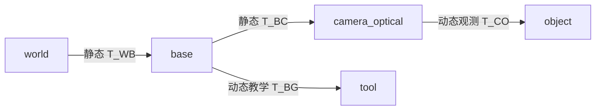

# S15.4 — TF2：坐标系树与时间一致性

## Problem → Why → Intuition

感知输出在camera坐标系，规划需要base/world坐标系；机器人运动时，变换也随时间变化。
S12.1手写变换链，这里用TF2维护有时间历史的frame tree。
本课只发布合成数据，不读取UR5e状态，不做IK、URDF或MuJoCo adapter。
状态唯一来源：[根README](../README.md#stage-15--ros2-integration)。

## Core Concepts



每个child只有一个parent和明确的发布责任方；树不能有cycle。
不要同时发布world→object与camera→object，也不要把同一child交给两个node发布。
本例固定树满足这些约束；没有实现全网重复publisher检测，TF2也不是业务拓扑校验器。
object在本场景固定，但它是“观测估计”的动态发布边，仍需要时间戳与新鲜度检查。
相机安装在base上固定，使用静态外参；工具运动由合成sin位置演示。

StaticTransformBroadcaster发送/tf_static，transient-local支持后来加入的listener获取静态数据；
发布者需保持存活，不保证发布者退出后新的listener还能获得数据。
TransformBroadcaster发送/tf；TransformListener订阅两者并原地填充Buffer，必须spin。
Buffer存历史数据，按指定时间合成、反转和插值；没有每次重新测量真实外参。

## Mathematics：意义 / shape / 单位 / frame

T_AB把B中坐标转换到A：p_A=R_AB p_B+t_AB。
数学T为4×4，R为3×3；API实际传translation(3)米和单位quaternion(4)。
ROS quaternion字段顺序x,y,z,w；MuJoCo freejoint顺序w,x,y,z，不能直接copy。
TF树的parent=A、child=B消息表达T_AB，即child在parent中的pose，映射child坐标到parent。

沿用S12.1历史约定，不作本轮UR5e测量：
R_WB=diag(−1,−1,1)，t_WB=0；
R_WC=diag(1,−1,−1)，t_WC=[camera_x,.1,.8]m；
R_WO=I，t_WO=[−.45,.2,.03]m。
因此R_BC=diag(−1,1,−1)，t_BC=[−camera_x,−.1,.8]m；
R_CO=diag(1,−1,−1)，t_CO=[−.45−camera_x,−.1,.77]m。

T_WO=T_WB T_BC T_CO；默认camera_x=−.35m。
p_O=[.02,.01,.03]m → p_B=[.43,−.21,.06]m → p_W=[−.43,.21,.06]m。
使用非原点测试点才能检验旋转，不能只比object原点平移。
移动相机x到−.25m时BC/CO分别变化，恢复出的WO和p_B应不变。

## 时间 → Math-to-Code

`lookup_transform(target,source,time)`返回T_target_source（TransformStamped），target在前。
Time()即0代表latest common time，**不是当前now**，也不是将各边不同时间的最新值随意拼接。
明确timestamp查询会插值缓存中的动态样本；超出最早/最晚范围可能抛出extrapolation异常。
未知frame或断链也失败。静态边对任意查询时间有效，不按其发布timestamp计算观测新鲜度。

应用gate：age=now−stamp，单位s；本课要求age≤.3s，并拒绝未来超过.05s的stamp。
这是应用政策，不是TF2自动保证。工具与object动态链分别检查；不把静态边当过期观测。
多个动态边的真实系统可能需要逐边验证年龄与来源；本课每条所查询链只有一条动态边。
使用共同ROS clock解释stamp，monotonic用于wall timeout；不混用两者。
未启用use_sim_time；以后仿真必须统一/clock和时钟模式，不能把wall time当simulation time。

[tf2_frames.py](../examples/16_ros2_integration/tf2_frames.py) 保持API可见：

| API | 输入 / 返回 / 原地状态变化 |
| --- | --- |
| TransformStamped | header.frame_id parent、child_frame_id child、stamp和translation/quaternion |
| broadcaster.sendTransform(msg或list) | 发送消息，不返回新机器人状态 |
| Buffer(cache_time=Duration(5s),node=node) | 返回带历史缓存的对象；node提供clock/frames服务 |
| TransformListener(buffer,node) | 建立订阅；executor回调更新buffer |
| lookup_transform(target,source,Time) | 返回合成变换；不修改物理场景 |
| set_transform(msg,authority) | 原地插入历史缓存，仅本课独立确定性fixture使用 |

查找默认不等待；外层循环spin然后lookup，失败继续，避免单线程阻塞lookup时无法接收TF。
probe成功后用同一object时间查询正/逆链；apply用显式quaternion旋转和translation，无NumPy依赖。
历史fixture独立Buffer插入t=10s/x=0m、t=12s/x=2m，t=11s预期x=1m；
t=9s/13s必须失败。这里只测试平移插值，不声称测过旋转SLERP。

来源：[官方Buffer与查询语义](https://raw.githubusercontent.com/ros2/geometry2/jazzy/tf2_ros_py/tf2_ros/buffer.py)、
[静态广播QoS](https://raw.githubusercontent.com/ros2/geometry2/jazzy/tf2_ros_py/tf2_ros/static_transform_broadcaster.py)、
[Listener订阅](https://raw.githubusercontent.com/ros2/geometry2/jazzy/tf2_ros_py/tf2_ros/transform_listener.py)。

## Minimal Experiment

apt依赖：ros-jazzy-rclpy、ros-jazzy-tf2-ros-py、ros-jazzy-tf2-py、
ros-jazzy-geometry-msgs、ros-jazzy-tf2-msgs；当前已安装，无新依赖/安装。
不在system pip或conda安装TF2，不导入MuJoCo/local helper，requirements.txt不改。

两个终端按[S15.1步骤](18_ros2_integration.md#环境边界与安装方案)退出conda/source Jazzy，项目根目录：

```bash
export ROS_DOMAIN_ID=54
export ROS_AUTOMATIC_DISCOVERY_RANGE=LOCALHOST
pwd
echo "${CONDA_DEFAULT_ENV:-}"
which python3  # /usr/bin/python3
printenv ROS_DISTRO  # jazzy
```

A：

```bash
/usr/bin/python3 examples/16_ros2_integration/tf2_frames.py broadcaster
```

B：

```bash
/usr/bin/python3 examples/16_ros2_integration/tf2_frames.py probe
```

预期frame_time_checks_passed，p_B=[.43,−.21,.06]m，历史/逆变换/未知frame检查通过。
probe可在broadcaster运行后启动，检验late listener获得静态外参。

对照都先关闭原broadcaster，再重启：

```bash
# 两端同改camera-x，预期恢复WO与p_B不变
/usr/bin/python3 examples/16_ros2_integration/tf2_frames.py broadcaster --camera-x -0.25
/usr/bin/python3 examples/16_ros2_integration/tf2_frames.py probe --camera-x -0.25
# A人为滞后stamp；B默认probe
/usr/bin/python3 examples/16_ros2_integration/tf2_frames.py broadcaster --stamp-lag 1
# A运行2s后停发；马上启动B并保持listener存活3s
/usr/bin/python3 examples/16_ros2_integration/tf2_frames.py broadcaster --stop-after 2
/usr/bin/python3 examples/16_ros2_integration/tf2_frames.py probe --observe-for 3
```

滞后/停发：预期latest_lookup_succeeded=True，但随后stale_transform拒绝exit1。
晚于动态停发才启动的新listener也没有历史/tf数据，预期transform_unavailable/exit3；
这与停发前已接收数据的listener缓存过期不同。无broadcaster同样exit3。
--timeout限制初次发现等待；--observe-for另加观察时长，不是一个总运行预算。

## Expected / Actual Result → Explanation

现场（2026-10-07 / Zero）：所有必需imports/API和以下实验通过。
系统Python3.12.3、空conda环境、/usr/bin/python3、ROS_DISTRO=jazzy；
rclpy/tf2_ros/tf2_py/geometry_msgs/tf2_msgs真实模块路径均来自/opt/ros/jazzy/lib/python3.12/site-packages。
apt rclpy7.1.12-1noble.20260912.162354、tf2-ros-py0.36.23-1noble.20260915.174232、
tf2-py0.36.23-1noble.20260915.173947、geometry-msgs5.3.8-1noble.20260911.102920、
tf2-msgs0.36.23-1noble.20260915.172312；dpkg --audit空。

| 实验 | 实测 |
| --- | --- |
| 默认/相机x=−.25 | exit0；p_B=[.43,−.21,.06]m，WO原点=[−.45,.2,.03]m，两组相同 |
| late listener获取静态边 | 默认/移动camera两组成功，任意t=1s静态查询通过 |
| 历史fixture | t11插值x1m，inverse正确，t9/t13拒绝 |
| unknown frame | 拒绝 |
| stamp-lag1 | latest成功，age1.144746s，stale拒绝exit1 |
| stop-after2 + early probe observe-for3 | latest成功，age1.365788s，stale拒绝exit1 |
| stop-after1 + 2s后新probe | 动态缺失exit3 |
| 无发布者 | timeout.5s，exit3 |
| nan lag/zero max-age/negative timeout/negative observe | exit2 |

默认/移动camera动态年龄.111481/.159058s；非稳定时延benchmark，不作为固定保证。
初版停发实验预期缓存stale但probe启动在停发之后，实际exit3；澄清动态历史不重放，
加入--observe-for并区分early/late listener后两种结果均通过，没有放宽age政策。
独立nonfinite translation、非单位quaternion、future_stamp gate拒绝通过。
日志/summary仅ignored tmp/s15_4_tf2/；本地links与git diff --check通过。
无GUI、MuJoCo、真实相机、UR5e动态TF、跨机器或硬件验证；未重跑前课独立实验。
Engineering Complete；本人随后确认实验与预测完成并回答全部五问，Learning Mastered。

exit0表示完整frame/time检查通过；exit1为应用age拒绝；
exit3为lookup缺失；非法CLI exit2。不能把stale对照的exit1报告为一般运行成功，
它是预期的拒绝结果。

## Failure Cases → Robotics Context

parent/child反置、相乘顺序错、quaternion排列混用、mm/m混用都可能产生错误pose。
静态发布应只用于恒定关系；运动camera/tool不能标静态来隐藏timestamp问题。
latest查询成功可能只取到旧缓存，不能自动认定观测仍适合操作。
缓存窗口限制历史查询；它不等于应用max-age。等待timeout也不会使缓存数据变新。
本例unknown frame和past/future异常检查，不覆盖断链、全网duplicate parent、clock jump或ROS bag循环。

机器人上下文：在图像曝光/深度采样时间查询camera→base变换，再将物体pose转换到规划frame。
静态外参有标定误差，TF能连通并不证明标定准确；source/target名称正确也不保证物理约定正确。
不发布假UR5e link tree；base/tool这里只是教学坐标系，实际joint/FK接入留到S15.5/6。

## Interview Capsule / Must Remember

30秒：TF2维护带时间的frame tree，用target/source/time查询变换，自动沿链组合和取逆。
静态关系用tf_static，动态观测用tf；latest不是now，应用必须额外拒绝过期观测。

2分钟：先解释T_AB和parent/child、米制translation和xyzw quaternion。
用world/base/camera/object链恢复物体位置，再用10/12秒样本解释11秒插值与越界查询。
最后用停发动态TF说明“可查询”和“足够新”不同；说明frame、clock和calibration的各自责任。

Must Remember：target在前；parent-child表达child→parent坐标映射；latest common time≠now；
静态边不按动态观测age规则拒绝；缓存可查≠应用可用；frame树连通≠真实标定正确。

## My Verification — Run / Modify / Explain

Run：默认两端，查看frame_time_checks_passed和历史fixture结果。
Modify：重启broadcaster添加--stamp-lag 1，预测latest查询仍成功，但默认.3s门限拒绝；
恢复无lag后再确认通过。
Explain：

1. parent=base/child=camera_optical的消息表达什么方向？lookup的target/source怎样对应？
2. 为什么静态外参与动态观测用不同广播方式？
3. Time()查询与观测timestamp查询有什么区别？
4. 为什么latest查询成功仍可能被stale gate拒绝？cache_time与max-age有什么区别？
5. 为什么移动相机后BC/CO改变，而恢复的WO不变？真实机器人还需哪些时间/标定条件？

2026-10-07 本人确认实验与预测完成并回答五问Explain，Run/Modify/Explain全部完成。
精度补充：Time()取整条链的最新共同可用时间，不把每条动态边各自最新样本直接拼接。
/tf_static的transient-local提供晚加入者所需静态数据，但发布者退出后，新listener不保证能获取它；
已接收静态数据的listener则仍可在自身buffer查询。
移动相机对照通过重启发布者重新配置恒定外参，不代表运动中的相机可继续作为static TF。

下一小任务S15.5 URDF/joint states，等待本人明确请求，不自动实施。
