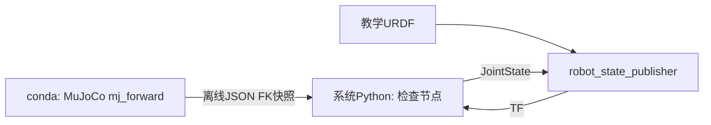

# S15.5 — URDF / JointState 与 MuJoCo FK 对照

## Problem → Why → Intuition

S15.4手动发布教学frame树。机械臂各link的TF应由结构与关节角计算，避免手工维护每条边。
URDF提供link/joint结构，JointState提供有名称、有时间的状态，robot_state_publisher(RSP)
结合两者做FK并广播TF。本课验证同一UR5e运动学在两种表示中是否一致。
状态唯一来源：[根README](../README.md#stage-15--ros2-integration)。



## Core Concepts

URDF不是状态：link描述坐标系与可选几何/惯性，joint描述父子、零位origin、axis和limits。
revolute关节变量是rad；prismatic是m；fixed无状态变量。
JointState.name[i]与position[i]一一对应；消息数组顺序不要求等于模型顺序，名称才是身份。
velocity单位rad/s或m/s，effort单位Nm或N；不知道就留空，不伪造测量零。
header.stamp是该消息状态采样时间，不是“服务器接收时间”。
RSP将固定边发布到tf_static、运动边由JointState驱动发布到tf；不是控制器，不积分动力学。

本课[ur5e_kinematics.urdf](../examples/16_ros2_integration/ur5e_kinematics.urdf)
是从Menagerie结构整理的**教学运动学投影**，不是厂商官方ROS URDF。
无mesh、collision、inertial、transmission、controller；velocity=2/effort=100仅语法所需教学占位，
不代表真实UR5e限值、执行能力或MuJoCo actuator能力。
保留joint位置range作结构对照；RSP本身不会执行关节限位控制。

## Mathematics：Meaning / Shape / Unit / Frame

每个旋转joint：T_parent_child(q)=T_origin·Rot(axis,q)。
origin.xyz单位m；origin.rpy单位rad，R=Rz(yaw)Ry(pitch)Rx(roll)。
axis为joint零位坐标系中的单位方向；不能把它当成固定world轴。
T_W_tool为4×4，沿link树组合；translation是m，rotation无量纲。

| joint | parent→child | origin.xyz [m] | origin.rpy [rad] | local axis |
| --- | --- | --- | --- | --- |
| shoulder_pan_joint | base→shoulder_link | 0,0,.163 | 0,0,0 | 0,0,1 |
| shoulder_lift_joint | shoulder_link→upper_arm_link | 0,.138,0 | 0,π/2,0 | 0,1,0 |
| elbow_joint | upper_arm_link→forearm_link | 0,−.131,.425 | 0,0,0 | 0,1,0 |
| wrist_1_joint | forearm_link→wrist_1_link | 0,0,.392 | 0,π/2,0 | 0,1,0 |
| wrist_2_joint | wrist_1_link→wrist_2_link | 0,.127,0 | 0,0,0 | 0,0,1 |
| wrist_3_joint | wrist_2_link→wrist_3_link | 0,0,.1 | 0,0,0 | 0,1,0 |

world→base固定Rz(π)，t=0，沿用Menagerie实际base约定；base不是world同轴。
wrist_3_link→tool固定xyz=[0,.1,0]m、Rx(−π/2)，tool对应MuJoCo attachment_site，
不是泛指任何UR驱动tool0/TCP。真实工具TCP需另定义与标定。
本机编译model每个hinge位于body原点，因此URDF child原点与MuJoCo body frame可一一对应。
若joint pivot非零，不能照搬本例origin×rotation公式，需处理绕偏置点旋转。

## Math-to-Code / APIs

[urdf_reference.py](../examples/16_ros2_integration/urdf_reference.py) 在conda mujoco运行：
Menagerie load返回官方MjModel（结构与编译参数），MjData(model)创建运行状态；
按名称查joint id，再用model.jnt_qposadr取得qpos地址，而不是假定id就是状态索引。
qpos为关节配置；写入零位/home/shoulder-pan修改后的配置，然后mj_forward(model,data)
原地更新body/site的xpos/xmat，无返回新状态、不mj_step，time保持0。
独立解析URDF的RPY与Rodrigues轴角rotation，逐link矩阵与MuJoCo比较。
导出三组配置及每个frame的FK；JSON只作为当前机器现场核验快照，不提交生成产物。

[joint_states_tf.py](../examples/16_ros2_integration/joint_states_tf.py) 仅系统ROS Python：
启动外部C++ RSP，并通过robot_description参数传入URDF文本；无colcon或框架集成。
create_publisher(JointState,'/joint_states',10)返回handle，publish提交name/position/stamp。
Buffer/TransformListener缓存RSP输出；lookup_transform('world',frame,state_stamp)
按该状态时间查询，不以旧latest冒充当前状态。逐frame矩阵与JSON FK比较。
name/position成对逆序应保持FK；只逆序name则错配，必须被对照拒绝。
ROS进程不import MuJoCo/NumPy，不给conda添加ROS包路径。
此例是三组离散状态检查，不是实时MuJoCo状态流或控制执行。

来源：[JointState官方定义](https://raw.githubusercontent.com/ros2/common_interfaces/jazzy/sensor_msgs/msg/JointState.msg)、
[Menagerie UR5e](https://raw.githubusercontent.com/google-deepmind/mujoco_menagerie/main/universal_robots_ur5e/ur5e.xml)、
[robot_state_publisher](https://github.com/ros/robot_state_publisher/tree/jazzy)。
本课数值以实际本机编译model核验，不把网上main分支当成本机资产版本。

## Minimal Experiment

依赖与环境：conda mujoco需要requirements已声明的mujoco/numpy/mujoco-menagerie；
ROS终端需要apt rclpy/sensor-msgs/tf2-ros-py/robot-state-publisher/ament-index-python及其解析依赖。
当前均已存在，无安装、无requirements改动；安装预览显示RSP已是最新版，无新增/升级/删除。

终端A（生成当前MuJoCo参考）：

```bash
cd /home/lucas/projects/mujoco-robotics-playground
conda activate mujoco
pwd
echo "$CONDA_DEFAULT_ENV"
which python
python examples/16_ros2_integration/urdf_reference.py
```

终端B（系统ROS Python，退出所有conda环境，按S15.1步骤source）：

```bash
source /opt/ros/jazzy/setup.bash
export ROS_DOMAIN_ID=55
export ROS_AUTOMATIC_DISCOVERY_RANGE=LOCALHOST
pwd
echo "${CONDA_DEFAULT_ENV:-}"
which python3  # /usr/bin/python3
printenv ROS_DISTRO  # jazzy
/usr/bin/python3 examples/16_ros2_integration/joint_states_tf.py
/usr/bin/python3 examples/16_ros2_integration/joint_states_tf.py --reverse-order
/usr/bin/python3 examples/16_ros2_integration/joint_states_tf.py --wrong-order
```

脚本自动启动和清理RSP，不必另开终端；不要同时运行其他world/base/tool发布者或JointState来源。
RSP每次新进程，从同一URDF开始；状态位置在home改变，不等于连续机械臂运动。

## Expected / Actual Result → Explanation

预期exporter：zero/home/pan_modified三配置、所有frame比对通过，time0。
ROS默认和成对reverse-order：三配置全通过exit0。
wrong-order：zero因为全0可能仍通过；home应显著错位并exit1。
现场（2026-10-07 / Zero）：

| 检查 | 实测 |
| --- | --- |
| conda URDF/MuJoCo default/.4rad | 各3配置×9frame，max矩阵元素误差8.882e−16，time0 |
| ROS默认/成对逆序 | 各3配置全frame通过exit0，max误差1.110e−15 |
| ROS仅逆序name | zero通过，home拒绝exit1，max矩阵元素误差约2（无量纲旋转部分参与，不是2m位置误差） |
| ROS读取.4rad快照 | 三配置全通过exit0，max误差1.110e−15 |
| 比较两组快照 | zero/home相同，pan_modified tool改变 |
| delta nan | argparse拒绝exit2 |

conda现场Python3.12.14 / MuJoCo3.13.0 / NumPy2.5.3 / Menagerie2026.9.2，
真实模块来自mujoco环境；版本是本机当日观察，不照搬旧3.14记录。
系统Python3.12.3；rclpy/sensor_msgs/tf2_ros/ament_index_python真实imports来自/opt/ros/jazzy。
apt rclpy7.1.12-1noble.20260912.162354、sensor-msgs5.3.8-1noble.20260911.140426、
tf2-ros-py0.36.23-1noble.20260915.174232、RSP3.3.4-1noble.20260915.184559、
ament-index-python1.8.4-1noble.20260519.010916；dpkg --audit空。

初版经ros2 run wrapper启动的完整实验超过25s外部预算，未计PASS，也未确定wrapper为唯一原因。
改用ament index定位RSP二进制并直接管理进程后，默认/重排/错误/Modify全部完成，子进程正常清理。
所有参考JSON/log/summary仅ignored tmp/s15_5_urdf/；无GUI、实时状态流或动力学验证。
Engineering Complete，Learning Run/Modify/Explain待本人确认。

## Failure Cases → Robotics Context

名称错配、遗漏关节、度/rad混用、axis frame误解、RPY次序错、tool/site不同，都会导致错误TF。
本课入口检查6个唯一name和6个有限position，但不是任意外部JointState全面验证器。
RSP不是关节状态估计器或单位转换器；不会因为收到rad字段就自动识别你传的是degree。
FK一致不证明mass/inertia/friction/contact/actuator一致；教学URDF不支持动力学对照。
参考JSON必须在当前模型/URDF变化后重生成；程序失败不要用旧快照伪报通过。
时间等待6s仅用于发现/传输，不能证明硬实时、真实同步或跨机器clock正确。
本课无RViz、GUI、硬件、UR驱动、ROS2控制器或抓取pipeline。

机器人上下文：JointState驱动link TF后，感知pose才可在相同时间变换到base/tool；
实际adapter应按关节名称映射qpos/qvel，保持采样时间、单位和TCP一致。
这些实时adapter留到S15.6a，不在本课实现。

## Interview Capsule / Must Remember

30秒：URDF描述结构，JointState描述有时间和名称的状态，RSP负责FK生成TF。
关节数组要按名称关联，旋转单位rad，不能混用world轴和joint局部轴。

2分钟：讲origin固定变换×axis旋转，再讲world/base的π旋转和attachment_site/tool映射。
用成对重排仍正确、只改name失败说明身份与数组位置的区别。
最后用MuJoCo mj_forward与RSP全frame对照说明验证范围：只证明运动学一致，不证明动力学或执行能力。

Must Remember：结构≠状态≠控制；name与value对应；qpos地址≠joint id的一般规则；
local axis≠world axis；rad≠degree；tool名称≠TCP定义；FK一致≠动力学一致。

## My Verification — Run / Modify / Explain

Run：依次生成参考、运行ROS默认与reverse-order，观察全frame通过；wrong-order预期失败。
Modify：终端A用 `--delta 0.4 --output tmp/s15_5_urdf/reference_delta04.json`，
终端B加 `--reference tmp/s15_5_urdf/reference_delta04.json`，预测pan_modified的tool位置/姿态改变，
但两套FK仍一致。zero/home应不变。
Explain：

1. URDF、JointState、RSP分别提供什么，不负责什么？
2. joint origin和axis分别在哪个frame，为什么先origin再Rot(axis,q)？
3. 为什么成对重排name/position保持正确，只改name会错？
4. world/base、wrist_3_link/tool各有哪些固定变换，tool为什么对应attachment_site？
5. 运动学比对通过为何不能说明动力学、碰撞或控制能力一致？

状态待本人明确Run/Modify/Explain；不自动推进S15.6a。
