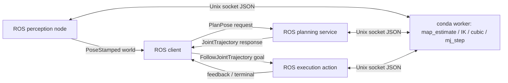

# S15.6a — 薄 ROS2 adapters：Pose topic → Plan service → Execution action

## Problem → Why → Intuition

前几课单独验证topic/service/action/TF。现在用一条最小链连接已有感知坐标映射、IK/轨迹和MuJoCo执行，
保持算法不依赖ROS、ROS节点不依赖MuJoCo。状态见[根README](../README.md#stage-15--ros2-integration)。
本课是固定场景、裸UR5e到物体上方的运动；无抓爪、抓持、释放、真实图像或完整manipulation pipeline。
S15.6b才评估完整系统与更多异常，不在本课扩展。



## Core Concepts / Contracts

| 边界 | 类型 / 字段 / 责任 |
| --- | --- |
| observation topic /s15_6a/object_pose | PoseStamped，world frame、米制position、xyzw单位quat、ROS采样stamp |
| /s15_6a/plan_pose | 自定义PlanPose：object_pose→success/reason/plan_id/JointTrajectory |
| /s15_6a/execute | 标准FollowJointTrajectory：issued reference→actual joint feedback/terminal result |
| ROS↔conda | localhost Unix socket JSON，每请求一连接，明确op、ok/value或reason |

PoseStamped本身没有reprojection quality字段；本课producer调用S13.1 map_estimate，
在发布前检查合成packet的quality/frame/单位，再输出world pose。
没有视觉测量：固定synthetic camera→object输入；不是image/PnP性能验证。
service检查world frame、finite、age∈[0,.5]s与本课upright/工作区约束，失败不发送action。
不将空Trigger冒充有类型pose输入，也不在string中塞轨迹代替JointTrajectory。

plan_id用于日志与worker事务；标准action没有plan_id字段，本课adapter仅接受**与当前唯一已发plan完全相同**的trajectory，
且拒绝busy和unsupported fields。接受后worker再次校验plan_id与起始actual q。
这是单plan、单goal教学约定；没有并发plan库、持久化恢复、跨node身份认证或抢占。
新planning请求使旧plan失效；取消/终止消费plan，不隐式重播。

## Mathematics：Meaning / Shape / Unit / Frame

T_WO=T_WB T_BC T_CO，复用S13.1 map_estimate，不在ROS侧重新实现坐标几何。
目标attachment_site位置=p_WO+[0,0,.22]m，目标R=diag(1,−1,−1)；只接受identity/upright物体朝向。
固定synthetic p_WO=[−.45,.2,.03]m → target=[−.45,.2,.25]m。
六关节q shape=(6,)单位rad；actual速度rad/s；feedback error=command−actual单位rad。

复用S11.3 bounded DLS solve_pregrasp_ik与cubic_reference，private MjData几何求解不动执行状态。
s(t)=3τ²−2τ³；q=q_start+sΔq。duration≥max(1.5|Δq|/.2,sqrt(6|Δq|/.8),1s)，
按dt=.02s向上舍入，最大20s。参考v≤.2rad/s、a≤.8rad/s²；不限制actual acceleration/jerk。
这不是RRT/碰撞planner：无障碍、路径碰撞保证、全身/持物检查，S14算法仍独立保留。
service在2s计算预算内生成短IK/cubic结果；若更长或搜索复杂，应改异步planning action/后台任务。
2s为返回后的合作式预算检查，socket timeout3s；不是中断IK的硬deadline。

## Math-to-Code / APIs

[adapter_worker.py](../examples/16_ros2_integration/adapter_worker.py) 仅conda：
Menagerie.load→MjModel；MjData是实际状态，初始化一次home。
map_estimate验证合成观测；solve_pregrasp_ik使用独立data；cubic生成JointTrajectory数值。
后续actual运动只用ctrl/mj_step；每tick=.02sim秒，内部步长来自model.opt.timestep。
qfrc_applied=qfrc_bias为理想外力bias补偿，非硬件扭矩能力证明。
最大command/actual偏差>.06rad则拒绝；最终hold .6sim秒后检查ep≤3mm/er≤.02rad。
不重设qpos来跟踪reference；不把FK几何验证当动态tracking。

[ros_adapters.py](../examples/16_ros2_integration/ros_adapters.py) 仅ROS/system Python：
create_publisher/subscription返回handle，topic回调取得PoseStamped；
create_service(PlanPose,callback)原地填写typed response；call_async返回Future，由spin驱动。
ActionServer的goal/cancel/execute独立处理；ReentrantCallbackGroup+3worker executor让取消可处理。
执行callback逐tick读取worker实际状态，填FollowJointTrajectory反馈；succeed/abort/canceled设置终态。
共享busy/plan有lock；worker单线程串行请求保证MuJoCo状态不被并发写。
wall每tick sleep.005s用于观察反馈/取消，simulation时间由mj_step推进，不宣称实时同步。
feedback.header是ROS发送时间，worker sim_time在result中另报；二者不是同一clock，
没有发布带假时间的真实JointState/TF。状态同步适配仍待后续任务。

取消：adapter在观察到is_cancel_requested后调用worker.stop，停止后续tick并使plan失效。
这会**暂停仿真推进**，保留qpos/qvel；不是持续hold controller，更不是物理速度降零或硬件急停。
cancel ACK后仍等CANCELED。IPC失败时stop可能失败，result必须说明remote_state_unknown。
超时只停止client等待；本课client请求cancel但不能证明远端终态，不能当作停止成功。

## 环境与有类型接口构建

conda执行依赖mujoco/numpy/mujoco-menagerie/matplotlib（map_estimate顶层import），已在requirements声明。
ROS需要rclpy/geometry-msgs/trajectory-msgs/control-msgs/action-msgs；
构建需要cmake/make/g++、ament-cmake、rosidl-default-generators/runtime和系统Python构建依赖。
apt包统一ros-jazzy前缀，系统编译工具除外；不安装MoveIt、ros2_control、ROS里的MuJoCo或colcon。
[示例README](../examples/16_ros2_integration/README.md)声明本课依赖；requirements不改。

本机准备时cmake/make/rosidl存在但g++缺失；构建失败No CMAKE_CXX_COMPILER，不是Python缺包。
apt-get -s install g++只新增g++及4项compiler依赖，无升级/删除；sudo需本人密码。
本人已完成 `sudo apt install g++`；接口编译及真实ROS链随后核验通过，见Actual。

[s15_interfaces](../examples/16_ros2_integration/s15_interfaces/package.xml)是小ament_cmake接口包；
[PlanPose.srv](../examples/16_ros2_integration/s15_interfaces/srv/PlanPose.srv)定义request/response。
用原生cmake显式构建单包，构建与install只放ignored tmp/s15_6a_interfaces/。
生成代码不是源文件，不提交。构建Python必须/usr/bin/python3，与apt ROS扩展一致。

来源：[官方自定义接口流程](https://raw.githubusercontent.com/ros2/ros2_documentation/jazzy/source/Tutorials/Beginner-Client-Libraries/Custom-ROS2-Interfaces.rst)、
[FollowJointTrajectory契约](https://raw.githubusercontent.com/ros-controls/control_msgs/jazzy/control_msgs/action/FollowJointTrajectory.action)。

## Minimal Experiment

安装g++后，ROS专用终端退出conda并source Jazzy，核验空环境/system Python/jazzy后：

```bash
cd /home/lucas/projects/mujoco-robotics-playground
bash examples/16_ros2_integration/build_interfaces.sh
source tmp/s15_6a_interfaces/install/share/s15_interfaces/local_setup.bash
/usr/bin/python3 -c 'from s15_interfaces.srv import PlanPose; print(PlanPose.Request(), PlanPose.Response())'
```

算法独立（conda mujoco）：

```bash
conda activate mujoco
pwd
echo "$CONDA_DEFAULT_ENV"
which python
python examples/16_ros2_integration/adapter_worker.py --standalone
```

接口build完成后，可从普通项目终端运行launcher：

```bash
bash examples/16_ros2_integration/run_adapters.sh
bash examples/16_ros2_integration/run_adapters.sh --bad-frame
bash examples/16_ros2_integration/run_adapters.sh --stale
bash examples/16_ros2_integration/run_adapters.sh --cancel-after 0.2
```

launcher每次独立worker初始home、启动ROS perception/server/client并清理自有进程。
每个子进程执行前打印环境/解释器边界；不调用base/system运行MuJoCo。
DOMAIN56/LOCALHOST，产物只在ignored tmp/s15_6a/run_*/；观察日志plan_id/feedback/terminal。
不同时运行其他同名adapter节点。可按同文件role手动分终端运行；Unix socket必须同路径。

## Expected / Actual Result → Explanation

预期default planning_success=True→goal accepted→actual feedback→SUCCEEDED/code0。
bad-frame/stale预期service success=False/exit1，没有execution_goal_accepted或仿真tick。
cancel预期cancel确认/CANCELED，worker sim time停止增长；取消实验符合预期则client exit0。
没有worker或topic时报告缺失，不能回退到假数据成功。

现场（2026-10-07 / Zero）准备阶段：conda3.12.14/MuJoCo3.13.0/NumPy2.5.3/Menagerie2026.9.2/Matplotlib3.11.2，
metadata与实际模块路径核验。独立worker已运行：reference6.58s，sim7.2s，
max tracking=.037672993rad，final ep=.000116171m，er=7.419434e−6rad，standalone_passed。
Unix socket实验通过observe/plan/begin/10tick/stop：暂停后simulation time与qpos不变，
继续tick及重播已消费plan拒绝，非法workspace拒绝；日志只在ignored tmp/s15_6a/ipc_checks/。
Python ast.parse、两shell脚本bash -n、本地Markdown文件links和git diff --check通过。
系统ROS3.12.3，rclpy/geometry_msgs/trajectory_msgs/control_msgs/action_msgs真实imports来自/opt/ros/jazzy；
apt版本分别7.1.12-1noble.20260912.162354、5.3.8-1noble.20260911.102920、
5.3.8-1noble.20260911.111503、5.10.0-1noble.20260911.141005、2.0.4-1noble.20260911.052334。
本人安装g++后接口build/install exit0；apt g++=4:13.2.0-7ubuntu1，
ament-cmake2.5.6-2noble.20260225.222913、rosidl-default-generators1.6.1-1noble.20260911.052510；
dpkg --audit空。自定义s15_interfaces0.0.1真实import/type support通过，来自当前ignored install。
原生单包CMake只生成package级local_setup.bash，初版误用install根setup导致import失败；
已改source install/share/s15_interfaces/local_setup.bash并复核通过，没有回退到系统pip。

| 完整ROS实验 | 实测 |
| --- | --- |
| 默认launcher | typed service返回330点/6.58sim秒参考，360次actual feedback，SUCCEEDED/code0/exit0 |
| --bad-frame | expected_world_frame，service false/exit1，无execution goal，sim time0 |
| --stale | future_or_stale_observation，service false/exit1，无execution goal，sim time0 |
| --cancel-after .2 | cancel_acknowledged=True、CANCELED/exit0，35反馈，sim停在.7s |

默认max tracking=.037672993rad，final ep=.116171mm/er7.419434e−6rad，sim7.2s；
默认standalone与ROS路径数值相同，不表示任何硬实时/跨机器保证。
每组client完成后两次worker state间隔.1wall秒，running=False且time/qpos不变；
取消状态qvel仍非零，明确不计为物理停止验证。
独立MuJoCo从最终actual q重算FK/姿态误差与360×.02sim clock通过；
新规划尝试失败后旧plan失效通过。所有launcher子进程已清理，无仍运行的本课worker/node。
validation_summary、final_state与logs只在ignored tmp/s15_6a/。
Engineering Complete；本人随后确认实验与预测完成并回答五问Explain，Learning Mastered。

## Failure Cases → Robotics Context

typed transport不保证物理语义；frame错误、旧观测、非有限值、workspace/姿态、IK预算均必须显式失败。
成功planner不证明碰撞路径可执行；actual tracking又与reference限速不同。
Unix socket断开与ROS服务失败不是同一层；worker状态未知时不能简单重试执行，防止重复动作。
本课停止推进仿真不等于重启可继续；plan消费后必须重新规划。
取消后actual速度未归零；launcher每次从新worker/home开始，不验证同一worker取消后立即恢复运动。
单plan只用于教学，实际系统需不可变plan身份、有效期、当前state revision和恢复策略。
本课取消/异常范围不扩展成S15.6b全面鲁棒性系统。

## Interview Capsule / Must Remember

30秒：adapter只翻译数据与生命周期，算法保持独立。带frame/time的pose经typed service返回轨迹，
action提供actual反馈和terminal，解释器隔离通过显式IPC实现，不混import。

2分钟：按topic→service→action讲每个输入输出、失败停止与plan消费。
讲private IK data与actual mj_step状态区别，再讲ROS wall timestamp和simulation time不能混。
取消只在worker确认停止推进后返回CANCELED，但保留速度，不能宣称物理制动。

Must Remember：typed schema≠正确单位；planner成功≠execution成功；reference≠actual；
ROS clock≠MuJoCo time；cancel ACK≠terminal；暂停仿真≠物理停住。

## My Verification — Run / Modify / Explain

Run：独立standalone与完整launcher默认链，核对success、actual feedback和终态结果。
Modify：launcher加--bad-frame，预测service拒绝且不会发送execution goal；恢复默认验证成功。
Explain：

1. 哪些逻辑属于算法worker，哪些属于ROS adapter？为什么不混两个Python环境？
2. PoseStamped/PlanPose/FollowJointTrajectory分别传什么，frame/unit/time如何约定？
3. 为什么planning成功仍需检查actual tracking与action terminal？
4. 为什么只接受当前issued plan，取消后要使它失效？
5. 本课CANCELED到底停止了什么，没有证明什么？ROS时间与sim time有什么区别？

2026-10-07 本人确认实验与预测完成，并回答五问Explain，README Run/Modify/Explain全部完成。
精度记录：本课topic=world PoseStamped（m/xyzw/ROS stamp），service=PlanPose返回JointTrajectory（rad/relative time），
action=FollowJointTrajectory；worker sim time与ROS timestamp不同，未验证统一时钟。
plan_id是worker事务标识；标准action不传plan_id，本课通过与当前issued trajectory完全相同来绑定，
尚无一般generation/revision协议。取消暂停mj_step，保留qpos/qvel且使plan失效，无rollback/reset或物理制动保证。

下一小任务S15.6b Final ROS2 manipulation pipeline，等待本人明确请求，不自动实施。
