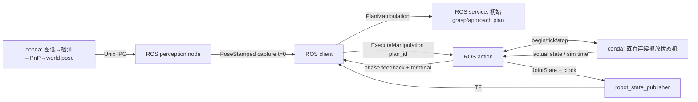

# S15.6b — 完整 ROS2 CPU manipulation pipeline

## Problem → Why → Intuition

S15.6a仅把裸臂送到物体上方；现在让ROS2管理一次完整视觉抓放，并能区分成功、业务失败、取消与超时。
复用S13.3b的合成landmark图像/PnP、grasp candidate/IK、连续home→pick→place→retreat；
不重复开发抓取算法。状态见[根README](../README.md#stage-15--ros2-integration)。
本课固定scene与CPU仿真，无GUI、真实相机/硬件、障碍RRT或通用操作能力声明。



## Core Concepts / Interfaces

[PlanManipulation.srv](../examples/16_ros2_integration/s15_interfaces/srv/PlanManipulation.srv)
输入world PoseStamped，输出success/reason/plan_id。短service只准备grasp与approach；
后续lift/transfer/descend/retreat的bounded Cartesian IK仍在长action执行过程中计算。
plan ready不代表整次抓放成功，也不表示所有后续阶段已预先求解。

[ExecuteManipulation.action](../examples/16_ros2_integration/s15_interfaces/action/ExecuteManipulation.action)：

| 部分 | typed字段 / 含义 |
| --- | --- |
| Goal | plan_id；仅执行当前服务发出的唯一plan |
| Feedback | phase、simulation_time_s、actual_joint_positions（6 rad） |
| Result | success、reason、diagnostics_json；外层仍有action terminal status |

诊断JSON容纳既有嵌套阶段证据，不作为pose/trajectory类型的替代。
SUCCEEDED需要placement_passed及支撑、分离、落点、退让、settling检查全部通过。
ABORTED保留失败phase/reason和partial trace。CANCELED的业务success=False，
表示操作未完成；取消实验client exit0只表示预期取消得到验证，不表示成功放置。

每次launcher创建fresh worker/scene；单active goal、单次trial，begin后plan被消费。
worker.used防止旧plan重播和同一worker不经恢复就再次操作。
这里明确使用plan_id，不再像S15.6a通过trajectory相等间接绑定。

## Mathematics / Frames / Units

复用已知metric landmark geometry、K、optical camera外参和PnP：
T_WO=T_WB T_BC T_CO。PnP结果经reprojection/positive depth与upright prior筛选。
图像是12个带color ID的合成landmark点，不是一般物体检测、实拍RGB或训练视觉模型。
known scene用于初始化和既有几何检查；held物体真值只用于评分/接触/支撑，
不把actual held pose反馈给目标生成以修正抓持误差。

物体初始中心约[−.45,.2,.03]m；commanded放置中心[−.30,−.10,.03]m。
T_OG为候选的名义抓取变换；lift/transfer/place目标来自estimate与名义关系。
物体actual qpos是freejoint：xyz（m）+wxyz quat，不焊接、不每步重置。
arm q为6 rad，qvel为rad/s；finger slide为m，opening=.02+q_left+q_right（m）。
法向力通过mj_contactForce取contact-frame x分量，单位N；不把ctrl当实际接触力。

## Math-to-Code / API与状态生命周期

[manipulation_worker.py](../examples/16_ros2_integration/manipulation_worker.py)仅conda：
复用make_image/detect_pixels/estimate_pose/map_estimate/upright_estimate/plan_motion。
复用run_pipeline的全部16phase、contact/force/retention/support/release/settling检查。
这里没有重写DLS、碰撞检查或夹爪动力学算法。

已有run_pipeline仅新增默认None的execution_guard(phase,data)，
在每次ctrl写入和mj_step之前调用；旧课调用不变。
worker用Condition和小步预算：每次IPC tick允许最多10个physics step，默认dt=.002s，约.02sim秒。
执行thread在预算耗尽后等待，IPC主thread可接收stop。
stop设置cancel并唤醒guard，guard在下一物理步前抛取消异常；保存部分证据后才返回确认。
如果cancel到达时已placement_passed或已失败，保留SUCCEEDED/ABORTED，避免伪称取消完成。

取消**暂停仿真推进**，保留完整qpos/qvel、ctrl与当前抓持状态，没有rollback/reset。
在transfer取消时物体悬空但不下落，是因为不再mj_step；不是证明能在真实重力下安全保持。
私人IK/图像处理不是可抢占线程，stop等到下一guard和artifact完成；不是硬实时取消。
IPC tick/stop等待上限15s，ROS socket20s，client取消终态宽限25wall秒；超出则remote_state_unknown。

[manipulation_ros.py](../examples/16_ros2_integration/manipulation_ros.py)仅系统ROS：
create_service返回service handle；其callback填写并返回response。ActionServer goal/cancel/execute分开，ReentrantCallbackGroup+3worker executor。
send_goal_async/get_result_async/cancel_goal_async返回Future，spin驱动返回结果。
生命周期对象不等于机器人状态，状态由conda实际MjData拥有。

## Clock / JointState / TF一致性

worker.data.time是唯一simulation clock源；adapter发送/clock并令ROS节点与RSP use_sim_time=True。
实际JointState.header.stamp来自同一worker sample sim time，position/qvel按六关节name映射。
RSP用S15.5教学URDF生成机械臂link TF；tool对应attachment_site，不包含finger/object TF。
client按终态sample的确切sim stamp查询world→tool，与MuJoCo actual site的位置和旋转矩阵核对。

图像只在初始sim t=0采集，perception重复发布仍保持capture stamp0，**不伪造新采样时间**。
service接受age∈[0,.5]sim秒；操作推进后旧观测不可作为新鲜目标。
perception timer用steady clock，所以sim暂停时仍能发布已缓存观测。
发现等待、执行timeout和取消宽限全部用wall/monotonic时间；不能用暂停的sim clock计超时。
不验证跨机器时钟同步、ROS bag time jump或真实传感器曝光同步。

## Minimal Experiment / Dependencies

conda依赖mujoco/numpy/mujoco-menagerie/matplotlib/opencv-python-headless，均requirements已声明。
OpenCV版本界限>=4.10,<5已核验，本机无需新增安装。
ROS apt需要rclpy/geometry-msgs/trajectory-msgs/action-msgs/rosgraph-msgs/sensor-msgs/tf2-ros-py/
robot-state-publisher/ament-index-python与接口build工具，均已存在。
接口包升级为s15_interfaces0.0.2，保留S15.6a PlanPose；新service/action生成物仍只在ignored tmp。

ROS专用终端退出conda，source Jazzy后重新build（系统/usr/bin/python3）：

```bash
cd /home/lucas/projects/mujoco-robotics-playground
source /opt/ros/jazzy/setup.bash
bash examples/16_ros2_integration/build_interfaces.sh
source tmp/s15_6a_interfaces/install/share/s15_interfaces/local_setup.bash
/usr/bin/python3 -c 'from s15_interfaces.action import ExecuteManipulation; from s15_interfaces.srv import PlanManipulation; print(ExecuteManipulation.Goal(),PlanManipulation.Request())'
```

构建完成后，launcher自动核验并隔离两个Python环境、启动worker/perception/server/RSP/client：

```bash
bash examples/16_ros2_integration/run_manipulation.sh
bash examples/16_ros2_integration/run_manipulation.sh --bad-frame
bash examples/16_ros2_integration/run_manipulation.sh --stale
bash examples/16_ros2_integration/run_manipulation.sh --bad-pose
bash examples/16_ros2_integration/run_manipulation.sh --nonfinite
bash examples/16_ros2_integration/run_manipulation.sh --cancel-phase transfer
bash examples/16_ros2_integration/run_manipulation.sh --execution-timeout 0.3
S15_CLOSE_TARGET=0.014 bash examples/16_ros2_integration/run_manipulation.sh
```

DOMAIN57/LOCALHOST。不要与别的/clock或同名joint/frame发布者同时运行。
每次独立trial，产物在ignored tmp/s15_6b/run_*/：
client.log、client_result.json、final_state.json、worker/server/perception/RSP logs，
artifacts下landmarks.png、trace.csv、pipeline.npz、summary.json、pipeline.png（有动态轨迹时）。
拒绝发生在执行前时无动态trace，final_state明确sim time0，不伪报放置成功。
launcher正常路径检查worker状态两次间隔.15wall秒，随后只清理自有进程。

## Expected / Actual Result → Explanation

| Case | 预期 | 操作完成？ |
| --- | --- | --- |
| 默认 | SUCCEEDED/placement_passed/exit0 | 是 |
| bad-frame/stale/bad-pose/nonfinite | service false/exit1，不发送goal、sim time0 | 否 |
| cancel-phase transfer | cancel ACK→CANCELED，部分trace/状态稳定，实验exit0 | 否 |
| execution-timeout .3s | 自动cancel并等终态，client exit4 | 否 |
| close-target .014m | close失败、ABORTED/exit1，不lift | 否 |

2026-10-07 / Zero（WSL2 Ubuntu24.04）：Engineering Complete；本人随后完成Run/Modify/Explain，Learning Mastered。
conda Python3.12.14、MuJoCo3.13.0、NumPy2.5.3、Menagerie2026.9.2、Matplotlib3.11.2、
opencv-python-headless4.14.0.94；系统Python3.12.3/Jazzy真实imports和apt版本核验，无新增安装。
rclpy7.1.12、sensor-msgs5.3.8、rosgraph-msgs2.0.4、RSP3.3.4、tf2-ros-py0.36.23。
s15_interfaces0.0.2 build及新旧接口type support通过。

默认完整16phase：11114个physics step，1112条feedback，sim22.228s，SUCCEEDED/exit0。
最终落点误差0.714212mm；相对估计目标朝向误差0.008263959°；支撑与分离通过，
退让79.974mm、开口80mm，最终物体线速度1.894e−10m/s、角速度3.297e−9rad/s。
终态live TF位置误差2.776e−16m，旋转矩阵元素最大误差8.882e−16。

四种输入拒绝均exit1/无goal/steps0；transfer取消CANCELED/exit0，sim13.52s，
无后续descend/release/retreat/final_hold，完整qvel保留非零。
.3wall秒timeout最终CANCELED/exit4，最终复测sim.26s（调度相关，不承诺固定取消延迟）。
close-target .014m在close因双指持续接触/法向力未建立而ABORTED/exit1，sim11.5s，无后续lift。
各case停止后两次state相同且running=False。

独立核对trace步数/时间增量/actual q、完整qpos/qvel恢复后的mj_forward/tool FK、
落点与目标朝向误差、支撑/分离及失败后无后续phase；曲线artifact已查看。
旧S13.3b默认CLI与S15.6a默认ROS链回归均exit0；没有运行GUI或硬件实验。

## Failure Cases / Diagnosis / Robotics Context

先定位层级：producer/PnP→service pose/time gate→initial IK/reference→action phase→IPC/worker→contact/settling。
transport正常不代表business成功；CANCELED和ABORTED不是placement_passed。
动作失败后不自动release、retreat或重新规划；物体可能仍被夹住，保留失败证据供明确恢复策略。
本课不做取消后的继续执行或真实机器人故障恢复。

初始plan只验证已有固定场景approach；后续阶段仍可能失败。
没有接入S14.7b的障碍RRT/held-object margin policy；本课不保证通用碰撞安全或连续路径。
接触允许pair和joint/speed/retention政策沿用S13.3b，model过滤/近似有边界。
单次固定scene成功不是跨姿态、质量、摩擦或真实视觉误差的成功率结论。
任务goal级action比单条FollowJointTrajectory更适合此处多阶段抓放，底层仍是直接MuJoCo API。

## Interview Capsule / Must Remember

30秒：完整操作用typed task action管理plan身份、phase反馈、终态和取消；
仿真worker执行已有算法，ROS发同一sim clock与实际joint states，TF和actual FK逐时刻对照。
失败/取消保留partial evidence，不能把暂停仿真等同物理制动。

2分钟：沿图像/PnP→pose topic→短planning service→完整action讲每个契约。
说明支撑后才release、最终settling才success；用close failure证明失败停止于当前phase。
用transfer取消解释下一physics step前guard、plan消费、状态保持；用timeout解释wall与sim clock区别。
最后强调固定scene与模型政策、不是硬件安全证明。

Must Remember：phase完整≠操作成功；plan ready≠全部阶段预解；capture stamp≠republish time；
clock同源≠硬实时；cancel ACK≠终态；暂停仿真≠真实保持；失败不自动继续。

## My Verification — Run / Modify / Explain

Run：默认launcher，确认SUCCEEDED/placement_passed、16阶段、支撑/分离/落点/settling与live TF检查。
Modify：launcher加--cancel-phase transfer，预测CANCELED与无descend/release/retreat，
检查部分trace、最后状态保持且qvel不必为0；恢复默认重新运行。
Explain：

1. planning service准备了什么，完整action为何仍可能在后续阶段失败？
2. 支撑、释放、退让与settling如何共同决定placement_passed，为什么终点接近不够？
3. 取消在哪里被检查，为什么CANCELED前需要worker停止确认，为什么不是物理制动？
4. capture stamp、/clock、JointState stamp、wall timeout怎样区分，为什么sim暂停后timeout仍有效？
5. bad pose、业务失败、取消、timeout分别在哪一层处理，如何从partial trace确认没有执行后续阶段？

2026-10-07 本人确认实验与预测完成，并补正初始planning与后续Action的范围；Run/Modify/Explain全部确认，Learning Mastered。
本课service仅准备初始grasp/approach并返回plan_id；不预先生成完整多阶段轨迹，
后续lift/transfer/descend/retreat的IK仍在action中计算。plan ready不证明整次任务可执行。
放置验收还包含物体支撑、与夹爪分离、退让及settling；ROS2 Action执行失败终态是ABORTED，
不是FAILED。partial trace与停止后状态观察提供本次实验的证据，不构成无限期或硬件停机证明。
不自动开展新阶段或扩大硬件/真实视觉范围。

接口格式与生成规则参考 [ROS2 Jazzy 官方 Creating an Action](https://raw.githubusercontent.com/ros2/ros2_documentation/jazzy/source/Tutorials/Intermediate/Creating-an-Action.rst)。
