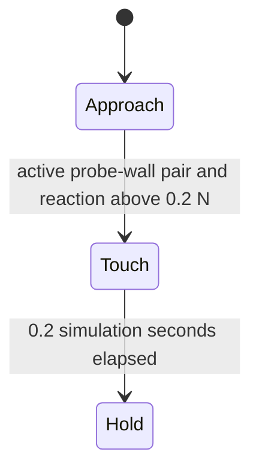

# S17.4 — Contact Transition Integration：接近 → 触碰 → 顺应保持

约0.5～2h，前置：[S17.3](20_3_impedance_sweep.md)、[S16.5接触力](19_5_contact_wrench.md)。
[代码](../examples/18_compliant_control/contact_transition.py) / [示例README](../examples/18_compliant_control/README.md)。
Engineering / Learning唯一状态来源：[根README](../README.md#stage-17--compliant--contact-rich-control)。

## Problem → Why → Intuition

自由空间回到目标，并不说明撞上表面时冲击小。怎样让工具接近表面，检测触碰，随后持续轻压？
接近时移动弹簧的参考位置；触碰后停止继续向前追赶，把参考缓慢移到表面后方一小段并固定。
真实工具被表面阻挡，参考与实际位置之间留下偏差，弹簧产生压紧力。
速度越大，接触前要消除的动能越多；即使最后同样稳定，过渡峰值也可能不合格。
本课集成阻抗与接触测量，只用测力触发阶段切换，没有接触力误差闭环。

## Core Concepts / Fixture

复用S17.1 XML/DT/GEAR/CAP，保留XY slide、M=diag(2,1)kg、固定orientation。
用标准库ElementTree在本课模型副本加入world平面和probe-wall显式pair；不修改旧XML/helper。
平面位于y=0，朝向+world Y；球probe半径r=.02m，site仍在球心。
球心初始[x,y]=[0,.06]m，零速度；几何首次触碰在y=.02m，不是球心y=0。
carriage不参与碰撞；condim1仅法向，无摩擦/切向力，X不运动。
gravity/passive damping均零；K400N/m、D_xy=[56.568542,40]N·s/m、dt1ms、joint cap±20N。
依赖仅已声明mujoco/numpy/matplotlib，local helper也导入三包；无新依赖/ROS/UR5e。



CSV phase编号0/1/2对应上述三态。Touch是一个有限reference过渡，不是再次瞬移实际位置。
阶段单向锁存，检测到touch后不来回切换；仍持续记录接触丢失率与最长丢失时段。
本fixture未出现丢失；没有自动重新接近策略，hold阶段标签本身不代表接触验收成功。

## Mathematics：shape / unit / frame

\[
v_W=J_{p,W}\dot q,\quad F_{cmd,W}=K(x_{d,W}-x_W)+D(v_{d,W}-v_W),\quad
\tau_{req}=J_{p,W}^{\mathsf T}F_{cmd,W}.
\]

x/v/xd/vd为world (3,) m或m/s，Jp为(3,2)，τ_req为(2,)slide force N。
K为N/m，D为对角增益N·s/m；Z控制力为零。qvel两项都是slide速度m/s。
gear=[2,1]，ctrl=τ_req/gear，actual=clip(τ_req,±20N)。

Approach：yd=max(.015,.06−s t)，未到下界时vd=−s，否则0。
默认s=.03m/s；fast=.3m/s。启动时vd从0跳为−s，是同样的简化启动策略，非加速度受限trajectory。
实际速度必须测量，不能把s当碰撞实际速度；fast触碰时实际速度约−.330842m/s。
触碰检测时锁存当前approach reference y_a；Touch用u=(t−t_touch)/.2：

\[
y_d=y_a+(.015-y_a)(3u^2-2u^3),\quad
v_d=(.015-y_a)6u(1-u)/.2.
\]

yd连续；touch开始vd从approach速度跳到0，控制力可能跳变，本课没有做到速度连续切换。
Touch结束yd=.015、vd=0，与Hold连续。没有将真实qpos/qvel重置为reference。

法向机器人动力学：m_y ydd=F_motor,y+F_env,y。
墙对probe为+Y，probe对墙为−Y；稳态速度/加速度近零时：

\[
F_{env,y}\simeq-F_{motor,y}=K(y-y_d)\simeq400(.020-.015)=2\ \mathrm N.
\]

2N是固定reference偏差的近似预期，不是输入的force target。软接触允许少量穿透，
实际y≈.019995m，反力≈1.998002N。改变环境/参数可能改变稳态；本课未保证恒定指定力。
触碰前法向动能E_n=½m_y vy²（J）；速度翻两倍且质量相同，动能翻四倍。
峰值反力还取决于接触刚度/阻尼、离散步长、控制切换，不能直接声称反力必然翻四倍。

## Math-to-Code / APIs / Contact parameters

MjModel.from_xml_string返回编译模型；MjData返回可变状态buffer。
mj_forward(model,data)原地更新FK/动力学/接触求解，不推进时间；
mj_jacSite写world线/角J到(3,nv)buffer；mj_fullM写(nv,nv)物理惯量；
mj_step原地推进qpos/qvel/time，每1ms重算controller。

```python
mujoco.mj_contactForce(model, data, index, raw)
frame = contact.frame.reshape(3, 3)
sign = 1. if contact.geom[1] == probe else -1.
force_world_on_probe = sign * (frame.T @ raw[:3])
```

mj_contactForce输入当前model/data/contact索引和(6,)float64 buffer，原地填contact frame
[Fn,Ft1,Ft2,Mn,Mt1,Mt2]，前三N、后三N·m，矩关于contact.pos；不返回新world向量。
frame的行是world表达的接触轴，normal为第一轴；geom[1]受raw wrench，geom[0]反号。
本课只使用force，condim1下切向力/矩为零；用Jᵀ映射验证qfrc_constraint，不借用motor力当反力。
[官方函数说明](https://mujoco.readthedocs.io/en/stable/APIreference/APIfunctions.html#mj-contactforce)。

显式pair：solref=[.01,1]、solimp=[.95,.95,.001,.5,2]、margin0；solver iterations100/tolerance1e−12。
正值solref是约束恢复时间常数（s）与阻尼比；solimp调节约束阻抗，
不能把solref/solimp当controller的K/D或真实材料模量。[官方solver参数](https://mujoco.readthedocs.io/en/stable/modeling.html#solver-parameters)。

每个pre-step采样先用上次ctrl作mj_forward，读取decision_force用于触碰检测；
再更新ctrl并forward，读取reaction/qacc用于本步积分记录。两者同一q/v、不同ctrl，
都是仿真约束求解的反力估计，不是两个硬件传感器读数。触碰切换时可能不同。
peak_reaction对应本步实际积分输入的求解反力；peak_decision记录检测解；impact_peak取两者最大，
用于保守的教学预算判据。不隐藏切换前较高反力，也不称其为采样间连续真实峰值。

## Minimal Experiment / Expected → Actual

仓库根目录：

```bash
conda activate mujoco
pwd
echo $CONDA_DEFAULT_ENV
which python
python examples/18_compliant_control/contact_transition.py
python examples/18_compliant_control/contact_transition.py --slow-speed .06
```

每命令slow/fast各5001×20 CSV（pre-step，0…5s）、results.json、transition.png。
Expected：慢速冲击较小；fast可能最后保持但冲击超预算。Modify仅将slow速度翻两倍，fast不变。
接触有效定义：active pair且+Y反力>.2N；不是只看ncon或几何重叠。
Hold qualified：4…5s每个采样都有有效接触且|vy|<2mm/s。
冲击预算10N是本教学fixture自选比较标准，非硬件安全限值；task_passed=hold合格且impact_peak≤10N。
失败对照继续仿真到5s，观察最终保持；没有实时超力急停。
工程PASS表示检查与预期失败对照成立，不表示每个case任务成功；读取JSON各case的task_passed。

Actual（2026-10-08，DESKTOP-781D67A，两个命令exit0，无import error）：

| case | touch / hold时刻s | 触碰实际速度m/s | 积分反力峰值N | 检测反力峰值N | 最大穿透mm | 任务 |
| --- | --- | --- | --- | --- | --- | --- |
| slow .03 | 1.334 / 1.534 | −.030000 | 5.189744 | 6.358974 | .102131 | 通过 |
| slow .06（Modify） | .667 / .867 | −.060001 | 10.173776 | 12.512237 | .189185 | 冲击超预算 |
| fast .3 | .142 / .342 | −.330842 | 58.295955 | 69.989116 | 1.137022 | 冲击超预算 |

三组touch后接触采样比例100%，最长丢失0；4…5s保持均合格，反力≈1.998002N、
motor≈−1.998002N、球心y≈19.995005mm、最大速度<1.3e−15m/s；motor未饱和。
法向触碰动能依次.000450/.001800/.054728J；fast不是严格十倍实际速度。
Motor cap20N并不限制接触反力到20N：碰撞减速时的m ydd项也参与力平衡。

检查：J/姿态/M、motor cap、法向反力符号、Jᵀcontact与qfrc_constraint、
M qacc=actual+constraint、零bias/passive/external；CSV时间/shape/finite及半隐式q/v递推逐点通过。
独立CSV控制律、动力学、几何depth、phase、peak核对；四种恢复状态（初始/触碰/峰值/末尾）
重新forward并直接contactForce核对通过；两命令fast CSV逐元素相同。
CLI speed0/nan各exit2；默认PNG已目视检查；本地文件链接与git diff --check通过。
产物只ignored tmp/s17_4_v0.03与v0.06；临时日志/tmp。未运行GUI或声明可视化操作完成。
现场WSL2 Ubuntu24.04.5/kernel6.6.87.2，Python3.12.14、MuJoCo3.14.0、NumPy2.5.3、
Matplotlib3.11.2，当前conda hook激活mujoco，同shell核验python/metadata/真实import路径/API。
无安装/requirements改动；代码保持3.11兼容语法，但未在3.11执行。

## Explanation / Failure Cases / Robotics Context

快接近时工具带更多动能进入contact，solver施更大反力减速；触碰后更换reference
不能抹掉已有速度。最终接触力相同，仍可能经历完全不同的冲击。
把hold reference放在几何touch位置时，理想稳态弹簧力接近0，不利于持续压紧；
本课将reference放到后方5mm，而真实工具只发生软接触的小穿透。
这不是“命令工具实际穿透5mm”；reference、真实位置与接触深度需分开读。

错误normal/geom符号会误判触碰；ncon存在不等于有效承力；只看motor force会漏碰撞反力峰值。
reference切换不连续可引入力跳，本课已明确vd跳变；真实任务可另设计速度连续过渡。
锁存phase不等于接触永远有效；本次没有contact-loss注入或重新接近/自动失败恢复验证。
10N判据属于离线评分，无力传感噪声、延迟/阈值去抖、硬件安全策略验证。
只有固定低DOF平面/球、零摩擦；不推广到UR5e、未知表面或通用接触稳定性。
应用是表面压紧、擦拭或插接前的接触过渡；力误差闭环留S17.6，admittance留S17.5。

## Interview Capsule

30秒：用移动reference阻抗接近平面，active contact与反力门限触发touch，
再把reference平滑移到表面后方并固定，用弹簧偏差保持约2N。
分别验收过渡峰值与最后1s接触/低速度；fast最终保持但冲击失败。

2分钟：说明球心/site与球面touch位置、world法向/反力正号；写Jv、JᵀF和
m ydd=F_motor+F_env；解释reference偏差产生压紧力。说明三个phase、
位置连续但触碰时vd跳变、接触测量两次求解时机，记录实际速度/动能/峰值与持续窗口。
最后指出力限幅约束motor而非反力，固定reference阻抗不等于force target闭环。

## Must Remember / My Verification — Run / Modify / Explain

接触前速度决定要消除的动能；touch是事件，hold是持续窗口验收；
reference不是actual，motor力不是contact力，最终保持成功不代表冲击合格。
Engineering Complete；2026-10-08 本人确认实验与预测完成，并正确回答五项Explain，
Run/Modify/Explain全部完成，Learning Mastered；状态只见根README。
解释精度补充：touch检测发生在Approach末端，随后进入Touch/Transition，
用.2s改变reference，最后Hold固定reference；全程是位置/速度reference到motor力的阻抗控制。
稳态近似F_env=K(y−yd)=400(.020−.015)=2N；不是把真实球心强制设到.015m。
约70N是检测解峰值，本步积分反力峰值约58.3N；教学评分保守取两者最大。

Run：运行默认命令，打开tmp/s17_4_v0.03/transition.png，对照slow/fast的阶段、速度、峰值与稳态。
Modify：先预测仅将slow速度.03→.06对触碰时刻、法向动能、冲击峰值、稳态反力与task_passed的影响，
再运行--slow-speed .06；fast应保持不变。预测峰值趋势即可，不要求从速度精确推导反力数值。
Explain：

1. 为什么球心y=.02m才是几何touch？hold reference=.015m为何产生约2N，而真实穿透不是5mm？
2. 三个phase分别改变什么？为何检测touch后不能直接清零实际qvel？
3. 速度翻倍使动能怎样变化？为什么不能据此断言接触反力峰值也严格翻四倍？
4. motor限幅20N为何仍可能测到约70N反力？反力方向与动力学平衡怎么写？
5. 为什么fast最终hold合格但任务失败？本课为何仍不是指定接触力的闭环控制？

下一小任务S17.5等待明确请求，不自动实现。
