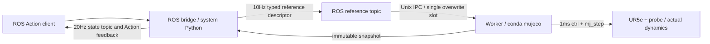

# S17.9 — Independent Worker / ROS Monitoring Integration

约0.5～2h；前置：[UR5e实际扫描](20_8b_surface_following_ur5e.md)、[ROS Action](18_3_ros2_action.md)、[双环境adapter](18_6a_ros2_adapters.md)。
[worker](../examples/18_compliant_control/control_worker.py) / [ROS](../examples/18_compliant_control/worker_ros.py) /
[launcher](../examples/18_compliant_control/run_worker_ros.sh) / [接口](../examples/18_compliant_control/s17_interfaces/action/FollowSurface.action)。
Engineering / Learning 的唯一状态来源是[根README](../README.md#stage-17--compliant--contact-rich-control)。

## Problem → Why → Intuition

P1的ROS执行循环每次RPC tick才推进物理，callback停顿会把机器人和时间一起冻结。
真实机器人在消息停发后仍受重力、接触和惯性作用，因此必须让本地控制继续运行，再观察退出任务后的响应。
本课把ROS当低频任务/参考与监控入口，把worker当唯一的高频物理/控制执行者。

## Core Concepts / Architecture



worker复用S17.8b模型/初始化/测力、surface frame与控制增益；P1与S17.8b文件不修改。
同裸UR5e、只probe-plane无摩擦接触、model bias补偿与motor cap；不存在arm避碰/硬件保证。
worker启动即在初始姿态局部hold并独立推进physics；Action begin只设置任务起始sim time，不重置actual q或sim time。
每个worker只接受一次goal，避免从任意故障接触状态隐式重启；重跑launcher建立新的独立实验。

参考采用有界扫描描述：distance10…30mm、每段2…3s、target固定2N。
ROS低频重复发送描述和lease；worker在本地simulation时间上生成quintic轨迹和normal反馈参考。
这不是ROS每100ms直接送下一毫米位置，不用状态读取或callback次数决定physics步数。
reference单槽覆盖避免旧包积压；begin/cancel/pause用最多8条生命周期队列，只有physics owner线程应用它们。
独立socket listener可以等待ACK，但不接触MjData；state RPC只读取已发布快照。

## Mathematics：two clocks / lease / units

```text
simulation dt = .001s, 10 physics steps per nominal .01s wall batch
elapsed_sim = data.time − task_start_sim
age_wall = monotonic_now − reference.issued_monotonic_s
deadline_wall = reference.issued_monotonic_s + command_timeout_s
valid = matching generation + increasing sequence + 0≤age_wall≤timeout
fallback if active and monotonic_now > deadline_wall
```

monotonic单位秒、只有同机进程共享时基。本课Unix socket限定同一WSL主机；不能把该stamp直接用于跨机或ROS epoch时间。
ROS `SurfaceState.sim_time_s/task_elapsed_s`是仿真秒，`snapshot_monotonic_s/command_age_s`是wall秒。
暂停physics时sim time不增长，但wall时钟和状态发布仍增长；命令期限不能通过sim pause而变成永不过期。
为了明确教学语义，本课拒绝active task的pause，先cancel/finish再pause。
wall pacing不追赶落后时间，不保证实时或1000Hz wall执行；固定1ms指physics积分步长。

控制同S17.8b：force error→bounded normal reference、quintic tangent、binormal/姿态保持，
`τ = qfrc_bias + Jpᵀ R_WS F_S + Jrᵀ M_W`，Nm；`ctrl=τ/gear`，actual受真实actuator force限幅。
R_WS列为world+X/+Z/−Y，origin[-.45,.20,.22]m，球心site为scan_tip，frame/单位见前课。

## Lifecycle / Math-to-Code

| 状态/操作 | 参考与physics行为 | Action语义 |
| --- | --- | --- |
| idle | actual起始pose的局部hold，独立mj_step | 未有任务 |
| active | approach/load/scan/final hold；lease必须新鲜 | 持续反馈 |
| succeeded | 完成12s任务验收；本地2N力hold继续，无续租要求 | SUCCEEDED |
| command_timeout / critical failure | 锁存actual位置/姿态，速度参考零，退出2N外环，继续physics | ABORTED |
| cancel applied | 同样切换actual pose hold，继续physics | CANCELED，ACK不代表物理静止 |
| explicit pause | 保留qpos/qvel/ctrl；跳过mj_step，仍处理IPC与状态 | 独立SetBool服务 |
| resume | 从保留actual state恢复局部控制/physics，不恢复旧任务 | 旧packet仍不可重启 |

cancel与worker成功完成可能竞争：bridge按观察到的worker已应用状态尝试映射终态；该竞态本轮未专门注入。
`reference` RPC的queued ACK只证明写入mailbox，应用/拒绝看state counters；生命周期ACK在owner实际应用后返回。
任务代次隔离不同goal，sequence阻止旧包重放，超期/未来/非法描述不能更新deadline。
旧包即使queued=True，也不能让取消/失败/完成的任务重新active。

`Controller.step()`是唯一physics入口；`mj_forward/mj_jacSite/mj_fullM/mj_step`输入、原地更新与单位沿用S17.8b。
每步检查actual motor cap、contact Jᵀ映射和完整动力学预算；execution中不写qpos/qvel。
worker main是唯一MjData owner；`threading.Lock`保护reference和快照，`queue.Queue(maxsize=8)`保护有限生命周期请求。
ROS `create_timer`定时生成低频reference/发布snapshot；`ActionServer`处理任务生命周期，`ActionClient`接收feedback/result/cancel。
`SetBool` request.data表示paused，success/message表示worker实际应用结果；不是motor制动接口。
Unix JSON仅用于同机跨解释器IPC，packet最大16KiB；连接读取超时.3s，生命周期application等待最多2s。
慢/partial客户端可延迟IPC，但physics owner继续运行并按lease回退。

## Dependencies / Environment

conda侧：requirements已声明mujoco/numpy/matplotlib/mujoco-menagerie；helper链与S17.8b相同，无新pip依赖。
ROS侧：Ubuntu24.04官方Jazzy apt的ros-jazzy-rclpy、ros-jazzy-std-srvs、ros-jazzy-action-msgs，
ros-jazzy-ament-cmake、ros-jazzy-rosidl-default-generators/runtime；cmake/make/g++。
生成固定长度ROS数组的Python runtime会使用apt python3-numpy，不在系统环境运行MuJoCo或数值学习示例。
新接口s17_interfaces0.0.1，build/install仅ignored tmp/s17_9_interfaces，P1接口不变。
launcher发现当前conda hook，分别核验conda与ROS系统解释器；清除跨环境PYTHONPATH。

## Minimal Experiment / Expected

仓库根目录运行，launcher自动按已有依赖构建接口并启动两个隔离进程：

```bash
bash examples/18_compliant_control/run_worker_ros.sh
bash examples/18_compliant_control/run_worker_ros.sh --command-delay .2
bash examples/18_compliant_control/run_worker_ros.sh --stop-after 6
bash examples/18_compliant_control/run_worker_ros.sh --command-delay .7
bash examples/18_compliant_control/run_worker_ros.sh --cancel-at 6
bash examples/18_compliant_control/run_worker_ros.sh --cancel-at 6 --pause-check
```

每次运行一个launcher，ROS_DOMAIN_ID=79、LOCALHOST；默认reference10Hz、state20Hz、lease.5wall秒。delay是真实有界ROS发送队列保留issue时间；到期后才发布。
.2s delay预期仍新鲜；.7s delay使初始lease先到期，迟到包不能恢复任务。
stop-after以task elapsed sim time6s为条件停止产生新reference，最后已发包的wall期限决定fallback时刻。
所有launcher命令验证预期终态后exit0；故障Action必须ABORTED，不能把脚本验证PASS当作扫描task成功。
每次输出目录打印在终端：client_result.json、worker_result.json、worker.csv及三个log，均ignored tmp/s17_9/run_*。
client要求实际ROS state和Action feedback均收到，并在任务终态后用两快照验证physics继续。
pause-check额外验证pause窗口qpos/qvel/sim time相同，resume后sim time增长。

## Actual Result / Explanation

2026-10-09，Zero，WSL2 Ubuntu24.04.5/kernel6.18.33.2；同执行shell分别核验conda mujoco与system Python/Jazzy。
conda Python3.12.14、MuJoCo3.13.0、NumPy2.5.3、Matplotlib3.11.2、Menagerie2026.9.2 distribution/实际imports/module paths通过。
ROS Python3.12.3、rclpy7.1.12、std-srvs5.3.8、action-msgs2.0.4来自apt/opt/ros/jazzy；
ament-cmake2.5.6、rosidl-default-generators/runtime1.6.1、g++13.2、cmake3.28.3、make4.3及apt python3-numpy1.26.4已有。
dpkg --audit空，无安装或requirements改动；build exit0，s17_interfaces0.0.1生成模块来自ignored install，真实type support通过。
Python3.11语法解析通过，未在3.11执行。

| 最终launcher case | Action终态 | 终态snapshot的task elapsed sim秒 | terminal后.25wall秒内sim增量 |
| --- | --- | --- | --- |
| 默认 | SUCCEEDED | 12.040 | .250s |
| delay .2s | SUCCEEDED | 12.050 | .250s |
| delay .7s | ABORTED / command_timeout | .500 | .240s |
| stop-after6 | ABORTED / command_timeout | 6.560 | .250s |
| cancel-at6 | CANCELED / cancel_applied | 6.080 | .240s |
| cancel-at6 + pause-check | CANCELED；pause/resume各通过 | 6.080 | .250s，pause另测 |

六条最终命令各exit0，含预期故障；数值是这次wall调度的观测，不保证相同终态反馈时刻或执行速率。
默认/delay.2的完整扫描最大切向误差.352200mm、normal误差.048350N，contact全保持、无饱和；
每轮均收到真实ROS state（11…249条）和Action feedback（11…241条）。默认接受124个reference；delay.2接受89个，
低频QoS/单槽覆盖与调度允许丢掉旧包，physics轨迹仍由本地fixed dt决定，不据此宣称包零丢失。
默认/短延迟成功后仍维持约1.999954N force hold；stop/cancel后检查时normal力0N，并有继续运动/局部恢复。
.7延迟初始lease先到期，accepted references0；较晚包不能恢复active。stop并非6s立即回退，而在最后有效issue时间加.5wall秒后退出。
pause窗口两snapshot的qpos/qvel/time逐值相同；resume后time增长，不恢复已取消任务。

`python tmp/s17_9_validation/audit_worker.py`独立worker/IPC验证：无ROS、无tick时idle physics继续；
partial socket客户端延迟listener而physics继续；重复序号、未来/过期stamp、wrong generation、描述不匹配均拒绝；
active pause拒绝、cancel applied/旧包不重启、post-cancel physics继续、pause/resume/second begin拒绝通过。
`python tmp/s17_9_validation/numerical.py`六条48列CSV完整actual q/v递推、失败reference锁存与速度零；
每case24…146actual快照独立重建FK/J、bias+Cartesian torque、contact/qacc、actual单步replay通过。
记录max动力学残差≤1.688e−14N·m；该简化模型的implicitfast递推观察沿用前课边界，不推广至所有模型。
分析PNG仅该独立分析脚本生成，位于各run目录monitoring.png；不是每次launcher自动产物。

CLI delay nan/period0/cancel−2/stop20各exit2；无Action server exit3；build shell bash -n、源码语法、本地Markdown文件链接/git diff --check通过。
正常退出后无仍运行worker/bridge；SIGINT/TERM记录trace并清理socket，后台worker显式恢复signal handler。
准备阶段修复ROS字段大小写与固定数组JSON序列化问题；失败运行未计最终PASS。
未专门注入success/cancel竞态、IPC应用超时、worker crash、lease边界抖动或高负载调度；
未运行CLI graph/GUI/硬件/跨机或长期稳定性实验。停发/取消后的快照增长证明本次继续physics，不证明硬实时或安全停止。

## Failure Cases / Robotics Context

仅用接收时刻续租会给迟到包重新赋予完整生命期；仅按simulation time计期限又会混淆暂停与wall停发。
reference backlog、旧generation/sequence、在ROS callback中运行physics、状态读取隐式tick，都会破坏生命周期语义。
动作终态后仍有机器人运动：局部hold并不保证瞬时静止、2N保持或硬件安全制动。
成功后继续2N hold是本课明确策略；取消/过期后退出力目标是另一策略，应分别看actual force。
应用对应有本地伺服循环的机器人控制器与上层ROS任务监控；Python线程/IPC、理想bias与软件wall pacing不等于硬实时控制。
无跨机时钟同步、硬件制动、ROS2 control、真实force sensor、GUI或一般安全/稳定性验证。

## Interview Capsule

30秒：worker独立固定dt控制和mj_step，ROS只送低频有lease的扫描描述并读取状态。
过期/cancel终止任务但继续局部控制，pause才冻结仿真。generation、sequence和原始wall issue时间防止迟到包恢复旧任务。

2分钟：画双环境/单physics owner/两个bounded mailbox；解释simulation dt与monotonic lease的单位和时基。
给出正常扫描、.2s/.7s延迟、6s停发、cancel、pause/resume的不同结果。
说明queued ACK与applied ACK、Action终态与actual motion的区别，最后说明非实时与同机clock边界。

## Must Remember / My Verification

状态以根README为准；2026-10-09 本人确认实验与预测完成，并提交五项Explain；Run/Modify/Explain全部完成，Learning Mastered。
解释精度：physics owner是worker主线程，socket listener及ROS callback均不访问实际MjData。
成功后继续本地2N力hold；cancel/timeout锁存实际位置与姿态、零参考速度，并退出2N外环。
单槽保存最新到达包，owner再按generation/sequence校验；不保证每个较新序号都被应用。
高频wall周期记录可提供时序验证证据，但有限样本不能证明通用硬实时保证。
必须记住：callback次数不是physics时间；任务停止不是仿真暂停；新鲜度不能在接收端重置；状态监控不能驱动控制步进。
Run：执行默认launcher，核对SUCCEEDED、ROS state/feedback、terminal后sim time继续增长。
Modify：先预测`--stop-after 6`的Action终态、fallback时刻与actual运动/力，再运行；保持lease.5、其余参数不变。
Explain：

1. 哪个线程有权访问MjData和调用mj_step？为什么ROS callback停止不应冻结physics？
2. simulation time、monotonic issue时间和command age各表示什么？为什么不能用接收时刻重新给迟到包续租？
3. generation、sequence和单槽mailbox分别防止什么？queued ACK与applied ACK有什么区别？
4. SUCCEEDED、ABORTED/cancel后的hold、pause/resume分别保留什么目标与状态？Action CANCELED是否证明工具静止？
5. .2s与.7s延迟相对.5s lease会产生什么结果？停发后的fallback发生在6s整吗，state/feedback能否证明高频wall实时？

完成当前Run/Modify/Explain后再决定下一学习任务，不自动启动Stage18。
